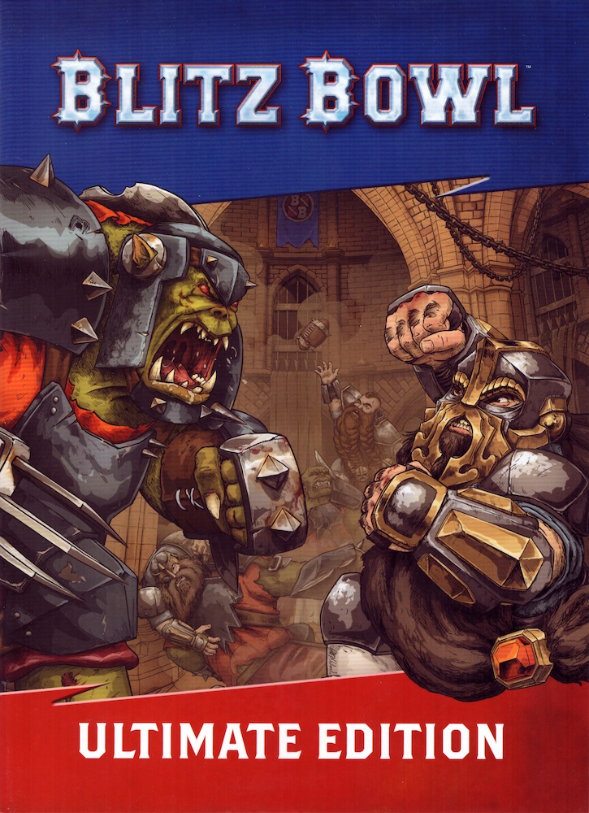

{ width=725 height=1000 }

GREETINGS SPORTS FANS!

"It's that time of year, sports fans, where we welcome you to a new season of Blood Bowl! I'm Jim Johnson, and I'm here to bring you our exclusive, live coverage of this year's Crush - the premier Blitz Bowl event. Alongside me, as always, is my enigmatic broadcast partner and living legend of the game, the illustrious Bob Bifford!"

"Thanks Jim! And I guess that makes you an un-living legend, does it, Jim?"

"That's very kind of you, Bob. Anyway, for those viewers who don't know about the Crush, Bob, why don't you give them the low-down on what they can expect to witness."

"Right you are, Jim. The Crush is where many players begin their career, should they survive of course! Teams put forwards their best rookies who then enter the Blitz Bowl pit to be put through their paces and see if they have what it takes to join their team's main roster. That's easier said than done as players from both teams will be looking to make a name for themselves, and that will likely come at the expense of some poor, hapless rookie on the wrong end of a bone-splintering tackle!"

"Well said, Bob! The Crush is fast becoming just as popular as regular Blood Bowl, with numerous companies sponsoring this year's event - and this year we are kicking things off with the Dwarf Canonneers taking on the Orc Rampagers."

"This should be a cracking contest, Jim; I can't wait to see these teams smash into each other!"

"Sounds like a match very much akin to your style of play, Bob. Plenty of crunching tackles, brutal blocks, and eye-watering collisions."

"That's my kind of match, Jim; reminds me of when I took part in the event many years ago. Back then it wasn't called the Crush; in fact, it got its name from my stellar performance where I destroyed the entire opposition in my rookie game - and the rest is history!"

"I never knew that, Bob. You learn something new every day! Anyway, the teams are heading into the pit; LET'S PLAY BLITZ BOWL!"

{ width=926 height=695 }
