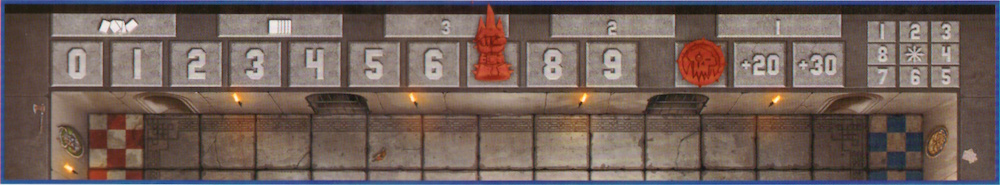
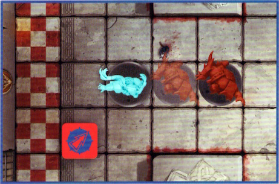

## GAME OVERVIEW

Blitz Bowl is a game of high-octane, full-throttle sports combat for two players. The aim of the game is to use your chosen team of emerging Blood Bowl stars to score as many points as possible, either by scoring Touchdowns or collecting Challenge Cards.

Should you manage to be 10 or more points ahead of your opponent at the start of any of your turns, or if you have the most points when all the Challenge Cards have been dealt, then you win!

### BEFORE YOU PLAY

Before you play your first game, you'll need to put all the miniatures together.

You will also need to remove the Dugouts and Throw Ruler from the cardboard sheet.

#### TEAM CARDS

Each team in Blitz Bowl has a unique, double-sided Team Card that has all the information that you will need to play with that team. Though this box contains a Dwarf team and an Orc team, there are a total of 23 different Team Cards in this box, allowing you to play with all manner of different races from the likes of Humans and Elves, to more sinister beings such as Skaven and Goblins. Other teams are available from www.warhammer.com

The front of each Team Card shows the miniatures that you will need for that team, allowing you to easily identify which Players you will need and what position they play. Most teams have six Players, though some may have more. Where there are multiple Players who have the same position on a team (e.g., Linemen), they are shown here too.

{ width=1000 height=371 }

On the back of each Team Card are all the rules you need to play using that team.  

Here we will go through what each bit means:

1. Team Name.  
2. Positions on the team.  
3. Each Player's Move, Block, Throw and Armour Values.  
4. The Players' abilities (if they have one).  
5. The team's Emergency Reserves Value.  
6. Descriptive text (this has no impact on the game).  
7. Number of Players that make up the team.

## LEARNING THE BASICS

Once you've put your two teams of miniatures together, it's recommended that you play through the seven Drill Cards in order. These are designed to give you a good grasp of the basics of Blitz Bowl and introduce you to the important principles. Once you've mastered these, the rest of the rules will make more sense!

It's also a good idea to read through this rulebook in its entirety at least once before playing your first full game to make sure you understand everything.

### UNDERSTANDING YOUR TEAM

Both of the teams in the box – Dwarfs and Orcs – consist of six Players, which is the standard for a Blitz Bowl team. Both teams have three Linemen, who are decent all-round Players but do not have any abilities of their own.

Both teams have a Blitzer on their roster. Blitzers excel at blocking opposing Players thanks to their Offensive Specialist ability, which allows them to re-roll the Block Dice when making a Block Action. If there is an Opposition Player that needs taking down, then these are the guys to send after them!

The Dwarf team has a Runner who is faster than the rest of the team. It is their job to try to score those all-important Touchdowns during the course of a game, and their Safe Hands ability means that should they get Knocked Down whilst holding a ball, they can choose where it bounces to.

In contrast, the Orc team has a Thrower. It is the role of the Thrower to collect a ball before passing it downfield to a waiting Team-mate to score. The Thrower's Handling ability means that they can pick up a ball whenever they are moved onto it, not just during a Run Action.

Each team also has a more unique Player on their roster that suits their own, individual playstyle.

The Dwarf team has a Troll Slayer who can make a free Block Action after making a Mark Action – ideal for blocking an opposition player who may think themselves just out of reach!

The Orc team has a Big Un Blocker. Though they may not have an ability of their own, the Big Un Blocker has a Block value of 2, allowing them to roll more Block Dice than anyone else on the pitch! Both the Dwarf and Orc team excel in getting stuck in, taking the fight to the opposition, and then squeezing the ball into the End Zone to score.

## IMPORTANT PRINCIPLES

Before we dive straight into a game, it is important to introduce you to some key concepts, phrases and principles that you will need to know. Understanding these will make following the rest of the rules presented in this rulebook far easier.

**COACH**

The real-life people playing the game (that's you!) are referred to as Coaches.

**PLAYERS**

The plastic miniatures that are used for the game and make up the Coach's team are referred to as Players.

**TEAM-MATE**

A Player from the same team as another Player is called a Team-mate.

**OPPONENT**

A Player from the opposite team as a Player is called an Opponent or Opposition Player.

**THROW CHECKS AND ARMOUR CHECKS**

If a Coach is called upon to make a Throw Check or Armour Check for one of their Players, they roll a D6 and compare the result to the Player's Throw Value or Armour Value as applicable. If the result is equal to or higher than the given value, then the check succeeds. If the result is lower than the given value, then the check fails.

*Example: The Dwarf Runner has to make an Armour Check and has an Armour Value of 3+. The Dwarf Runner's Coach rolls a D6, and rolls a 5 meaning the Armour Check is a success.*

Some rules will modify the result of a check, and this is done before comparing the dice result to the relevant value. However, in all cases, a check can never be modified by more than -1/+1, even when more than one modifier would apply. Additionally, a roll of an unmodified 1 on the dice will always fail, and a roll of an unmodified 6 will always succeed.

A Player with a '–' for their Armour Value will automatically fail any Armour Check they are required to make – do not roll the dice. A Player with a '–' for their Throw Value cannot take possession of a ball, and if they move into the same square as a ball, or a ball would Bounce onto that Player, it will automatically Bounce again from the square that player is in (see page 17).

**RE-ROLLING DICE**

Some rules will allow a Coach to re-roll a specific result. This allows the Coach to pick up the dice they just rolled, ignore the result, and roll it again. If they rolled multiple dice then they must roll all of them again.

The result of the re-roll must be applied, even if it is worse than the first roll. Also, a re-roll cannot be used on a roll that has already been re-rolled: you cannot re-roll a re-roll! You also cannot use a re-roll on another Coach's roll, only on your own roll.

**TAKING POSSESSION OF A BALL**

A Player will take possession of a ball when any of the following occur:

- They move into the same square as a ball whilst making a Run Action.
- They are the target of a successful Throw Action or a Hand-off.
- A ball Bounces into the square they occupy and the Player is Open.
- Through a unique Player ability or Bonus Play card ability.

The rules for these are covered later in this rulebook, but regardless of how a Player takes possession of a ball, when they do, place that ball on the base of that Player. Once this is done, the Player is said to be in possession of a ball.

**WITHIN**

If a rule states that something needs to be 'within' a certain number of squares of something else (such as a Player having to be within 3 squares of another Player or an End Zone), simply count the number of squares between the two things by the shortest route – including over any other Players or through blocked squares.

**CHALLENGE CARDS**

Challenge Cards have two sides; the red side showing the Challenge each team is trying to accomplish, and the blue side showing the Bonus Play a team will receive for completing the Challenge. The front of each Challenge Card shows the following:

{ width=326 height=573 }

1. The name of the Challenge.  
2. The conditions that must be met to claim the Challenge Card.  
3. The number of points the Challenge Card is worth.

The back of each Challenge Card is referred to as a Bonus Play Card, and shows the following:

{ width=375 height=593 }

1. The name of the Bonus Play.  
2. How the Bonus Play Card can be played.

**CARD VS RULEBOOK**

Some cards break the rules in this rulebook; for example, modifying a Throw Check by more than -1 or +1. Whenever a card contradicts the rules in this book, the card takes precedence.

**CAN VS CANNOT**

If two or more rules come into conflict, and one of them says cannot, then that rule takes precedence over the other. For example, if a Player has an ability that says their Block Actions cannot be Assisted, then a Bonus Play Card that means your Players' Block Actions are Assisted would have no effect upon that Player.

**A COACH'S HAND**

When Challenge Cards are claimed, they are put to one side or held by the Coach that claimed them. This is referred to as that Coach's hand. The Bonus Play Card side of a Challenge Card in a Coach's hand should be kept secret from their opponent.

**INTERRUPT**

Some Abilities or Bonus Plays will allow a Coach or a particular Player to interrupt the current Action and apply an effect. These are called Interrupt effects. When a rule would allow for a Coach to Interrupt, the current Action Step is paused and then the Interrupt effect is applied. Once the Interrupt effect has been applied, the current Action Step resumes from where it was paused, and play continues. An Interrupt effect cannot be played during the course of another Interrupt effect – you cannot Interrupt an Interrupt!

**PLAYER STATUS**

During a game of Blitz Bowl, Players can either be Open, Marked, Prone or in Reserves. Each of these are explained below:

**Open Players** – A Player who is standing and is not adjacent to any standing Opposition Players is Open. Each of the eight squares around a given square are said to be adjacent to them.

{ width=459 height=477 }

*This Dwarf Lineman has no Opposition Players adjacent to them, and so is said to be Open.*

**Marked Players** – A Player who is standing and is adjacent to an Opposition Player who is not Prone is said to be Marked. Players can Mark, and be Marked by, multiple Opposition Players at the same time. Marking has a number of effects, which will be explained later on.

{ width=461 height=477 }

*This Dwarf Runner is adjacent to the Orc Blitzer. As such, both Players are Marking, and being Marked by, each other.*

**Prone Players** – A Player who is laying on the ground is Prone. A Prone Player cannot Mark, or be Marked by, Opposition Players and is for all intents and purposes not an active participant in the game. For example, they cannot score Challenge Cards and do not affect the placement of Players returning to the pitch (see page 19). If a Player becomes Prone whilst holding a ball, it will immediately Bounce from that Player's square.

{ width=460 height=478 }

*This Dwarf Lineman has been Knocked Down and has been laid down as a result. They are said to be Prone.*

**Reserves Players** – Sometimes, a Player will find themselves placed in the Dugout. A Player in a team's Dugout is said to be in Reserves and will be waiting to return to the pitch.

{ width=303 height=579 }

*This Orc Lineman is in their team's Dugout. They are in Reserves.*

**SCORING POINTS**

During a game of Blitz Bowl, teams are awarded points by scoring Touchdowns and claiming Challenge Cards. Each team's score is tracked by the position of their team's Score Marker on the Score Track. Once a team's score reaches 10 points, their Team Coin is placed on the +10 space and their Score Marker is returned to the 0 space. The same happens when their team's score reaches 20 and 30.

{ width=1000 height=185 }

*So, for example, a team with a score of 17 would have their Team Coin on the +10 space, and their Score Marker on the 7 space.*

## SETTING UP THE GAME

To set up a game of Blitz Bowl, follow the steps outlined below:

1. First, flip one of the Team Coins to determine which Coach wins the toss. The winning Coach chooses which pitch they want to use for the game and places the game board in the centre of the table with their chosen pitch face-up. For your first game, we recommend using the pitch with only a single Trapdoor in the middle of it.

2. Next, each Coach takes a Dugout and places it at their end of the pitch as shown in the diagram.

3. The Coaches then decide who will use each team. If you are playing straight out of the box, then the Coach who won the toss may choose which of the two teams – either Dwarfs or Orcs – they control, with the other Coach taking control of the other. If you are using the other teams available in Blitz Bowl, simply tell your opponent which team you are using. In either case, place your team's Team Card in front of you with the Players' profiles and abilities side face-up so it can be easily referenced.

4. Shuffle the 26 Challenge Cards and place them with the Bonus Play side face-down next to the space marked with the ({ width=30 height=19 }) icon. Then, deal the top three Challenge Cards, challenge side up, into the Active Challenge Card spaces – the top card is dealt to the '1', the second card is dealt to the '2', and the third card is dealt to the '3'.

5. The Coach that lost the toss then sets up their Players in their End Zone; the other Coach then does the same. When setting up their Players, the Coach may choose which of the squares in their End Zone each Player is placed in. Each square can only have one Player in it.

6. Each Coach then places their Score Marker on the 0 space on the Score Track, and their Team Coin near to the board for later on.

7. Finally, place a ball on the Trapdoor. If you are using a pitch with multiple Trapdoors, randomly determine which of the Trapdoors a ball is placed on.

***Important:** When placing a ball during the set-up of the game, you do not roll to see where a ball will Bounce to (see page 17). Additionally, the colour and shape of a ball does not matter; a ball does not belong to either team.*

[{ width=1000 height=333 }](../media/blitz_bowl/setting_up_the_game.jpg)

## PLAYING THE GAME

A game of Blitz Bowl is played over a variable number of turns. The Coach who set up their team first is Coach A, and they take the first turn. The other Coach is Coach B, and they take the second turn. Coaches then alternate taking turns, one after the other, until the game ends (see page 22).  
On their turn, each Coach works through the following game sequence:

| Coach A's turn                                                                                                                                 | Coach B's turn                                                                                                                                 |
| ---------------------------------------------------------------------------------------------------------------------------------------------- | ---------------------------------------------------------------------------------------------------------------------------------------------- |
| **1) Pre-Turn Sequence**\* A. Refresh Challenge Cards step  B. No Ball in Play step  C. Emergency Reserves step | **1) Pre-Turn Sequence**\* a. Refresh Challenge Cards step  b. No Ball in Play step  c. Emergency Reserves step |
| **2) Player Action 1**  • Claim Challenge Card step\**                                                                                     | **2) Player Action 1**  • Claim Challenge Card step\**                                                                                     |
| **3) Player Action 2**  • Claim Challenge Card step\**                                                                                      | **3) Player Action 2**  • Claim Challenge Card step\**                                                                                      |
| **4) Player Action 3**  • Claim Challenge Card step\**                                                                                      | **4) Player Action 3**  • Claim Challenge Card step\**                                                                                      |

**Important**

\* In each coach's first turn, do not complete the Pre-Turn Sequence - it is skipped.

\** In addition, Challenge cards cannot be claimed by either coach during their first turn.

A Coach first completes the Pre-Turn Sequence – refreshing the Challenge Card row (see Challenge Cards, page 21), checking to see if a new ball enters play (see No Ball in Play, page 20), and then finally checking for Emergency Reserves (see Emergency Reserves, page 19). They will then make three Player Actions, one after the other (see Actions, page 15).

Play then passes to the other Coach to take their turn, and play then alternates in this way, one Coach taking a turn followed by the other, until the game comes to an end.

## ACTIONS

On their turn, a Coach makes a total of three Actions, one in each Player Action of their turn. They may divide these Actions between the Players on their team however they wish; however, a Player cannot make the same Action more than once during a turn, though they can make multiple different Actions if their Coach wishes.

For example, if the Orc Coach made a Run Action with their Blitzer, they could not make a second Run Action with their Blitzer during the same turn.

They could, however, make another Action with their Blitzer, such as a Mark Action or a Block Action. The Orc Coach could still make Run Actions with other Players on their team, as long as no Player on their team makes the same Action more than once.

The Actions that a Player can make are dependent on their current Player Status, as shown in the table below:

| **Open Players** | **Marked Players** | **Prone Players** | **Reserves Players** |
|------------------|--------------------|-------------------|----------------------|
| Run Action       | Block Action       | Stand Up Action   | Reserves Action      |
| Mark Action      | Sidestep Action    |                   |                      |
| Throw Action     |                    |                   |                      |

### FREE ACTIONS

Some Player abilities and Bonus Play Cards allow a Player to make a free Action. This is done in the **same way as a regular Action**, following all the restrictions listed previously (e.g., the same Player cannot make the **same Action** more than once in a turn), but does **not** count towards the regular three Player Actions a Coach can make during their turn.

Free Actions must be performed when they are granted and cannot be saved for later in the turn or game. Additionally, free Actions are also accompanied by a Claim Challenge Card Step, granting Coaches the chance to claim a Challenge Card in the same way as a regular Player Action.

*For example, during the Dwarf Coach's third Player Action, their Troll Slayer makes a Mark Action and moves adjacent to the Orc Coach's Thrower. Due to the Troll Slayer's Frenzied ability, they may make a free Block Action after making a Mark Action, which they can now do even though the Dwarf Coach has made three Player Actions during their turn, as the Block Action was a free Action. If this free Block Action would result in the Troll Slayer now fulfilling the criteria of a Challenge Card, the Dwarf Coach may then claim it.*

{ width=1000 height=511 }

### RUN ACTION

When a Coach chooses a Player to make a Run Action, they may choose one of their Open Players and move them a number of squares up to their Move Value. A move can be made into any adjacent square that is not occupied by another Player (either standing or Prone) or blocked (see page 5), and the Player cannot move off the pitch. Additionally, during a Player's Run Action, they cannot move into any square that is adjacent to an Open or Marked Opposition Player, though they can move adjacent to Prone Opposition Players. Trapdoors do not block movement; though they can be quite hazardous as they fly open whenever a new ball enters play, and many a Player has disappeared down them never to be seen again – you have been warned!

{ width=461 height=652 }

Here, the Orc Blitzer is making a dash across the pitch, running a total of 6 squares whilst making a Run Action. During their Run Action, the Orc Blitzer may not move into a square that is adjacent to either of the Dwarf Linemen.

### RANDOM MOVE VALUE

If a Player's Move Value on their Team Card is shown as D6, roll a D6 each time that Player makes a Run Action. The result of the D6 is how many squares that Player can move during that Run Action.

### PICKING UP A BALL

A Player who makes a Run Action and moves into a square containing a ball will automatically pick it up and gain possession of that ball. If a Player moves, or is moved, onto a ball in any other way – such as making a Sidestep or Mark Action, or when pushed by an opponent – then they do not take possession of that ball and it will Bounce instead (see page 17).

A Player who is already in possession of a ball cannot take possession of another one. Should a Player who is in possession of a ball move onto another ball, or have another ball Bounce into their square, the other ball will immediately Bounce from their square.

If a Player takes possession of a ball, place it on their base to show they are carrying it. When a Player has possession of a ball, a ball will move with them.

### MARK ACTION

An Open Player can make a Mark Action. When a Player makes a Mark Action, they may move up to two squares as described under the Run Action; however, when a Player makes a Mark Action they must finish this move Marking an Opposition Player. A Player making a Mark Action can move adjacent to Open or Marked Opposition Players as they move, but must finish this move as soon as they do so.

{ width=460 height=379 }

*The Dwarf Blitzer is making a Mark Action. They move two squares, finishing their move Marking the Orc Thrower.*

*The Dwarf Lineman also makes a Mark Action. They move one square and are adjacent to the Orc Blitzer, immediately ending their Mark Action as they are now Marking an Opposition Player.*

*The Dwarf Runner cannot make a Mark Action as they cannot end the move Marking an Opposition Player.*

### THROW ACTION

An Open Player who is in possession of a ball can make a Throw Action to pass a ball to another Player from their team on the pitch. To make a Throw Action, pick a Team-mate that is in range of the throw. To see whether a Team-mate is in range, place the Throw Ruler so that the curved end is in line with the edge of the throwing Player's base, as shown in the diagram below. A Team-mate is in range if any part of the Throw Ruler can reach the centre of the square that the Team-mate is standing in; if the Team-mate is in the black section, it is a Short Throw { width=35 height=35 }, whilst if they are in the red section it is a Long Throw { width=35 height=35 }. A Throw Action can still be made if the Throw Ruler is touching any obstructions – they do not stop a Player from throwing a ball. A Player cannot make a Throw Action to a Prone Team-mate.

{ width=461 height=354 }

*The Throw Ruler is placed in line with the Player's base. The grey shaded area is in short range whilst the red shaded area is within long range.*

To see if the Throw Action is successful, the throwing Player makes a Throw Check as described on page 8. The throwing Player subtracts 1 from the result if either of the following apply:

- **Long Throw:** The centre of the target square is in the half of the Throw Ruler marked Long Throw.
- **Obstructed Throw:** The target Team-mate is Marked, or any part of the Throw Ruler between the thrower and the target Team-mate crosses over a blocked square or a square containing an Open Opposition Player.

**Important:** Remember that a Throw Check can only ever be modified by a maximum of -1/+1.

If the Throw Check is successful, the target Team-mate takes possession of that ball. If the Throw Check fails, that ball will Bounce from the target Team-mate's square as described opposite.

### BOUNCING BALL

When a ball Bounces, it is placed into an adjacent square. Roll a D8 and look at the Bounce Chart printed on the game board to see which square a ball is placed in. What happens next depends on the square a ball is placed into.

- If a ball Bounces into an empty square, it remains in that square and nothing further happens.
- If a ball Bounces into a square containing an Open Player, that Player takes possession of that ball.
- If a ball Bounces into a square containing a Marked or Prone Player, it immediately Bounces again from the new square.
- If a ball Bounces into an obstructed square or off the board, the ball will not Bounce in that direction. Instead, work clockwise around the Bounce Chart (from 1–8) until you reach a result which means the ball will Bounce into a square on the pitch that doesn't contain an obstruction. Use that result instead.

{ width=460 height=304 }

*Here, a ball is forced to Bounce from the Dwarf Runner. A 7 is rolled on the Bounce Chart, however, this would take the ball into an obstructed square. Moving clockwise around the Bounce Chart, the next available square to place a ball is at 1 on the Bounce Chart (as 8 would also be an obstructed square) and so it is placed there instead.*

### FUMBLE

If the result of a Throw Check is a 1 (before or after modifiers), the throw automatically fails and will Bounce from the thrower's square rather than the square of the target Team-mate.

### HAND-OFF

If the target Team-mate is already adjacent to the Player making the Throw Action, then they automatically take possession of that ball – there is no need to make the Throw Check. This is referred to as a Hand-off.

### BLOCK ACTION

When a Player makes a Block Action, their Coach chooses an Opposition Player they are Marking to be the target of the Block Action and rolls a number of Block Dice equal to their Player's Block Value. The symbol rolled determines the result of the Block Action. If multiple Block Dice are rolled during a Block Action, the Coach of the Player making the Block Action may choose which one result to apply.

Below are the different symbols you will see on the Block Dice, and what they all mean:

### BLOCK DICE RESULTS

- { width=70 height=70 } **Smash:** The target is Knocked Down. A Knocked Down Player is placed Prone in the square they are in, and if they are carrying a ball it immediately Bounces. Then, the Knocked Down Player's Coach must make an Armour Check for the Player. If the Armour Check succeeds, the Player remains Prone. If the Armour Check fails, the Player is Injured.

- { width=70 height=70 } **Kerunch!:** The target is Knocked Down (see Smash). If an Armour Check is made, subtract 1 from the result, to a minimum of 1.

- { width=70 height=70 } **Shove:** The target is pushed one square directly away from the Player making the Block Action, if possible. The Player making the Block Action can then choose to make a follow-up move into the square the target left. If it is not possible to push the target directly away from the Player making the Block Action because this would take the target into an occupied or blocked square, or off the board, then the target is instead Knocked Down (see Smash).

- { width=70 height=70 } **Tackle:** The target is Knocked Down (see Smash). Additionally, the Player making the Block Action cannot make any more Actions, including Free Actions, this turn.

- { width=70 height=70 } **Miss:** The target is unaffected. Additionally, the Player making the Block Action cannot make any more Actions, including Free Actions, this turn.

{ width=461 height=305 }

*Here, the Dwarf Coach has rolled a Shove result on the Block Dice. This causes the Orc Lineman to be moved back one square, directly away from the Dwarf Lineman.*

### INJURED PLAYERS

When a Player is Injured, they are removed from the game board and placed in their team's Dugout. They are now a Reserves Player.

### ASSISTING A BLOCK ACTION

If the target of a Block Action is also Marked by one or more Team-mates of the Player making the Block Action, the Block Action is Assisted. This means that the Coach rolls one Block Dice in addition to the number equal to their Player's Block Value, and then chooses which result to use.

{ width=424 height=375 }

*The Orc Blitzer is making a Block Action against the Dwarf Lineman. As the Dwarf Lineman is also being Marked by the Orc Thrower, the Block Action is Assisted. The Orc Coach rolls two Block Dice – one for the Orc Blitzer's Block Value of 1, and one for the Block Action being Assisted.*

### SIDESTEP ACTION

A Marked Player can make a Sidestep Action. A Player that makes a Sidestep Action can move one square, however, they must finish this Action Open after the move. If a Player moves onto a ball when making a Sidestep Action, that ball bounces.

### STAND UP ACTION

A Prone Player can only make a Stand Up Action. If a Prone Player makes this Action, immediately stand them up in the square they are occupying.

### RESERVES ACTION

A Reserves Player can only make a Reserves Action. When a Player makes this Action, remove them from their team's Dugout and place them in any square in their team's End Zone. They cannot be placed in a square that is adjacent to a standing Opposition Player, or a square containing a ball, unless there is no other option. In the rare situation that a Player who makes a Reserves Action must be placed in a square containing a ball, it immediately Bounces. If every square in a team's End Zone is occupied by Players, their team's Reserves Players cannot make Reserves Actions.

If a Player makes a Reserves Action and has already made another type of Action during the same Turn in order to score a Touchdown, they are allowed to make the same Action again if the team still has Actions remaining. This is because, although they are the same miniature and Player, they are technically a new version of that Player as the other has been whisked away to sign a contract for the big leagues!

*For example: During the Dwarf Coach's Turn, the first Action their team makes is a Run Action with the Dwarf Runner in order to score. The Dwarf Runner is then placed in the Dugout as a Reserves Player. The Dwarf Coach then decides to make a Reserves Action with the Dwarf Runner. For their third Action, the Dwarf Coach wants to make a Run Action with the Dwarf Runner, which they are allowed to do.*

### EMERGENCY RESERVES

During the Emergency Reserves Step of a team's Pre-Turn Sequence, if the number of Reserves Players in a team's Dugout is equal to or greater than that team's Emergency Reserves Value (as found on their Team Card), then they may immediately make one free Reserves Action.

## SCORING TOUCHDOWNS

Touchdowns are important in Blitz Bowl, they are how the Players get noticed and whisked off to the big leagues after all!

After completing a Player Action, but before the Claim Challenge Card Step, check to see if a Touchdown is scored. To score a Touchdown, a Player from your team must fulfil the following three criteria at the end of any Action made during your turn:

- They must be in a square in the other team's End Zone.
- They must be in possession of a ball.
- They must be Open.

If a Player scores a Touchdown, the ball that the Player was in possession of is removed from play and that Player's team immediately scores 4 points. Additionally, the Player is immediately hauled out of the arena (no doubt to be whisked away to sign a lucrative contract with the first professional Blood Bowl team that can get their mitts on them!) and is placed in their team's Dugout. They are now a Reserves Player.

Scoring a Touchdown does not prevent a Coach from completing their turn by making any remaining Player Actions they have left. Even though there may not be a ball on the pitch, this is a great opportunity to reposition some Players or make a Block Action or two!

### NO BALL IN PLAY

If there is no ball on the pitch during the No Ball in Play Step of a team's Pre-Turn Sequence, a new ball will enter play. See New Ball! below.

### NEW BALL!

When a new ball enters play, it emerges through one of the Trapdoors on the pitch. If there is only one Trapdoor on the pitch, it will automatically emerge from that one. If there are multiple Trapdoors on the pitch, randomly determine which of them a ball will emerge from.

If a Player is standing on the Trapdoor when a ball emerges from it, that Player is immediately Injured, and if they were holding a ball it will disappear down the Trapdoor with them and is removed from play. If there is another ball on the Trapdoor that a ball emerges from, remove it from play.

Finally, place the new ball on the Trapdoor square the new ball emerged from; it will then immediately Bounce.

### MULTIPLE BALLS IN PLAY

When there is more than one ball in play at once, only one ball can occupy a square, and each Player can only be in possession of one ball at a time. If a Player in possession of a ball moves into a square containing another ball, that ball will immediately Bounce. If a ball Bounces into a square containing another ball, or a square containing a Player in possession of another ball, then that ball Bounces again.

## CHALLENGE CARDS

Challenge Cards represent objectives that both teams can complete in order to score points and claim the Bonus Play on the other side. In Coach A's first turn, Challenge Cards are not used and the Claim Challenge Card and Replace Challenge Cards Steps are skipped. At all other times, including during Coach B's first turn, the three Challenge Cards in the spaces marked 1-3 are considered to be active and can be claimed during the Claim Challenge Cards Steps of a Coach's turn. The Challenge Card on top of the Challenge Card Deck is not active, though it is visible to both Coaches – that way they can always see what the next card to become active will be.

Coaches are not allowed to look at the Bonus Play side of the Challenge Cards until they take them into their hand.

### CLAIMING CHALLENGE CARDS

During a Coach's turn, they may claim a Challenge Card during any of the Claim Challenge Card Steps in their turn, so long as they have fulfilled the conditions on the Challenge Card required to claim it following an Action made by a Player on their team (including a Free Action). If more than one Challenge Card's conditions have been met simultaneously, only one of them can be claimed during that Claim Challenge Card Step, and any Challenge Cards not claimed must have their conditions met again later in the turn in order to be claimed.

*For example: the Orc Coach has made a Block Action with their Blitzer against the Dwarf Lineman in possession of a ball. As a result of the Block Action, the Dwarf Lineman is Knocked Down, causing that ball to Bounce, and the Lineman to be Injured after failing their Armour Check. The Orc Coach has then met the conditions for two Challenge Cards, Free Up The Ball (for causing an Opposition Player to no longer be in possession of a ball) and Break Some Bones (for Injuring an Opposition Player). The Coach must now decide which of the two Challenge Cards they wish to claim, but they cannot claim both during the same Claim Challenge Card Step.*

When a Challenge Card is claimed by a Coach, its points value is immediately added to their team's score and the Coach takes the card, adding the Bonus Play on the back of the Challenge Card to their hand. If a Coach has more than three Bonus Plays in their hand at the end of their turn (not counting cards played in front of them), then they must discard a number of cards from their hand until they are left with three.

### CLEAN SWEEP

If a Coach claims all three active Challenge Cards in a single turn, this is a *Clean Sweep*. A Coach who achieves a Clean Sweep gains an additional 2 bonus points as the crowd goes wild!

### REPLACE CHALLENGE CARDS

During the Pre-Turn Sequence of a Coach's turn, the active Challenge Cards are refreshed. Simply draw new Challenge Cards from the Challenge Card Deck to fill any of the free spaces in the active Challenge Cards area.

Additionally, if all three active Challenge Cards are still present during this step, the Coach taking their turn must discard one of the active Challenge Cards of their choice and replace it with the top card of the Challenge Card Deck. This is not done during either Coach's first turn.

### DISCARDING CHALLENGE CARDS

When a Challenge Card is discarded, place it in the Challenge Card Discard Pile space on the edge of the game board (as shown by the 🍌 symbol), with its Bonus Play side showing.

## BONUS PLAYS

The reverse of each Challenge Card has a Bonus Play on it. These are a special boost that a Coach can use to gain an advantage during the course of a game. Each Bonus Play will state when it can be played and the effect of the card. A Coach can play any number of Bonus Plays during a turn, so long as they meet the conditions to play the cards. Once a Bonus Play has been played, discard it into the Challenge Card Discard Pile (unless the card specifically says otherwise).

The only restriction is that a Coach cannot play multiple of the same type of Bonus Play during the same turn. For example, if a Coach had two copies of *Raw Talent* in their hand, they could only play one of them.

One important thing to note is that Challenge Cards of the same type will not always have the same Bonus Play on the reverse – in fact, quite often they will purposefully be different. As a result, it is important to make sure that you keep your Bonus Plays hidden from your opponent.

## WINNING THE GAME

There are two ways to win a game of Blitz Bowl – with a Sudden Death Victory or with a Points Victory.

### SUDDEN DEATH VICTORY

If, at the start of a Coach's turn, before the Pre-Turn Sequence begins, their team's score is 10 or more points ahead of the score of the opposing team, then the game immediately ends and that Coach wins the game as a Sudden Death Victory.

*For example, at the start of the Dwarf Coach's turn, the Dwarf team has 23 points whilst the Orc team has 12. As a result, the game immediately ends and the Dwarf team earns themselves a Sudden Death Victory!*

### POINTS VICTORY

Once the last Challenge Card has been dealt out and becomes active, each team has one more turn, after which the game ends and the team with the highest score wins the game with a Points Victory. If the game ends with both teams having the same number of points, the game is a draw!

*For example, at the start of the Dwarf Coach's turn, they deal out the last Challenge Card, which becomes active. This means that each team will only have a single turn remaining. The Dwarf Coach completes their final turn, before the Orc Coach takes their final turn. The game ends with the Dwarf Coach having 25 points to the Orc Coach's 26 – securing the Orc Coach a Points Victory by the narrowest of margins!*

## ADVANCED RULES

Once you are familiar with the rules of Blitz Bowl and have a few games under your belt, you can add the following advanced rules to your games. These add Random Event Cards, additional Actions and teams to your games — all of which are a lot of fun and provide you with new, exciting challenges to overcome!

### RANDOM EVENT CARDS

These rules introduce the special Random Event Cards to your games, which are designed to represent all manner of crazy and unusual situations that are synonymous with the game of Blitz Bowl — and further fuel the excitement that crowds have come to expect!

After the top three Challenge Cards have been placed into the Active Challenge Card spaces, take the 12 Random Event Cards and shuffle them face-down. Then, take the top 6 Random Event Cards and shuffle them into the Challenge Card Deck face-down so that the front of the card cannot be seen. If one of the Random Event Cards ends up on top of the deck, shuffle them again so that there is not a Random Event Card on top. Place the remaining Random Event Cards back in the box — they won't be used for this game.

Every time a Challenge Card is moved from the Challenge Card Deck into an Active Challenge Card space, if the new top card of the Challenge Card Deck is a Random Event Card then the Coach whose turn it is must draw it and apply the effect written on the card. If, after a Random Event Card is drawn, the top card of the Challenge Card Deck is another Random Event Card, repeat the process above — there is no telling when something unpredictable may happen in Blitz Bowl!

Random Event Cards are discarded after they have been resolved.

### ADDITIONAL TEAMS

Blitz Bowl includes a total of 23 Team Cards, allowing Coaches to use a variety of different teams not included in the box. These teams are available separately, and there is a wide variety of races and teams to choose from. Using one of these additional teams simply requires you to swap out one or both of the teams in the Blitz Bowl box with the appropriate miniatures, as shown on your chosen team's Team Card.

### ROOKIES TO WATCH

Every season, there will be a group of players who show more promise than most, and will catch the watchful eye of commentators and scouts as *Rookies to Watch* during the upcoming try-outs of this year's Crush.

If you are an experienced Blitz Bowl Coach and introducing someone new to the game, then give them the Rookies to Watch Card during set-up.

A Coach with the Rookies to Watch Card can discard it (put it back in the box) after they make an Armour Check, a Throw Check, or after rolling the Block Dice for a Block Action made by a Player on their team. If they do, they may re-roll the dice.

## SPECIAL ACTIONS

There are some Actions that can only be made by certain Players, or may result in the Player performing them being punished for their dastardly and underhanded actions by the referee and sent-off from the field of play.

### FOUL ACTION

Committing a Foul is strictly against the rules of the game, and any Player attempting to stick the boot in risks the wrath of the referee and being swiftly ejected from the game. Not that this stops anyone of course; in fact, many Players find the risk of being sent-off to add to the thrill of the sport, and many of the fans simply love the added violence!

An Open Player who is adjacent to a Prone Opposition Player can make a Foul Action that targets that Opposition Player. When a Player makes a Foul Action, their Coach rolls a single Block Dice and applies the relevant result.

**FOUL RESULTS**

- { width=35 height=35 } **Spotted!**: The target Player is unaffected. Additionally, the Player making the Foul Action is spotted by the referee and ejected from the game. Place the Player in their team's Dugout: they are now a Reserves Player.

- { width=35 height=35 } **Take That!**: The target Player is Injured. Additionally, the Player making the Foul Action is spotted committing the Foul Action (see Spotted!).

- { width=35 height=35 } **Slipped!**: The target Player is unaffected. Additionally, the Player that made the Foul Action cannot make any more Actions, including Free Actions, this turn.

- { width=35 height=35 } { width=35 height=35 } **Got Them!**: The target Player is Injured. Place the target Player in their team's Dugout: they are now a Reserves Player.

### THROW TEAM-MATE ACTION

Certain larger Players can throw some of their smaller team-mates around the pitch, allowing for some unique and impressive looking plays – provided that their allies land on their feet instead of in a pile of broken bones! An Ogre, Troll or Treeman can make a Throw Team-mate Action. A Throw Team-mate Action is considered a Throw Action (e.g., for the purpose of claiming Challenge Cards) with the following changes:

- The Player making the Throw Team-mate Action must be Open and cannot have possession of a ball.
- When a Player makes a Throw Team-mate Action, they can throw one adjacent standing team-mate (either Open or Marked) and not of the same position – an Ogre cannot throw another Ogre, for example!
- To make a Throw Team-mate Action, pick a target square that is within range of the thrower, as determined by the Throw Ruler, and then make a Throw Check for the Player making the Action.
- If the Throw Check succeeds and the target square is unoccupied, place the thrown Player standing in the target square. If the thrown Player has possession of a ball, they keep possession of it.
- If the Throw Check fails, place the thrown Player Prone in the target square, but do not make an Armour Check for them. If the thrown Player has possession of a ball, that ball will Bounce from the target square.
- If the target square is a square containing another Player then, unless the Throw Check is a Fumble (see below), place the Player in the target square Prone and make an Armour Check for them – apply a -1 modifier to the Armour Check if the Throw Check was successful. If the Player in the target square was in possession of a ball, it will Bounce from the target square. Additionally, the thrown Player is automatically Injured, and if they were in possession of a ball it will Bounce from the target square.
- If the Throw Check is a Fumble, regardless of if the target square was occupied or not, then the thrown Player is Injured. If it is the thrown Player that was in possession of a ball, it will Bounce from the throw square containing the Player that made the Throw Team-mate Action.
- If a Player is thrown to a square that already contains a ball, that ball will Bounce from the square.

## OPTIONAL RULES

Here we present a few optional rules that Coaches can use to add some extra flavour to their games. From different regional arenas, to all manner of weird and wonderful balls, these optional rules will provide a number of fun outcomes that can make each of your games feel unique, giving you a different experience each and every time you play.

If both Coaches agree, they can use any of the optional rules presented here for their game of Blitz Bowl.

### BLITZ BOWL ARENAS

There are hundreds of Blitz Bowl arenas scattered across the known world, each dedicated to the yearly spectacle that is 'the Crush' and allowing hopeful rookies the opportunity to make a name for themselves and join the pro leagues of Blood Bowl. Regardless of where the arena is located, huge numbers of prospective players flock to them each year, ready to do whatever it takes to prove themselves tough enough to be signed to one of the onlooking Blood Bowl teams. Of course, with the known world being incredibly diverse, the various arenas will often feel different from continent to continent, region to region, and sometimes even city to city, with many Blitz Bowl arenas choosing to adopt their own unique rulings to make their version of the Crush feel more akin to the Blood Bowl leagues that successful rookies will likely play in!

If you decide to use the rules for Blitz Bowl Arenas in your game, follow the rules below:

When setting up the game, before the Coach that won the toss chooses which pitch they want to use, they roll a D8 and consult the following table to see which Blitz Bowl Arena is being used and what regional rule is in play as a result.

| D8 | Blitz Bowl Arena                  | Regional Rule |
|----|-----------------------------------|----------------|
| 1  | **Great Moot Bake-off Tent** *(Halfling Thimble Cup)* | Subtract 1 from the Emergency Reserves Value of both teams (for example, 4 becomes 3). |
| 2  | **Sewer Pipe Stadium** *(Underworld Challenge)* | When a Player makes a Reserves Action, they can choose a Trapdoor to be placed on instead of a square in their team's End Zone. If there is a ball on the chosen Trapdoor, it is removed from the pitch. If there is a Player on the chosen Trapdoor, that Player is immediately Injured. |
| 3  | **The Bone Pit** *(Sylvanian Spotlight)* | After a Player makes a Reserves Action, they may make a free Run Action. This includes any free Reserves Actions such as those triggered through the Emergency Reserves rule. |
| 4  | **Glittering Coliseum** *(Elven Kingdoms League)* | Do not subtract 1 from the Throw Check when making a Long Throw. |
| 5  | **Coliseum of Chaos** *(Chaos Clash)* | If a Player is not able to be pushed back as a result of a Shove during a Block Action, it becomes a Kerunch! instead of a Smash. |
| 6  | **Badlands Fighting Pit** *(Badlands Brawl)* | Assisted Block Actions roll two additional Block Dice instead of one (to a maximum of three Block Dice). |
| 7  | **Mountain Summit Stadium** *(Worlds Edge Superleague)* | Teams only need to be 8 or more points ahead of the opposing team in order to win a Sudden Death Victory. |
| 8  | **Overgrown Arena** *(Lustrian Superleague)* | Block Actions that target a Player that is adjacent to a Trapdoor count as Assisted. |

## BLITZ BOWL BALLS

Generally speaking, games of Blitz Bowl use the same BBBC (Blood Bowl Ball Company) approved spiked balls as the main version of the game; after all, why mess with such a classic design, right?

Regardless, some teams and promoters prefer to use their own types of balls when playing games of Blitz Bowl. This can be for a number of reasons, from a team wanting to use their 'lucky' ball, a coach seeking to give their team an edge, to the Crush officials hoping to spice things up by introducing another unpredictable element into an already volatile arena.

It's fair to say that Blitz Bowl balls come in all shapes and sizes, some of which can have a far bigger impact on the game than others!

The two teams in the Blitz Bowl box have a number of balls on the frame, which have their own rules. If you decide to use the rules for Blitz Bowl Balls in *your* game, follow the rules below:

- At the start of the game, the Coach that set up their team second chooses the ball that starts the game.
- Whenever a Coach is required to place a ball on the game board due to the No Ball in Play Step of the Pre-Game Sequence, they may choose which ball they use.
- Whenever the Multi-Ball card is drawn, each Coach may choose one ball to enter play, starting with the Coach that drew the Multi-Ball Bonus Play.

### DWARF RUNE BALL

This expertly-crafted ball is engraved with a number of Dwarfen runes that are said to bring good luck to those that carry it, and in particular to the sons of Grungni.

Players in possession of this ball may re-roll 1s when making a Throw Check. Players from a Dwarf team in possession of this ball may instead re-roll any failed Throw Checks.

### EXTRA SPIKEY BALL

Covered with more spikes than you can shake a Squig at, these pointy pigskins are a favourite amongst Orc teams who like to use them for some extra krumpin'.

Players in possession of this ball may re-roll results of Miss when making a Block Action.

### SQUIG BALL

A Squig stuffed with a regulation ball, or simply a ball-shaped Squig, makes for an excellent substitute for a ball – especially if you want to encourage a bit more bloodshed in the arena!

At the start of each Coach's turn, if a Player from their team is in possession of this ball, roll a D6. On a 1, this ball will immediately Bounce from the square the Player holding this ball is in as the Squig bites their fingers.

Additionally, at the start of each Coach's turn, if this ball is on the floor, it will immediately Bounce from the square it is currently in.

## ADDITIONAL TEAMS

In this box you will also find the Team Cards for a number of different teams available to be used in Blitz Bowl – 23 of them in fact! These additional teams represent all manner of different races that play the great sport, and each team has its own spread of Players, positions, and abilities that make each of them play differently in the arena.

Using these different teams in place of one of those in the box is a great way to expand your Blitz Bowl playing experience, giving you new challenges to overcome, new oppositions to face, and new tactics to add to your ever growing repertoire as a coach!

Though most teams do, not all teams have only six Players. Some have more, with some even having as many as 10! That's not to say that quantity means quality though; many of these larger teams have weaker individual Players and rely on the weight of numbers to get the job done.

## GLOSSARY

- **Active Challenge Card**: A Challenge Card face-up in a Challenge Card Space (see below).

- **Adjacent Square**: A square touching the square a Player or ball is in, including diagonally, is referred to as being adjacent to that Player or ball.

- **Armour Check**: When the D6 is rolled and compared to a Player's Armour Value to determine a Player's chance of survival, often as a result of a Block Action. If the roll is equal to or greater than the Player's Armour Value (after modifiers), the Armour Check is passed.

- **Assisted Block**: A Block Action that is made when one or more Team-mates are adjacent to the target.

- **Block Action**: An Action made by a Player. Block Actions can knock the target down, and potentially injure them.

- **Block Dice**: Three six-sided dice that come with the game, that are used to determine the success of a Block Action or a Foul Action. There are five results available from the Block Dice: Smash, Kerrunch!, Tackle, Miss, Show (×2).

- **Bonus Play Card**: After a Coach claims a Challenge Card, that card is referred to as a Bonus Play Card and has a special effect on the blue side that can be used by the Coach.

- **Bounce Chart**: A chart featured on the game board in the top right corner that dictates the eight directions a ball can Bounce.

- **Challenge Card**: A Challenge Card with its Challenge-side face-up, either in a Challenge Card Space, or in the Challenge Card Deck.

- **Challenge Card Spaces**: The three spaces on the board next to the Challenge Card Deck, numbered 1, 2 and 3. Challenge Cards are placed here, Challenge-side up, at the start of the game.

- **Claim Challenge Card**: During a Coach's turn, after making a Player Action, if that Coach has completed the requirements of a Challenge Card, they may claim that Challenge Card, scoring the points shown on the card and then adding the card to their hand as a Bonus Play Card. Only one Challenge Card can be claimed at a time, even if the Coach has completed the requirements to claim more than one.

- **Clean Sweep**: When a Coach claims all three Active Challenge Cards in a single turn.

- **Coach**: The person controlling a team and taking part in a game of Blitz Bowl.

- **Coach's Hand**: If a Coach has any Bonus Play Cards, those cards are referred to as that Coach's hand. *See also*: Claim Challenge Card.

- **D6**: The two six-sided dice that come with this game, whose facings have between 1 and 6 pips on them.

- **D8**: The two eight-sided dice that come with this game, whose facings have the numerical values 1 to 8 on them.

- **Drill Card**: A small deck of cards that help Coaches learn the rules of the game.

- **Dugout**: A card where Players that are in Reserve are placed. The Dugout also contains useful information about the rules of the game.

- **Emergency Reserves**: Each team has an Emergency Reserves Value. If the number of Reserves Players on a team is equal to or greater than the team's Emergency Reserves Value, they must make one free Reserves Action in the Emergency Reserves Step of their Pre-Turn Sequence.

- **Empty Square**: Any square on the pitch that does not contain a Player, a ball, or an obstruction.

- **End Zone**: A row of squares situated at either end of the pitch. Each End Zone is assigned to a team. A team is set up in their End Zone at the start of the game, and can score Touchdowns in the other team's End Zone.

- **Follow-up**: When a Player making a Block Action rolls a Shove, they can then choose to make a follow-up move into the square the target left.

- **Foul Action**: An Action made by a Player that can only target a Prone Player they are Marking. Foul Actions can potentially injure opposing Players, but are illegal and may result in the Player making the Foul Action being Sent-off.

- **Fumble**: When the Throw Check made by a Player making a Throw Action results in a 1 (before or after modifiers), the throw fails and is a Fumble. The ball will Bounce from the throwing Player's square.

- **Hand-off**: When a Player makes a Throw Action that targets an adjacent Team-mate, this is a Hand-off. The target Player automatically takes possession of that ball: no Throw Check is made.

- **Injured Players**: A Player who is Injured is removed from the pitch and placed in their Dugout, becoming a Reserves Player.

- **Interrupt**: A rule that pauses the current Action Step in order to apply an additional effect. Once resolved, the Action Step continues as normal.

- **Long Throw**: When the centre of the square the target Player of a Throw Action occupies is in the half of the Throw Ruler marked Long Throw.

- **Mark Action**: An Action that can be made by an Open Player. The Player may move up to two squares, and must themselves be Marked at the end of the move.

- **Marked Players**: A Player status. A Marked Player is one who has one or more adjacent Opposition Players who are not Prone.

- **Modifier/Modify**: An adjustment made to the result of a D6 or D8 roll, either positive or negative. A result for a Throw Check or an Armour Check can never be modified by more than +/-1, even when more than one modifier would apply.

- **New Ball!**: When a ball is added to the pitch via a Trapdoor. If a Player is standing on the Trapdoor when a new ball emerges, that Player is Injured. If another ball is on the Trapdoor when a new ball emerges, that ball is removed from the game.

- **No Ball in Play**: A state of play where there is no ball on the pitch.

- **Obstructed Throw**: A Throw Action when the target Player is Marked, or any part of the Throw Ruler between the thrower and the target Player crosses over a square containing an obstruction or an Open Opposition Player.

- **Open Player**: A Player status. A Player with no adjacent Opposition Players.

- **Opposition Player**: A Player from the other Coach's team.

- **Pitch**: The playing area is called the pitch, and is divided into a number of squares.

- **Player(s)**: Members of a team. Can refer to either Team-mates or Opposition Players.

- **Player Action(s)**: Actions that can be made by Players. These include Run, Mark, Throw, Block, Foul, Stand Up, Reserves, Sidestep and Throw Team-mate. A Player cannot make the same Action more than once during a turn.

- **Player Status**: A Player's status during the game, which dictates what Actions that Player can make. A Player's status can either be Open, Marked, Prone or Reserves.

- **Prone Player**: A Player status. A Player who has been Knocked Down.

- **Random Event Card**: A type of card shuffled into the Challenge Card Deck face-down that, when it appears on top of the Challenge Card Deck, is immediately resolved.

- **Re-roll**: When a Coach is allowed to re-roll a dice roll, they pick up the dice and roll them again. If they rolled multiple dice, they must re-roll all of the dice. A Coach cannot re-roll a dice that has already been re-rolled. A Coach cannot re-roll the other Coach's dice. After a dice has been re-rolled the Coach must use the result of the re-roll, even if it is worse.

- **Reserves Action**: An Action that can be made by a Reserves Player. The Player can be placed in any square in their End Zone, though not in one that is adjacent to an Opposition Player or one that contains a ball, unless there is no other option.

- **Reserves Player**: A Player status. When a Player is in their Dugout, often as a result of being Injured, they are a Reserves Player.

- **Run Action**: An Action that can be made by an Open Player. The Player can move a number of squares up to their Move Value. They cannot move into a square adjacent to a standing Opposition Player during a Run Action.

- **Scoring Points**: Teams can score points by scoring Touchdowns, claiming Challenge Cards and through some Bonus Play Cards. When a team scores points, their Score Marker is advanced along the Score Track a number of times equal to the number of points the team scored.

- **Sidestep Action**: An Action that can be made by a Marked Player. The Player can move a single square, though they must not be Marked at the end of the move.

- **Square**: The playing area is divided into squares, collectively known as the pitch. These squares can be empty or contain obstructions. Players are placed on squares, and only one Player can occupy a square at a time.

- **Stand Up Action**: An Action that can be made by a Prone Player. The Player immediately stands up in the square they are in.

- **Standing Opponent**: A Player on the other team that is neither a Reserves Player or a Prone Player.

- **Sudden Death Victory**: If, at the start of a Coach's turn, their team is 10 or more points ahead of the opposing team, the game immediately ends and that Coach is the winner.

- **Taking Possession of a Ball**: When a ball is placed on the base of a Player, that Player is said to have taken possession of that ball and is now in possession of a ball.

- **Target Player**: A Player who is being thrown a ball, or is being blocked, is said to be the target Player of that Throw Action or Block Action.

- **Team**: A group of Players controlled by a Coach.

- **Team Card**: A card that contains the information required to play with a team, outside of the core rules of the game.

- **Team-mate**: A Player from the same team as another Player.

- **Throw Action**: An Action that can be made by an Open Player who is in possession of a ball. The Player can throw a ball to a Team-mate by making a Throw Check.

- **Throw Check**: When the D6 is rolled and compared to a Player's Throw Value during a Throw Action. If the roll is equal to or greater than the throwing Player's Throw Value (after modifiers), the Throw Action is successful.

- **Throw Ruler**: The ruler used during a Throw Action to determine the distance of a Throw Action or Throw Team-mate Action.

- **Throw Team-mate Action**: An Action that can be made by an Open Player that is a Troll, Ogre or Treeman. The Player can throw a smaller Team-mate around the pitch by making a Throw Check.

- **Thrower/Throwing Player**: When a Player is making a Throw Action, they are referred to as the thrower or throwing Player.

- **Touchdown**: After completing an Action on your turn, but before claiming any Challenge Cards, if a Player from your team who is in possession of a ball is Open and in a square in the opposing team's End Zone, then they may score a Touchdown. That Player's team then scores 4 points, that Player is placed in their team's Dugout as a Reserves Player, and the ball that Player was in possession of is removed from the pitch.

- **Trapdoor**: There are always one or more Trapdoors on the pitch. Players can move onto Trapdoors as if they were normal squares. A Trapdoor is where a ball may emerge from should there be no ball in play.

- **Turn(s)**: A game of Blitz Bowl is divided into turns, taken alternately by each Coach.

- **Within**: A model is said to be within X squares of something else if the number of squares in between the model and the target (including the square of the target) is equal to, or less than, X.

## REFERENCE

### GAME SEQUENCE

| Coach A's turn                                                                                                                                 | Coach B's turn                                                                                                                                 |
| ---------------------------------------------------------------------------------------------------------------------------------------------- | ---------------------------------------------------------------------------------------------------------------------------------------------- |
| **1) Pre-Turn Sequence**\* A. Refresh Challenge Cards step  B. No Ball in Play step  C. Emergency Reserves step | **1) Pre-Turn Sequence**\* a. Refresh Challenge Cards step  b. No Ball in Play step  c. Emergency Reserves step |
| **2) Player Action 1**  • Claim Challenge Card step\**                                                                                     | **2) Player Action 1**  • Claim Challenge Card step\**                                                                                     |
| **3) Player Action 2**  • Claim Challenge Card step\**                                                                                      | **3) Player Action 2**  • Claim Challenge Card step\**                                                                                      |
| **4) Player Action 3**  • Claim Challenge Card step\**                                                                                      | **4) Player Action 3**  • Claim Challenge Card step\**                                                                                      |

**Important**

\* In each coach's first turn, do not complete the Pre-Turn Sequence - it is skipped.

\** In addition, Challenge cards cannot be claimed by either coach during their first turn.

### BLOCK RESULTS

- { width=70 height=70 } **Miss**: The target is unaffected. Additionally, the Player making the Block Action cannot make any more Actions, including Free Actions, this turn.

- { width=70 height=70 } **Tackle**: The target is Knocked Down (see Smash). Additionally, the Player making the Block Action cannot make any more Actions, including Free Actions, this turn.

- { width=70 height=70 } **Kerrunch!**: The target is Knocked Down (see Smash). Additionally, when the resulting Armour Check is made, subtract 1 from the result, to a minimum of 1.

- { width=70 height=70 } **Smash**: The target is Knocked Down. A Knocked Down Player is placed Prone in the square they are in, and if they are carrying a ball it immediately Bounces. Then, the Knocked Down Player's Coach must make an Armour Check for the Player. If the Armour Check succeeds, the Player remains Prone. If the Armour Check fails, the Player is Injured.

- { width=70 height=70 } **Shove**: The target is pushed one square directly away from the Player making the Block Action, if possible. The Player making the Block Action can then choose to make a follow-up move into the square the target left. If it is not possible to push the target directly away from the Player making the Block Action because this would take the target into an occupied or blocked square, or off the board, then the target is instead Knocked Down (see Smash).