## AMAZON TEAM

NUMBER OF PLAYERS: 6

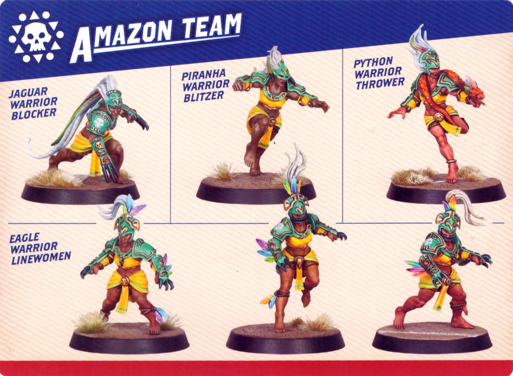{ width=1000 height=732 }

| Position                | Move | Block | Throw | Armour | Ability                   |
| ----------------------- | ---- | ----- | ----- | ------ | ------------------------- |
| Eagle Warrior Linewoman | 6    | 1     | 4+    | 4+     |                           |
| Python Warrior Thrower  | 6    | 1     | 3+    | 4+     | Handling Skills |
| Piranha Warrior Blitzer | 7    | 1     | 4+    | 4+     | Hit and Run     |
| Jaguar Warrior Blocker  | 6    | 2     | 4+    | 3+     | Defensive       |

EMERGENCY RESERVES: 4

**Handling Skills:** Whenever this Player is moved into a square containing the ball, they pick it up, as though they were making a Run Action.

**Hit and Run:** After this Player makes a Block Action, they may make a free Run Action of up to 2 spaces. This Run Action may be made if they are adjacent to an Opposition Player.

**Defensive:** Opposition Players adjacent to this Player can never Assist a Block Action.

---

## BLACK ORC TEAM

NUMBER OF PLAYERS: 6

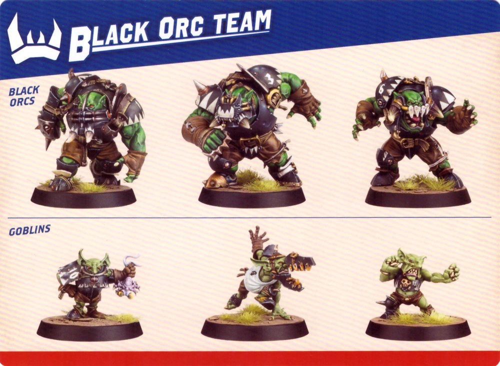{ width=1000 height=732 }

| Position  | Move | Block | Throw | Armour | Ability           |
| --------- | ---- | ----- | ----- | ------ | ----------------- |
| Goblin    | 6    | 1     | 4+    | 6+     | Elusive |
| Black Orc | 4    | 2     | 5+    | 2+     |                   |

EMERGENCY RESERVES: 4

**Elusive:** When this Player makes a Run Action they can move adjacent to Opposition Players, but must end the Action Open.

---

## CHAOS CHOSEN TEAM

NUMBER OF PLAYERS: 6

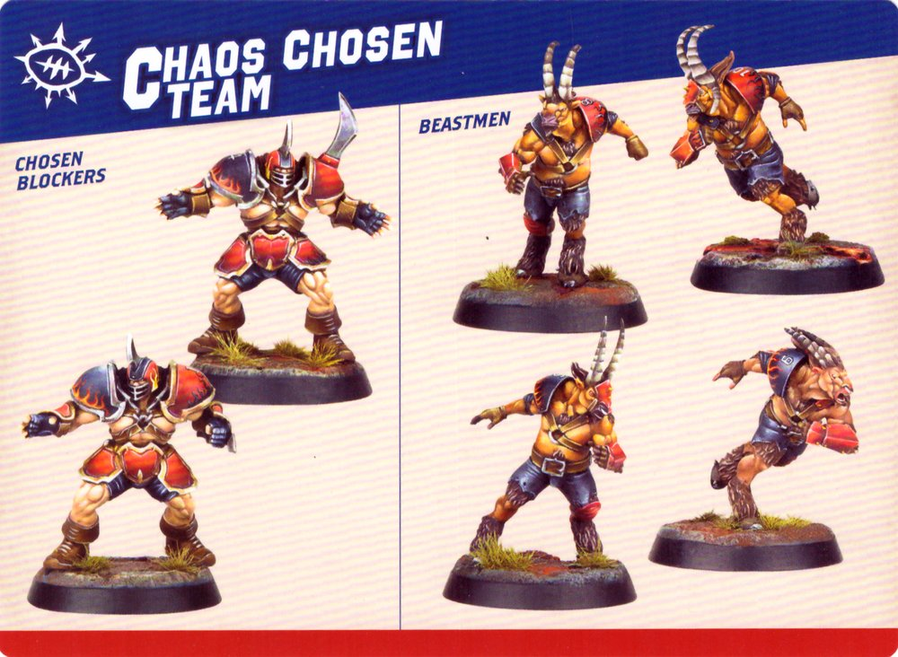{ width=1000 height=732 }

| Player             | Move | Block | Throw | Armour | Ability             |
| ------------------ | ---- | ----- | ----- | ------ | ------------------- |
| Beastman (4)       | 6    | 1     | 4+    | 4+     | Head-butt |
| Chosen Blocker (2) | 5    | 2     | 5+    | 2+     |                     |

EMERGENCY RESERVES: 4

**Head-butt:** If this player makes a Run Action, followed by a Mark Action, they may make a free Block Action.

---

## DARK ELF TEAM

NUMBER OF PLAYERS: 6

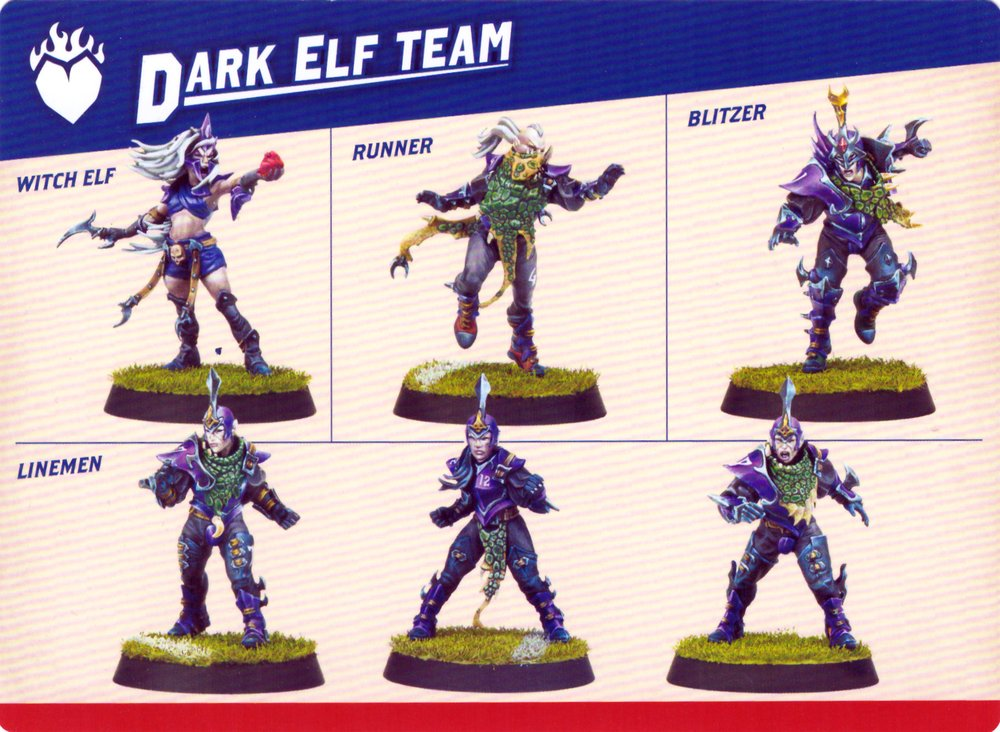{ width=1000 height=732 }

| Position  | Move | Block | Throw | Armour | Ability                        |
| --------- | ---- | ----- | ----- | ------ | ------------------------------ |
| Lineman   | 6    | 1     | 4+    | 3+     |                                |
| Runner    | 7    | 1     | 3+    | 4+     | Dump-off             |
| Blitzer   | 7    | 1     | 4+    | 3+     | Offensive Specialist |
| Witch Elf | 7    | 1     | 5+    | 4+     | Frenzied             |

EMERGENCY RESERVES: 4

**Dump-off:** When this Player is chosen as the target of a Block Action, they may Interrupt the Action and make a free Short Throw (or Hand-off) with no modifiers, even if they are Marked.

**Offensive Specialist:** When this Player makes a Block Action, you can choose to re-roll the Block Dice.

**Frenzied:** After this Player makes a Mark Action, they may make a free Block Action against a Player they are now Marking.

---

## DWARF TEAM

NUMBER OF PLAYERS: 6

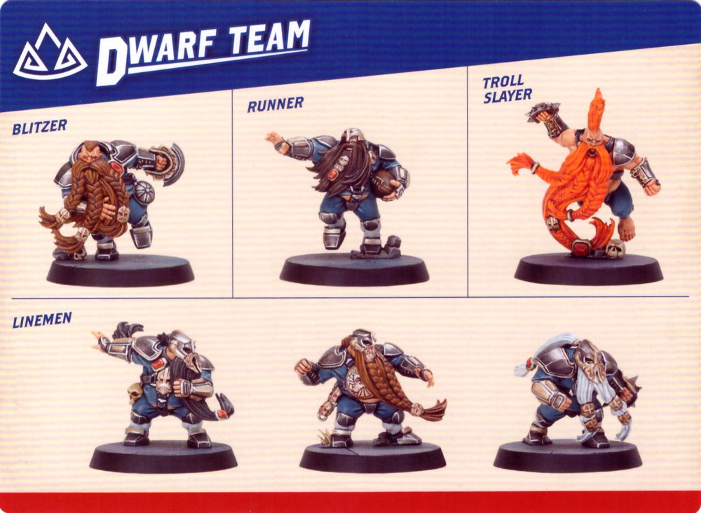{ width=1000 height=732 }

| Position      | Move | Block | Throw | Armour | Ability                |
|--------------|------|-------|-------|--------|------------------------|
| Lineman      | 4    | 1     | 5+    | 2+     |                        |
| Runner       | 6    | 1     | 4+    | 3+     | Safe Hands         |
| Blitzer      | 5    | 1     | 4+    | 2+     | Offensive Specialist |
| Troll Slayer | 5    | 1     | 6+    | 4+     | Frenzied           |

EMERGENCY RESERVES: 4

**Safe Hands:** If this Player is Knocked Down whilst holding the ball, you can choose which adjacent square the ball Bounces into instead of rolling a D8.

**Offensive Specialist:** When this Player makes a Block Action, you can choose to re-roll the Block Dice.

**Frenzied:** After this Player makes a Mark Action, they may make a free Block Action against a Player they are now Marking.

---

## ELVEN UNION TEAM

NUMBER OF PLAYERS: 6

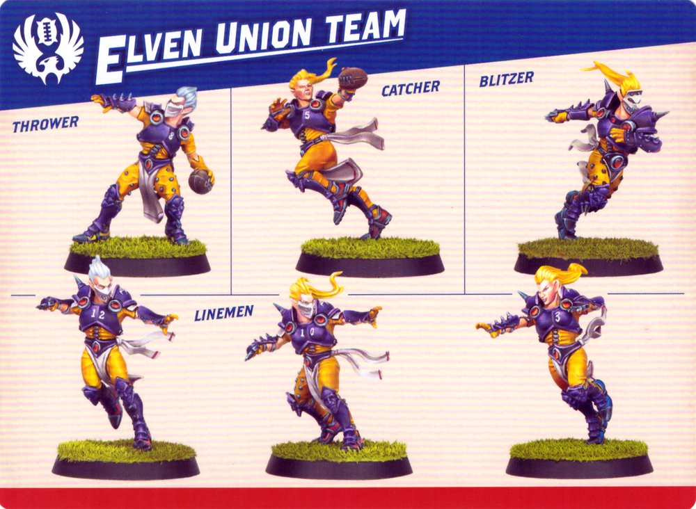{ width=1000 height=732 }

| Position  | Move | Block | Throw | Armour | Ability                |
|-----------|------|-------|-------|--------|------------------------|
| Lineman   | 6    | 1     | 3+    | 4+     |                        |
| Thrower   | 6    | 1     | 2+    | 4+     | Expert Passer      |
| Catcher   | 8    | 1     | 3+    | 5+     | Catcher's Instincts |
| Blitzer   | 7    | 1     | 3+    | 3+     | Offensive Specialist |

EMERGENCY RESERVES: 4

**Expert Passer:** Whenever this Player fails a Throw Check, they may re-roll the dice.

**Catcher's Instincts:** If this Player is Open and is the target of a successful Throw Action (not a Hand-off), they can make a free Run Action.

**Offensive Specialist:** When this Player makes a Block Action, you can choose to re-roll the Block Dice.

---

## GNOME TEAM

NUMBER OF PLAYERS: 8

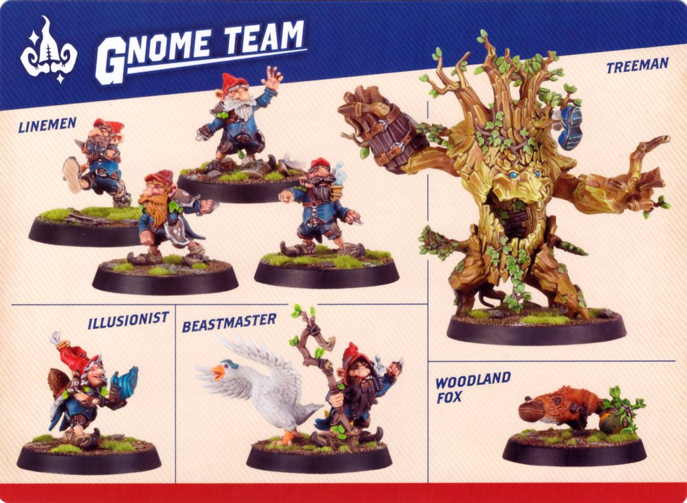{ width=1000 height=732 }

| Position        | Move | Block | Throw | Armour | Ability          |
|---------------|------|-------|-------|--------|------------------|
| Lineman      | 5    | 1     | 4+    | 6+     |                  |
| Illusionist  | 5    | 1     | 3+    | 6+     | Dump-off      |
| Beastmaster  | 5    | 1     | 4+    | 4+     | Woodland Aid  |
| Woodland Fox | 7    | 1     | 6+    | 6+     | Lithe Creature |
| Treeman      | 2    | 2     | 5+    | 2+     | Hulking Brute |

EMERGENCY RESERVES: 4

**Dump-off:** When this Player is chosen as the target of a Block Action, they may Interrupt the Action and make a free Short Throw (or Hand-off) with no modifiers, even if they are Marked.

**Woodland Aid:** Block Actions that target this Player may not be Assisted.

**Lithe Creature:** When this Player makes a Run Action they can move adjacent to Opposition Players, but must end the Action Open. Additionally, this Player cannot make Throw Actions.

**Hulking Brute:** When this Player makes a Block Action, treat results on the Block Dice of 'Tackle' and 'Smash' as 'Kerrunch!'. In addition, if this Player is the target of a Block Action, treat results of 'Shove' as 'Miss'.

---

## GOBLIN TEAM

NUMBER OF PLAYERS: 7

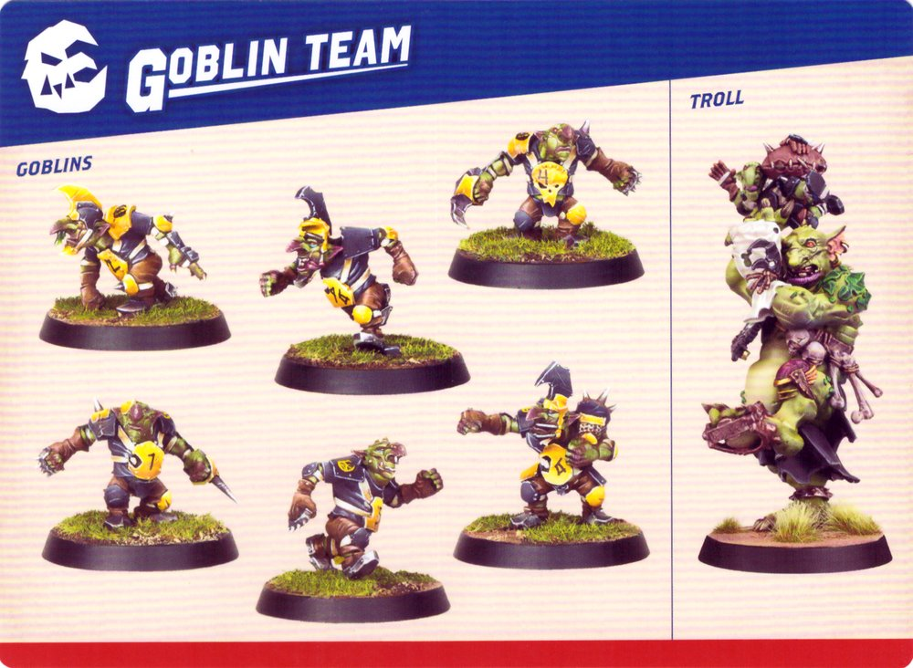{ width=1000 height=732 }

| Position  | Move | Block | Throw | Armour | Ability         |
|-----------|------|-------|-------|--------|----------------|
| Goblin    | 6    | 1     | 4+    | 6+     | Elusive    |
| Troll     | 4    | 2     | 5+    | 2+     | Hulking Brute |

EMERGENCY RESERVES: 4

**Elusive:** When this Player makes a Run Action they can move adjacent to Opposition Players, but must end the Action Open.

**Hulking Brute:** When this Player makes a Block Action, treat results on the Block Dice of 'Tackle' and 'Smash' as 'Kerrunch!'. In addition, if this Player is the target of a Block Action, treat results of 'Shove' as 'Miss'.

---

## HALFLING TEAM

NUMBER OF PLAYERS: 7

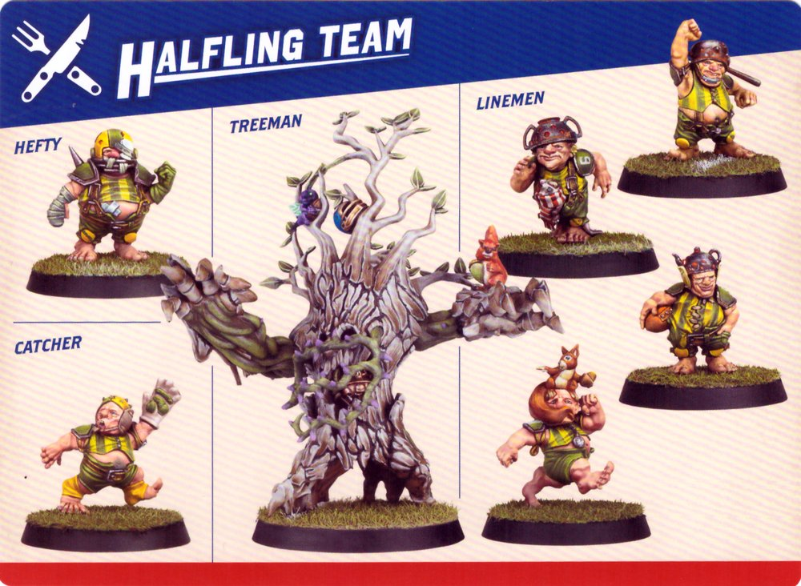{ width=1000 height=732 }

| Position  | Move | Block | Throw | Armour | Ability                |
|-----------|------|-------|-------|--------|------------------------|
| Lineman   | 5    | 1     | 4+    | 6+     |                        |
| Catcher   | 5    | 1     | 4+    | 6+     | Catcher's Instincts |
| Hefty     | 5    | 1     | 4+    | 4+     | Stand Firm         |
| Treeman   | 2    | 2     | 5+    | 2+     | Hulking Brute      |

EMERGENCY RESERVES: 2

**Catcher's Instincts:** If this Player is Open and is the target of a successful Throw Action (not a Hand-off), they can make a free Run Action.

**Stand Firm:** When this Player is the target of a Block Action, treat results of 'Shove' as 'Miss'.

**Hulking Brute:** When this Player makes a Block Action, treat results on the Block Dice of 'Tackle' and 'Smash' as 'Kerrunch!'. In addition, if this Player is the target of a Block Action, treat results of 'Shove' as 'Miss'.

---

## HUMAN TEAM

NUMBER OF PLAYERS: 6

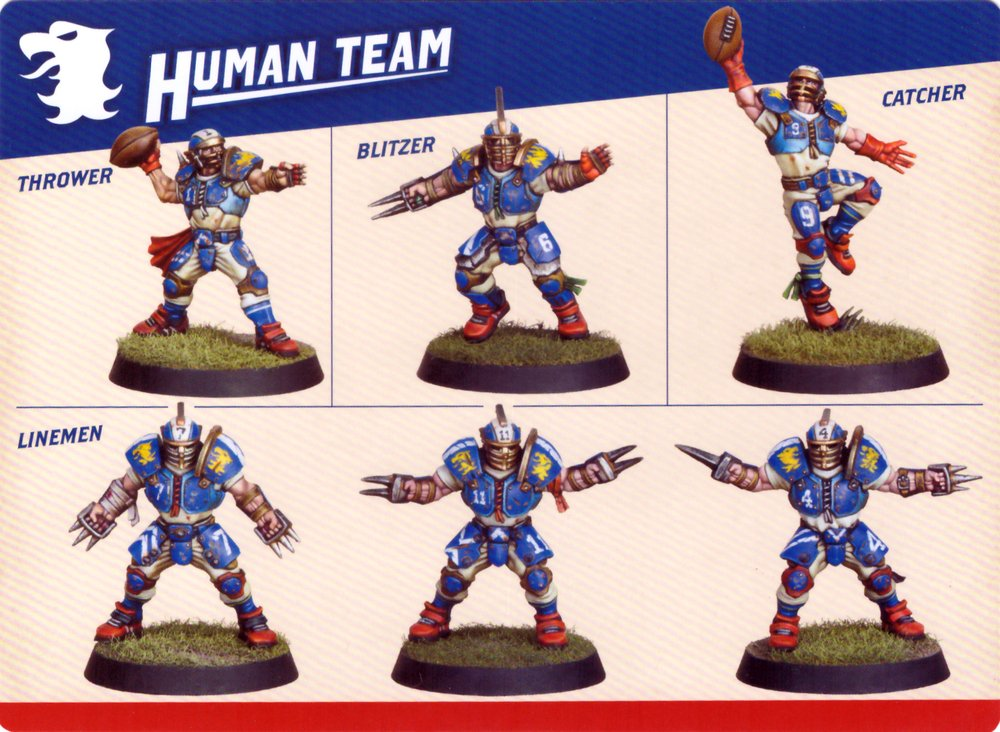{ width=1000 height=732 }

| Position  | Move | Block | Throw | Armour | Ability                |
|-----------|------|-------|-------|--------|------------------------|
| Lineman   | 6    | 1     | 4+    | 3+     |                        |
| Thrower   | 6    | 1     | 3+    | 3+     | Handling Skills    |
| Catcher   | 8    | 1     | 4+    | 5+     | Catcher's Instincts |
| Blitzer   | 7    | 1     | 4+    | 3+     | Offensive Specialist |

EMERGENCY RESERVES: 4

**Handling Skills:** Whenever this Player is moved into a square containing the ball, they pick it up, as though they were making a Run Action.

**Catcher's Instincts:** If this Player is Open and is the target of a successful Throw Action (not a Hand-off), they can make a free Run Action.

**Offensive Specialist:** When this Player makes a Block Action, you can choose to re-roll the Block Dice.

---

## IMPERIAL NOBILITY TEAM

NUMBER OF PLAYERS: 6

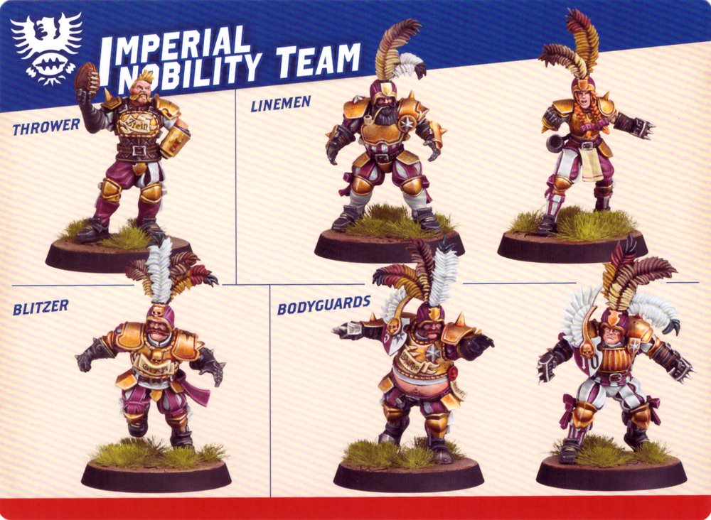{ width=1000 height=732 }

| Position   | Move | Block | Throw | Armour | Ability                |
|------------|------|-------|-------|--------|------------------------|
| Lineman    | 6    | 1     | 4+    | 5+     |                        |
| Thrower    | 6    | 1     | 3+    | 4+     | Running Pass       |
| Bodyguard  | 6    | 1     | 5+    | 3+     | Stand Firm         |
| Blitzer    | 7    | 1     | 4+    | 3+     | Offensive Specialist |

EMERGENCY RESERVES: 3

**Running Pass:** After this Player makes a Run Action, they may make a free Short Throw.

**Stand Firm:** When this Player is the target of a Block Action, treat results of 'Shove' as 'Miss'.

**Offensive Specialist:** When this Player makes a Block Action, you can choose to re-roll the Block Dice.

---

## KHORNE TEAM

NUMBER OF PLAYERS: 6

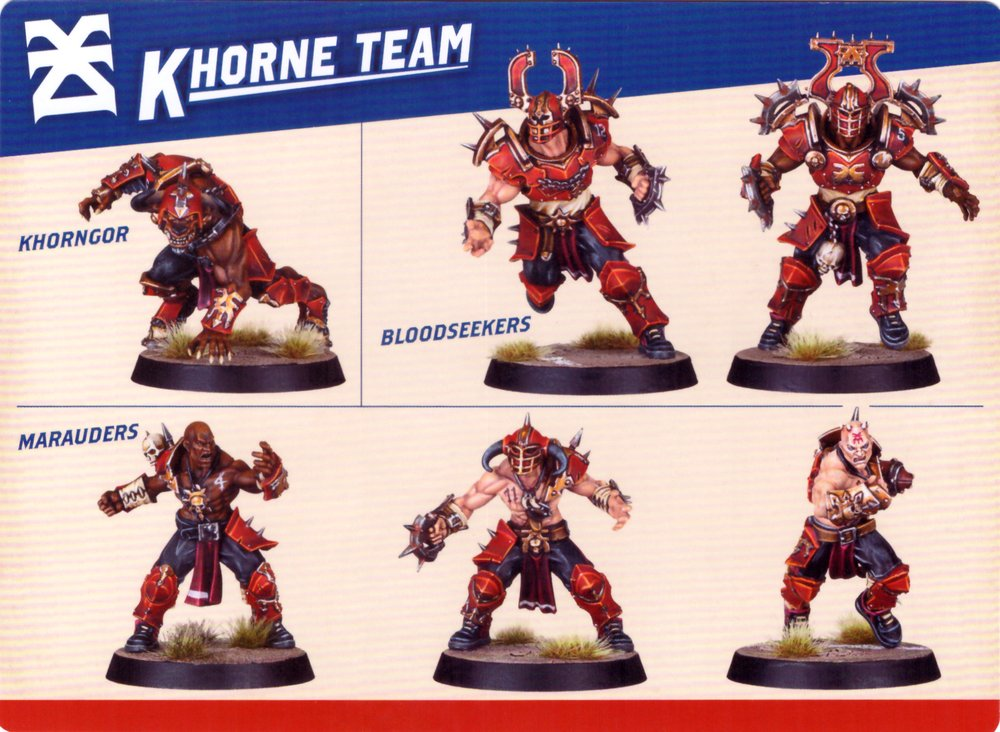{ width=1000 height=732 }

| Position    | Move | Block | Throw | Armour | Ability      |
|------------|------|-------|-------|--------|--------------|
| Marauder   | 6    | 1     | 4+    | 4+     |              |
| Khorngor   | 6    | 1     | 4+    | 4+     | Head-butt |
| Bloodseeker | 5    | 2     | 6+    | 3+     | Enforcer  |

EMERGENCY RESERVES: 4

**Head-butt:** If this Player makes a Run Action, followed by a Mark Action, they can immediately make a free Block Action.

**Enforcer:** When this Player makes a Block Action, you must resolve the result of each Block Dice rolled, picking the order they are resolved in. For each result that causes the target to be Knocked Down, the opposing Coach must make an Armour Check for the target Player. This Player must always follow-up after a Shove result.

---

## LIZARDMEN TEAM

NUMBER OF PLAYERS: 6

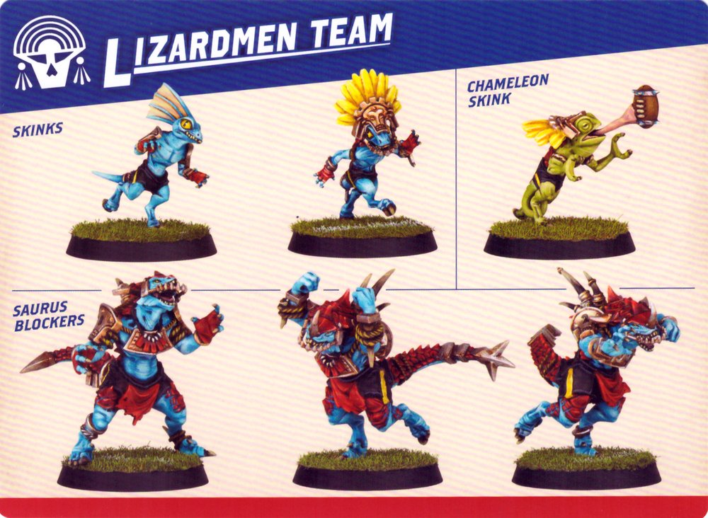{ width=1000 height=732 }

| Position          | Move | Block | Throw | Armour | Ability                |
|------------------|------|-------|-------|--------|------------------------|
| Skink           | 8    | 1     | 4+    | 6+     | Safe Hands         |
| Chameleon Skink | 7    | 1     | 3+    | 6+     | Catcher's Instincts |
| Saurus Blocker  | 6    | 2     | 6+    | 2+     |                        |

EMERGENCY RESERVES: 5

**Safe Hands:** If this Player is Knocked Down whilst holding the ball, you can choose which adjacent square the ball Bounces into instead of rolling a D8.

**Catcher's Instincts:** If this Player is Open and is the target of a successful Throw Action (not a Hand-off), they can make a free Run Action.

---

## NECROMANTIC TEAM

NUMBER OF PLAYERS: 7

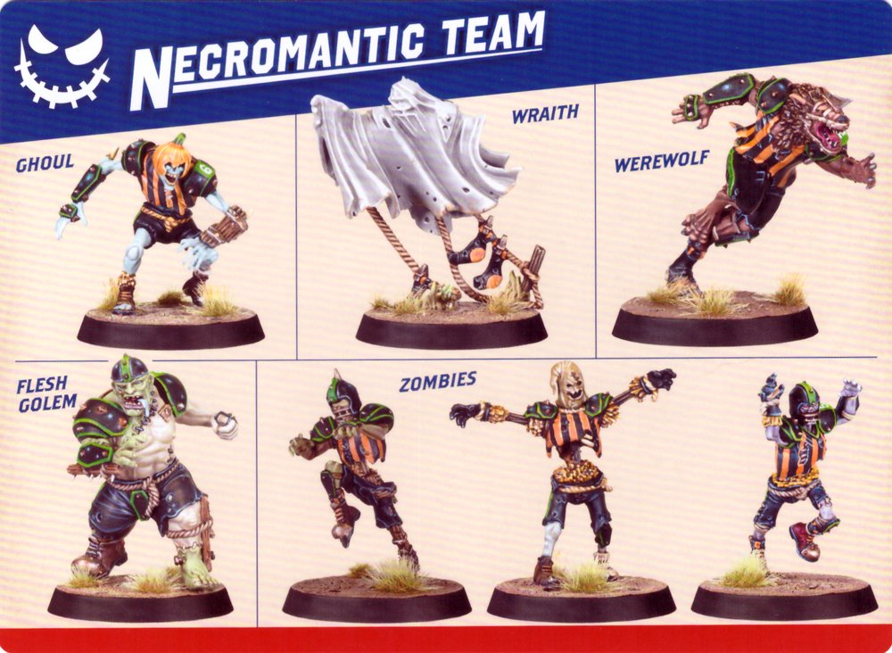{ width=1000 height=732 }

| Position      | Move | Block | Throw | Armour | Ability                |
|--------------|------|-------|-------|--------|------------------------|
| Zombie       | 4    | 1     | 6+    | 3+     |                        |
| Ghoul        | 7    | 1     | 4+    | 4+     | Safe Hands         |
| Wraith       | 6    | 1     | -     | 3+     | Ethereal           |
| Werewolf     | 8    | 1     | 4+    | 3+     | Violent            |
| Flesh Golem  | 4    | 2     | 6+    | 2+     | Stand Firm         |

EMERGENCY RESERVES: 5

**Safe Hands:** If this Player is Knocked Down whilst holding the ball, you can choose which adjacent square the ball Bounces into instead of rolling a D8.

**Ethereal:** When this Player makes a Run Action, they can move adjacent to or through Opposition Players and through obstructions and Team-mates, but they must end the Action Open and not on a Player or obstruction.

**Violent:** When this Player makes a Block Action or Foul Action, roll a D6 along with the Block Dice. If the result is a 6, the target is automatically Injured - do not resolve the Block Dice.

**Stand Firm:** When this Player is the target of a Block Action, treat results of 'Shove' as 'Miss'.

---

## NORSE TEAM

NUMBER OF PLAYERS: 7

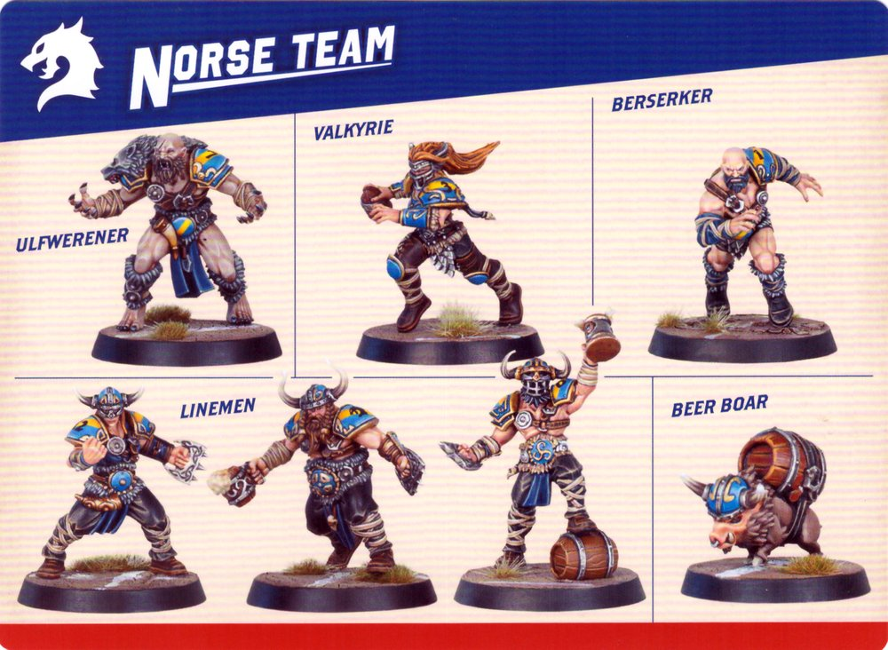{ width=1000 height=732 }

| Position    | Move | Block | Throw | Armour | Ability                |
|------------|------|-------|-------|--------|------------------------|
| Lineman    | 6    | 1     | 4+    | 4+     |                        |
| Beer Boar  | 5    | 1     | -     | 6+     | Pick-me-up         |
| Berserker  | 6    | 1     | 4+    | 4+     | Offensive Specialist |
| Valkyrie   | 7    | 1     | 3+    | 4+     | Safe Hands         |
| Ulfwerener | 6    | 2     | 6+    | 3+     | Frenzied           |

EMERGENCY RESERVES: 3

**Pick-me-up:** At the end of any Action performed by this Player, any adjacent Prone Team-mates may make a free Stand Up Action.

**Offensive Specialist:** When this Player makes a Block Action, you can choose to re-roll the Block Dice.

**Safe Hands:** If this Player is Knocked Down whilst holding the ball, you can choose which adjacent square the ball Bounces into instead of rolling a D8.

**Frenzied:** After this Player makes a Mark Action, they may make a free Block Action against a Player they are now Marking.

---

## NURGLE TEAM

NUMBER OF PLAYERS: 6

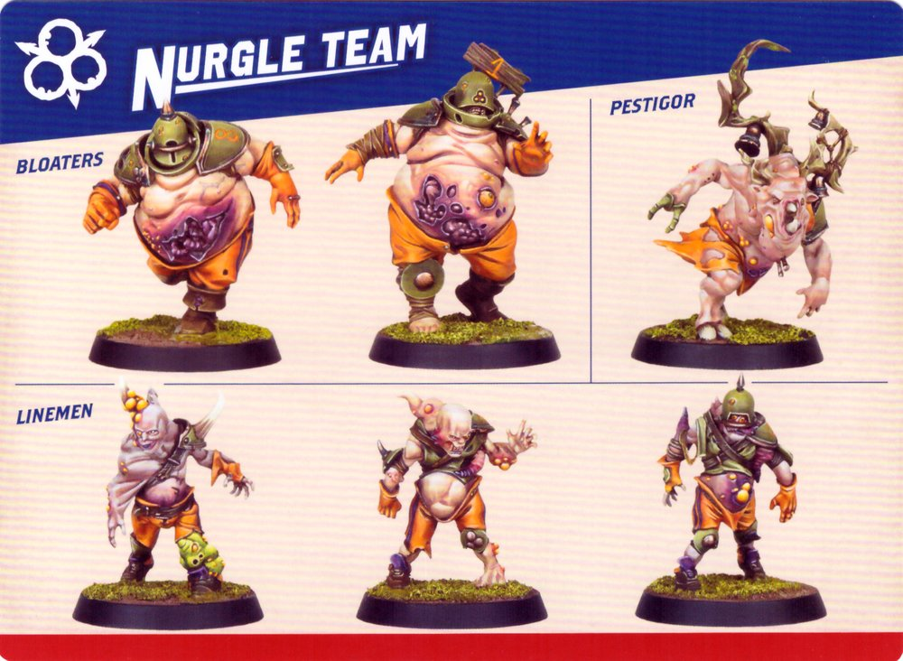{ width=1000 height=732 }

| Position  | Move | Block | Throw | Armour | Ability      |
|-----------|------|-------|-------|--------|--------------|
| Lineman   | 5    | 1     | 6+    | 4+     |              |
| Pestigor  | 6    | 1     | 4+    | 3+     | Head-butt |
| Bloater   | 4    | 2     | 6+    | 3+     | Stand Firm |

EMERGENCY RESERVES: 4

**Head-butt:** If this Player makes a Run Action, followed by a Mark Action, they can immediately make a free Block Action.

**Stand Firm:** When this Player is the target of a Block Action, treat results of 'Shove' as 'Miss'.

---

## OGRE TEAM

NUMBER OF PLAYERS: 8

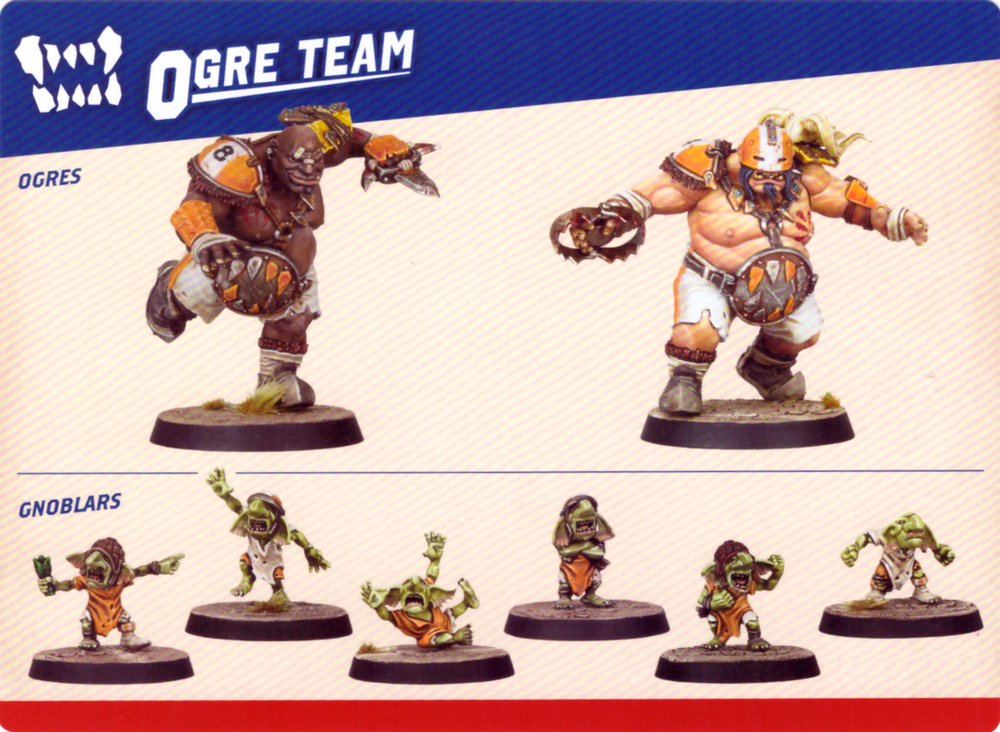{ width=1000 height=732 }

| Position  | Move | Block | Throw | Armour | Ability         |
|-----------|------|-------|-------|--------|----------------|
| Gnoblar   | 5    | 1     | 5+    | 6+     | Titchy     |
| Ogre      | 5    | 2     | 5+    | 2+     | Hulking Brute |

EMERGENCY RESERVES: 4

**Titchy:** Opposition Players may move adjacent to this Player during a Run Action, but doing so ends the Action. When this Player makes a Block Action, treat results of 'Tackle' as 'Miss'.

**Hulking Brute:** When this Player makes a Block Action, treat results on the Block Dice of 'Tackle' and 'Smash' as 'Kerrunch!'. In addition, if this Player is the target of a Block Action, treat results of 'Shove' as 'Miss'.

---

## ORC TEAM

NUMBER OF PLAYERS: 6

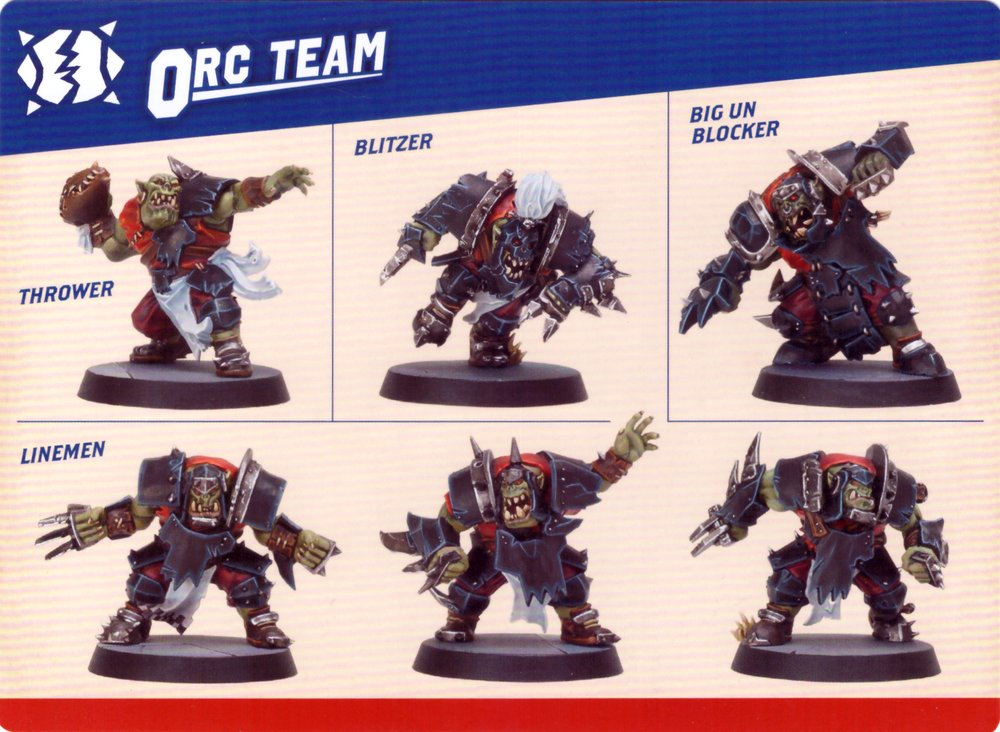{ width=1000 height=732 }

| Position       | Move | Block | Throw | Armour | Ability                |
|---------------|------|-------|-------|--------|------------------------|
| Lineman       | 5    | 1     | 4+    | 3+     |                        |
| Thrower       | 5    | 1     | 3+    | 3+     | Handling Skills    |
| Blitzer       | 6    | 1     | 4+    | 2+     | Offensive Specialist |
| Big Un Blocker | 5    | 2     | 6+    | 2+     | Mighty Blow        |

EMERGENCY RESERVES: 4

**Handling Skills:** Whenever this Player is moved into a square containing the ball, they pick it up, as though they were making a Run Action.

**Offensive Specialist:** When this Player makes a Block Action, you can choose to re-roll the Block Dice.

**Mighty Blow:** When this Player makes a Block Action, treat results of 'Smash' as 'Kerrunch!'.

---

## SHAMBLING UNDEAD TEAM

NUMBER OF PLAYERS: 7

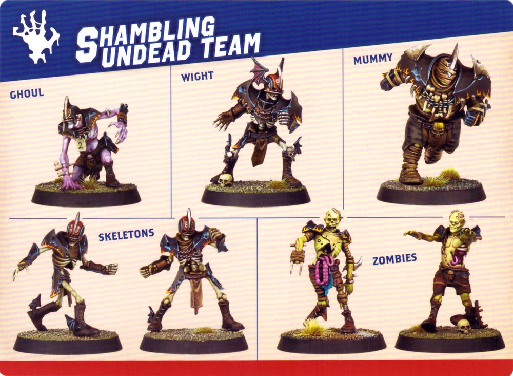{ width=1000 height=732 }

| Position      | Move | Block | Throw | Armour | Ability                |
|--------------|------|-------|-------|--------|------------------------|
| Zombie       | 4    | 1     | 6+    | 3+     |                        |
| Skeleton     | 5    | 1     | 6+    | 4+     | Regenerate         |
| Ghoul        | 7    | 1     | 4+    | 4+     | Safe Hands         |
| Wight        | 6    | 1     | 5+    | 3+     | Offensive Specialist |
| Mummy        | 3    | 2     | 6+    | 2+     | Mighty Blow        |

EMERGENCY RESERVES: 4

**Regenerate:** After the Pre-Turn Sequence of your turn, but before making your first Player Action, if this Player is Prone they can immediately make a free Stand Up Action.

**Safe Hands:** If this Player is Knocked Down whilst holding the ball, you can choose which adjacent square the ball Bounces into instead of rolling a D8.

**Offensive Specialist:** When this Player makes a Block Action, you can choose to re-roll the Block Dice.

**Mighty Blow:** When this Player makes a Block Action, treat results of 'Smash' as 'Kerrunch!'.

---
## SKAVEN TEAM

NUMBER OF PLAYERS: 6

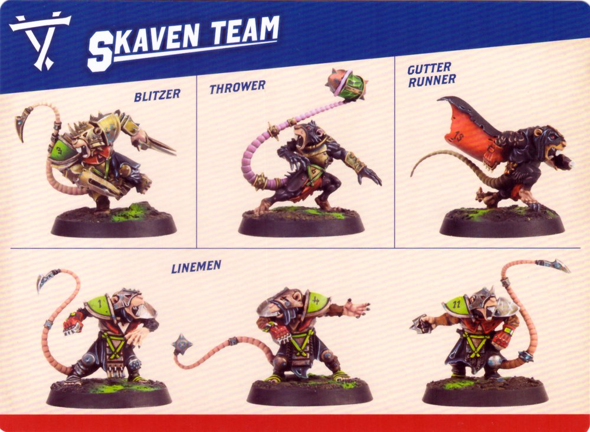{ width=1000 height=732 }

| Position       | Move | Block | Throw | Armour | Ability                |
|---------------|------|-------|-------|--------|------------------------|
| Lineman       | 7    | 1     | 4+    | 4+     |                        |
| Thrower       | 7    | 1     | 3+    | 4+     | Handling Skills    |
| Blitzer       | 7    | 1     | 5+    | 3+     | Offensive Specialist |
| Gutter Runner | 9    | 1     | 4+    | 5+     | Safe Hands         |

EMERGENCY RESERVES: 4

**Handling Skills:** Whenever this Player is moved into a square containing the ball, they pick it up, as though they were making a Run Action.

**Offensive Specialist:** When this Player makes a Block Action, you can choose to re-roll the Block Dice.

**Safe Hands:** If this Player is Knocked Down whilst holding the ball, you can choose which adjacent square the ball Bounces into instead of rolling a D8.

---

## SNOTLING TEAM

NUMBER OF PLAYERS: 10

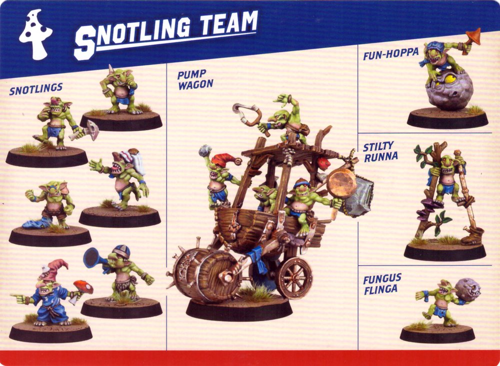{ width=1000 height=732 }

| Position       | Move | Block | Throw | Armour | Ability                |
|---------------|------|-------|-------|--------|------------------------|
| Snotling      | 5    | 1     | 5+    | -      | Insignificant      |
| Fungus Flinga | 5    | 1     | 4+    | -      | Bomber             |
| Fun-Hoppa     | 6    | 1     | 5+    | -      | Leap               |
| Stilty Runna  | 7    | 1     | 5+    | -      |                        |
| Pump Wagon    | D6   | 3     | -     | 3+     | War Machine        |

EMERGENCY RESERVES: 5

**Insignificant:** Opposition Players may move adjacent to this Player during a Run Action. When this Player makes a Block Action, treat results of 'Tackle' as 'Miss'.

**Bomber:** This Player can make a Block Action whilst Open. Choose an Open or Marked Opposition Player within 3 squares to be the target. The Block Action cannot be Assisted and treat results of 'Shove' as 'Miss'.

**Leap:** When this Player makes a Run Action, they can move adjacent to and through Opposition Players and Team-mates, but must end the Action Open.

**War Machine:** This Player can make a Run Action whilst Marked. When this Player makes a Run Action, they can move adjacent to Opposition Players and finish the Action either Open or Marked. The Player's Block Actions cannot be Assisted.

---

## VAMPIRE TEAM

NUMBER OF PLAYERS: 7

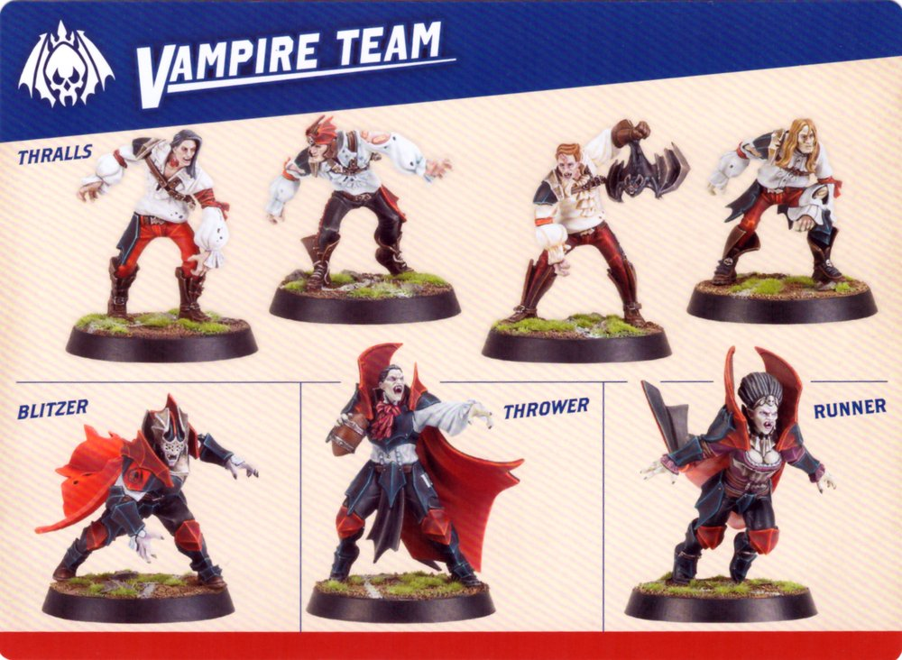{ width=1000 height=732 }

| Position  | Move | Block | Throw | Armour | Ability      |
|-----------|------|-------|-------|--------|--------------|
| Thrall    | 6    | 1     | 5+    | 6+     | Minion   |
| Runner    | 8    | 1     | 4+    | 3+     | Bloodlust |
| Thrower   | 6    | 2     | 2+    | 3+     | Bloodlust |
| Blitzer   | 6    | 2     | 5+    | 3+     | Bloodlust |

EMERGENCY RESERVES: 4

**Minion:** When an adjacent Team-mate would be Injured as a result of their Bloodlust Ability, you may choose for this Player to be Injured instead.

**Bloodlust:** After resolving the Claim Challenge Card Step for a Block Action performed by this Player, if any of the Block Dice rolled showed a Miss, this Player is Injured. If they were holding a ball, it will Bounce.

---

## WOOD ELF TEAM

NUMBER OF PLAYERS: 6

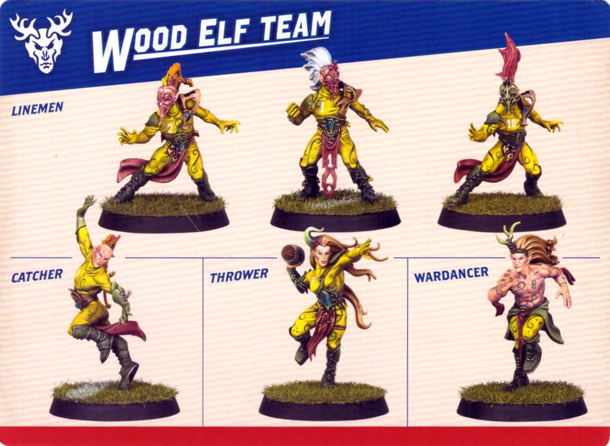{ width=1000 height=732 }

| Position   | Move | Block | Throw | Armour | Ability                |
|------------|------|-------|-------|--------|------------------------|
| Lineman    | 7    | 1     | 4+    | 5+     |                        |
| Thrower    | 7    | 1     | 2+    | 5+     | Handling Skills    |
| Catcher    | 8    | 1     | 4+    | 6+     | Catcher's Instincts |
| Wardancer  | 8    | 1     | 4+    | 4+     | Wardance           |

EMERGENCY RESERVES: 4

**Handling Skills:** Whenever this Player is moved into a square containing the ball, they pick it up, as though they were making a Run Action.

**Catcher's Instincts:** If this Player is Open and is the target of a successful Throw Action (not a Hand-off), they can make a free Run Action.

**Wardance:** This Player can make a free Sidestep Action.
