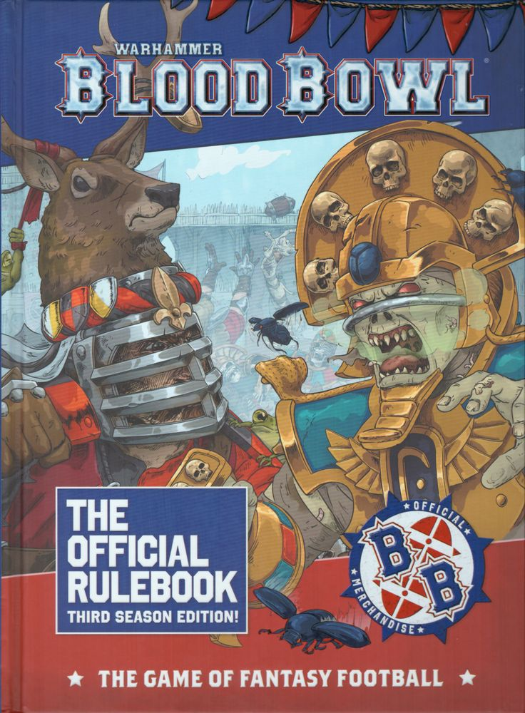
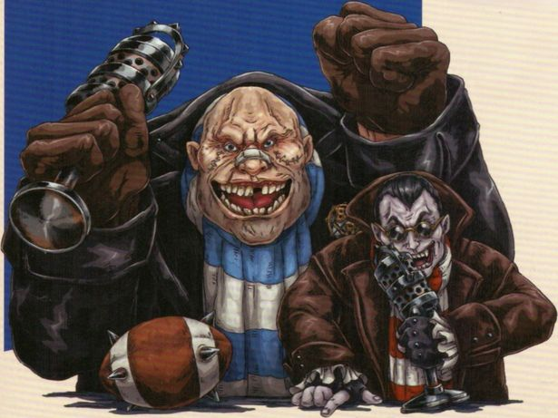

# GREETINGS SPORTS FANS!

Welcome to Season 3 of Blood Bowl, the game of fantasy football! In Blood Bowl you take on the role of Coach of your very own team, leading 11 spike-adorned, blood-crazed, and frankly insane, maniacs onto the pitch in an attempt to defeat your rivals in a clash of sporting glory! Victory and violence is the name of the game and if you're lucky, you may find yourself showered with fame, fortune and fan adulation along the way.

In this rulebook you'll find everything you need to know to play the great game. From the rich history of Nuffle and his sacred game, to the full rules and game mechanics you'll need to play Blood Bowl, either in a league or a tournament setting. There is also the full list of Skills and Traits used by the players, the rosters for the various races that play the game and the rules for many Star Players - the greatest sporting stars to step onto the gridiron!

But don't just take our word for it - let's hear what two bonafide legends of the game have to say. Introducing the legendary commentary team: Jim & Bob!

---

* "Good evening, sports fans! I'm Jim Johnson, welcoming you once again to a thrilling Blood Bowl encounter! You join us at the Emperor's Bowl for the final of the XLV Blood Bowl Classic, where the Brionne Barons are set to take on the Nehekharan Nightmares in a clash to determine this year's champions. I'm joined, as always, by my broadcasting counterpart - a true Blood Bowl pioneer and legend of the game, the enigmatic Bob Bifford!"

* "Thanks, Jim, and I must say it's been quite a season! New teams have seemingly sprung from the ground and the game has never been in better shape!"

* "You're not wrong, Bob! Blood Bowl is thriving the world over and we are seeing teams that have only recently joined the competitive circuit already competing at the highest level, and hanging with the big boys of the sport. Take today's contenders; both the Brionne Barons and the Nehekharan Nightmares are competing in their very first Blood Bowl Classic and they've both made the final - remarkable!"

* "That's right, Jim, a truly astonishing achievement. Personally, I'm just glad we don't have to watch any puny Elves flouncing about the place this evening."

* "Still holding onto that old grudge I see, Bob? Well, that's about it from us as the teams are stepping out onto the pitch. It's going to be a clash of chivalry versus chicanery, and I for one cannot wait!"

**LET'S PLAY BLOOD BOWL!**

