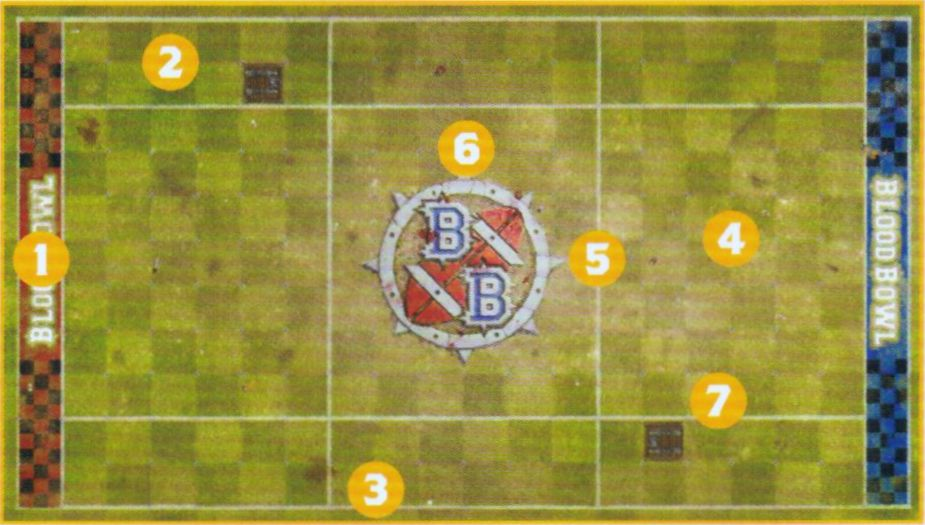
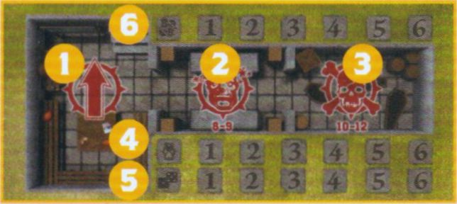

## THE BLOOD BOWL SEVENS PITCH

Blood Bowl Sevens uses a bespoke pitch that shares many similarities with the regular Blood Bowl pitch, but is shorter and narrower to enable faster, action-packed play. There are some key differences to be aware of, which we will go through here. A Sevens pitch is split into a number of sections:

### The Pitch

A Blood Bowl Sevens pitch features:

1. **End Zones:** The areas at the short edges of the pitch where players are trying to get the ball in to order to score a Touchdown.
2. **Wide Zones:** These are the areas on either side of the pitch that run the length of the pitch from End Zone to End Zone. They are two squares wide.
3. **Sidelines:** These run the length of the pitch from End Zone to End Zone and denote the edge of the pitch.
4. **Centre Field:** This is the area in the middle of the pitch between the two Wide Zones that runs from End Zone to End Zone. It is seven squares wide, the same as the regular Blood Bowl pitch.
5. **Lines of Scrimmage:** The pitch is split into three sections by two lines that run across the width of the pitch. These are called Lines of Scrimmage, and denote where the two teams will line up for kick-off.
6. **No Man's Land:** The area of the pitch in-between the two Lines of Scrimmage is often referred to as No Man's Land. This includes the parts of the Wide Zones that also sits in-between the two Lines of Scrimmage.
7. **Trapdoors:** Each half has a single Trapdoor within one of its Wide Zones.

{ width=925 height=525 }

### Dugouts

Just as with normal Blood Bowl, each team in a game of Blood Bowl Sevens will have its own Dugout. The Dugouts used for Blood Bowl Sevens are almost identical to normal Dugouts, as described on page 24 of the *Blood Bowl Rulebook*, except for one important distinction. On a Blood Bowl Sevens Dugout the Turn Tracker and Team Re-roll tracker only go up to six each, rather than the usual eight. This is because a game of Blood Bowl Sevens only has six Turns per half.

1. **The Reserves Box:** This is where any healthy players are kept, ready for the next Drive.
2. **The Knocked-out Box:** Players that have been Knocked-out are placed here until they recover.
3. **The Casualty Box:** Any Players that have been injured, or worse, are placed here for the remainder of the game.
4. **Turn Tracker:** This is where a team places their Turn Marker, which is important for keeping track of which Turn a team is on.
5. **Team Re-roll Trackers:** This is where a team places their Team Re-roll Marker, which is important for tracking how many Team Re-rolls a team currently has remaining.
6. **The Score Tracker:** A rather important feature in any game! Whenever a team scores a Touchdown, they record it here.

{ width=644 height=288 }

## DRAFTING A BLOOD BOWL SEVENS TEAM

Blood Bowl Sevens teams are drafted in a similar way as regular Blood Bowl teams, using the same Team Rosters found in the *Blood Bowl Rulebook* and *Spike! Journals*. Where they differ are the rules dictating how they are drafted, with the differences explained in this section.

### Team Draft Budget

When drafting a Blood Bowl Sevens team, a Coach has a Team Draft Budget of 600,000 gold pieces rather than the usual 1,000,000 gold pieces - there is less cash in the game after all! A Sevens team's budget can be spent on anything a team could normally buy while drafting. Some aspects of a team, such as Sideline Staff and Team Re-rolls may cost more than usual when drafting a Sevens team; if that is the case, it will be identified here.

### Hiring Players

Every Blood Bowl team needs players and Sevens teams are no exception! Each Team Roster details all of the players available to that type of team, including their Hiring Fee which you will need to pay from your Team Draft Budget to permanently hire the player and add them to your Team Draft List.

### Number of Players

The most important thing to note is that Sevens teams require a minimum of 7 permanently hired players when they are first drafted - though if you are playing in a league, then injuries may temporarily take the team below this as explained on page 14.

No Blood Bowl Sevens team may ever have more than 11 permanently hired players on their Team Draft List.

### Player Positions

In addition to the maximum number of players allowed on a Sevens team, there is also a limit to the type of players that can be included on a Team Draft List. Simply put, due to the very nature of Blood Bowl Sevens, there just aren't as many top quality players playing it - if they were, they'd probably already be playing for the first team!

Sevens teams can include no more than 4 total players without the **Lineman** Keyword. However, any **QTY** restrictions for the individual player positions on a roster remain in place. So if a team had a player type with a QTY of 0-2, they could still only include a maximum of 2 of that type of player.

So long as the QTY of any player positions isn't exceeded, you may include any combination of non-Lineman players on your Team Draft List - so long as there is still no more than 4 players without the Lineman keyword, of course!

*For example: A Human team hires 2 Blitzers (reaching their QTY limit), 1 Ogre and 1 Thrower. As all four non-Lineman have now been filled, any remaining players must be filled by Human Linemen and/or Halfling Hopefuls, the latter of which is still restricted by the 0-3 QTY.*

*For example: An Imperial Nobility team hires 4 Bodyguards. They may now not include any Imperial Throwers, Noble Blitzers or Ogres and must fill out their Team Draft with only players with the Lineman keyword - in this case, Imperial Retainers.*

### Purchasing Team Re-rolls

Blood Bowl Sevens teams are made up of the reserves and rookies of the team, representing up-coming players attempting to make a name for themselves during the off-season and break into the first team in time for the next season to kick off. Being not quite as skilled as those who have made it in the big leagues, Sevens teams are not well-oiled machines like their counterparts who play during the regular Blood Bowl season.

When drafting a Sevens team roster, or later during the course of a league, Coaches may purchase Team Re-rolls. Each Team Re-roll costs 100,000 gold pieces rather than the cost given on the Team Roster. This increase in cost is down to the extra effort teams have to invest to reach the same level of training as their better drilled counterparts.

### Hiring Sideline Staff

Sevens teams are less likely to have extensive Sideline Staff on the payroll, with the few reliable and competent candidates often the focus of bidding wars between team owners, allowing the staff to charge exorbitant fees for their work! Nevertheless, Sevens teams can hire a number of Sideline Staff as detailed here.

#### Assistant Coaches

When drafting a Sevens team, or later during the course of a league, Coaches may hire Assistant Coaches at a cost of 20,000 gold pieces each. A Sevens team may never have more than 3 Assistant Coaches.

#### Cheerleaders

When drafting a Sevens team, or later during the course of a league, Coaches may hire Cheerleaders at a cost of 20,000 gold pieces each. A Sevens team may never have more than 3 Cheerleaders.

#### Apothecary

When drafting a Sevens team, or later during the course of a league, a Sevens team may purchase an Apothecary if their Team Roster allows them to, at a cost of 80,000 gold pieces. A team may never have more than 1 Apothecary.

Teams able to hire an Apothecary may also hire additional Wandering Apothecaries during a league as Inducements as normal.

#### Dedicated Fans

Just like more well-known Blood Bowl teams, every Sevens team has small groups of fanatical fans eager to scream about how their team is the best and is a step away from the big leagues.

When drafting a Sevens team it will automatically have a Dedicated Fans Characteristic of 1, representing 100 fans, likely made up of overly enthusiastic and competitive parents, bored spouses and the customers of various local drinking establishments!

When drafting a Sevens team, a Coach may improve the Dedicated Fans Characteristic by 1, at a cost of 20,000 gold pieces per improvement. Over the course of a league, the Dedicated Fans characteristic will increase and decrease as normal as games are played - though in Sevens the Dedicated Fans Characteristic can never be more than 5 or less than 1.

## PLAYING BLOOD BOWL SEVENS

Earlier, we mentioned that Blood Bowl Sevens follows the standard rules for playing Blood Bowl as described in the *Blood Bowl Rulebook*. However, there are some instances where the rules are modified to take into account the smaller pitch size and fewer number of players on the pitch. Any modifications to the core Blood Bowl rules can be found in this section. If you are unsure on how something works, and cannot find it here, then it will almost certainly work the same as it is described in the *Blood Bowl Rulebook*.

### Set-up

When setting up their players, each team must select seven players to take part in the Drive, or as many players as they can if less than seven are available. Any players not chosen to be set up for the Drive are placed in the Reserves box. A team may not set up more than seven players at the start of a Drive.

The kicking team must set up first followed by the receiving team. Teams are set up as follows:

- Teams must set up fully within the area between their End Zone and their Line of Scrimmage.
- Each team can set up a maximum of one player in each of their Wide Zones.
- Each team must set up a minimum of three players in the Centre Field directly adjacent to their own Line of Scrimmage.
- Neither team may set up players in No Man's Land under any circumstance.

If a team is unable to set up three or more players on their Line of Scrimmage during any Start of Drive Sequence, then they may opt to Concede Without Penalty. This works exactly as described on page 101 of the *Blood Bowl Rulebook*, including for League Play.

Should a team that is unable to set up three or more players on their Line of Scrimmage wish to soldier on, then all available players must be set up on the Line of Scrimmage, as described above - and no doubt they'll be praying to Nuffle for some form of miracle!

### The Kick-off

As the players who are nominated to kick the ball are usually not as good at doing so, there is a small change to how this works in Blood Bowl Sevens. When rolling to Deviate the Kick-off, roll two D6 for the distance and use the lower result. This represents the kickers simply not being able to put as much power into their kicks, and will also result in fewer Touchbacks.

Additionally, if after the ball Deviates it has landed in No Man's Land, then this will not cause a Touchback. A Touchback will only be caused if the ball leaves the pitch, or crosses the kicking team's Line of Scrimmage.

### The Kick-off Event Table

The Kick-off Event Table has been altered slightly to better accommodate Blood Bowl Sevens.

| 2D6 | Kick-off Event |
|-----|----------------|
| 2 | **Get the Ref:** Each team immediately receives one free Bribe Inducement. This Bribe must be used by the end of the game or it is lost. |
| 3 | **Time-out:** If the kicking team's Turn Marker is on turn 5 or 6 for the half, move both teams' Turn Marker back one space. Otherwise, move both teams' Turn Marker forwards one space. |
| 4 | **Alert Defence:** The Coach of the kicking team selects up to D3+1 Open players on their team. The selected players may immediately move one square in any direction, even if this takes them into No Man's Land. |
| 5 | **High Kick:** If the ball is set to land in a square within the area between the receiving team's End Zone and Line of Scrimmage (but not No Man's Land), then one Open player on the receiving team may immediately be placed in the square the ball is going to land in. |
| 6 | **Cheering Fans:** Both Coaches roll a D6 and add the number of Cheerleaders on their Team Roster. The first Block Action performed during the Coach with the highest roll's next Turn receives an additional Offensive Assist. If both Coaches roll the same, both will receive this benefit during their next Turn. |
| 7 | **Brilliant Coaching:** Both Coaches roll a D6 and add the number of Assistant Coaches on their Team Roster. The Coach with the highest total, or both Coaches if the result is a tie, immediately gains a free Team Re-roll for the Drive ahead. If this free Team Re-roll has not been used by the end of the Drive, it is lost. |
| 8 | **Changing Weather:** Immediately make a new roll on the Weather Table. If the new result is Perfect Conditions, the ball will Scatter (3) in the air before it lands. |
| 9 | **Quick Snap:** The Coach of the receiving team selects up to D3+1 Open players on their team. The selected players may immediately move one square in any direction, even if this takes them into No Man's Land. |
| 10 | **Charge!:** The Coach of the kicking team selects up to D3+1 Open players on their team. The selected players may then be activated one at a time, exactly as if it was their team's Turn, and perform a free Move Action. One of the selected players may instead perform a free Blitz Action, one may perform a free Throw Team-mate Action, and one may perform a free Kick Team-mate Action. If a selected player Falls Over or is Knocked Down during their activation, no further selected players can be activated and the Charge ends. |
| 11 | **Dodgy Snack:** Both Coaches roll a D6. The Coach that rolled the lowest, or both Coaches in the result of a tie, randomly selects one of their players on the pitch and rolls a D6. On a 2+, the player's pre-drive snack has not gone down well and for the duration of the Drive the player reduces their MA and AV by 1. On a 1, the player's pre-drive snack has violently disagreed with them; place the player in the Reserves box as they spend the rest of the Drive locked in the lavatory! |
| 12 | **Pitch Invasion:** Both Coaches roll a D6 and add their Fan Factor. The Coach that rolled lowest, or both Coaches in the result of a tie, randomly selects one of their players on the pitch. The selected players are immediately Placed Prone and become Stunned. |

### Injuries

Rather than the standard Injury Table found in the *Blood Bowl Rulebook*, games of Blood Bowl Sevens have their own version - both for normal players and those with the Stunty Trait. These are simplified versions of the standard tables designed to be quick and easy to use - and to get you back into the action as swiftly as possible!

#### Blood Bowl Sevens Injury Table

| 2D6 | Result |
|-----|--------|
| 2‑7 | **Stunned:** The player is immediately Stunned. |
| 8‑9 | **Knocked-out:** The player is immediately Knocked-out. Remove them from the pitch and place them in the Knocked-out box of their Dugout. |
| 10  | **Badly Hurt:** The player suffers a Casualty. Remove them from the pitch and place them in their team's Casualty box. Do not make a Casualty Roll for them, instead they just miss the rest of this game but suffer no further effects. |
| 11  | **Seriously Hurt:** The player suffers a Casualty. Remove them from the pitch and place them in their team's Casualty box. Do not make a Casualty Roll for them, instead they just miss the rest of this game, and in League Play must miss their next game as well. |
| 12  | **Dead:** The player suffers a Casualty. Remove them from the pitch and place them in their team's Casualty box. Do not make a Casualty Roll for them, they are dead and take no further part in the game. In League Play, permanently remove the player from their Team Draft List. |

#### Blood Bowl Sevens Stunty Injury Table

| 2D6  | Result |
|------|--------|
| 2‑6  | **Stunned:** The player is immediately Stunned. |
| 7‑8  | **Knocked-out:** The player is immediately Knocked-out. Remove them from the pitch and place them in the Knocked-out box of their Dugout. |
| 9‑10 | **Badly Hurt:** The player suffers a Casualty. Remove them from the pitch and place them in their team's Casualty box. Do not make a Casualty Roll for them, instead they just miss the rest of this game but suffer no further effects. |
| 11   | **Seriously Hurt:** The player suffers a Casualty. Remove them from the pitch and place them in their team's Casualty box. Do not make a Casualty Roll for them, instead they just miss the rest of this game, and in League Play must miss their next game as well. |
| 12   | **Dead:** The player suffers a Casualty. Remove them from the pitch and place them in their team's Casualty box. Do not make a Casualty Roll for them, they are dead and take no further part in the game. In League Play, permanently remove the player from their Team Draft List. |

### Amateur Referees

Decent referees are hard to come by in the world of Blood Bowl, especially as any that prove to be actually competent are swiftly hired by the various governing bodies to officiate proper leagues and tournaments. That often means that those left to referee games of Blood Bowl Sevens are usually either incompetent, corrupt, stupid, lacking in basic Blood Bowl experience or, Nuffle forbid, some combination of all of the above!

As such, referees in games of Blood Bowl Sevens are prone to missing the more devious tactics some teams will attempt to employ - and certainly don't have the power to eject the likes of angry team coaches, should they not like their decisions!

Whenever a Coach attempts to Argue the Call, use the following table instead of the one in the *Blood Bowl Rulebook*.

| D6  | Result |
|-----|--------|
| 1‑4 | **"I Don't Care!":** The referee is not interested in your argument and sticks to their decision. The player is still Sent-off. |
| 5‑6 | **"Well, When You Put It Like That...":** You make some good points and the referee is swayed. The player is placed back in the square they were in and is not Sent-off, though a Turnover is still caused. |

### Throw-ins

Due to the smaller pitch size, when a Throw-in is required do not roll 2D6. Instead roll a single D6 and add 2 to the result. All other rules associated with Throw-ins remain unchanged.

### Veterans

The players that play Blood Bowl Sevens are, at best, decisively average. Players that have either shown a complete lack of skill or ability to improve; those who are way past their prime and are looking for one final hurrah; and sometimes players who never fully recovered from injury and are relegated away from the first team so they don't weigh them down with their own inadequacies! Yet even on teams filled with a mish-mash of ineptitude, bad fortune, and downright incompetence, there are still some who shine brighter than the rest: grizzled veterans of the first team who have been sent to the reserve teams in order to whip the youngsters into shape.

When drafting a Team Draft List for a Blood Bowl Sevens team, you must select one player on your roster to be your Veteran. This must be a Lineman. Your Veteran immediately reduces their MA by 1 (due to all the beatings they've taken during their career), however, they will also gain the following ability:

Once per game, when your Veteran fails to pick up the ball, catch the ball, make a Pass Action or would be Knocked Down by their own Block Action, they may re-roll the dice.

## LEAGUE PLAY

Much like with standard Blood Bowl, leagues are an ever popular part of the Blood Bowl Sevens landscape, with plenty of short, quick-fire leagues popping up in the off season as a way to get the reserves some much needed practice - and a way of seeing who is actually any good without the risk of having any important players hurt in the process!

A Blood Bowl Sevens league will function in mostly the same way as a standard Blood Bowl league as described on pages 94-101 of the *Blood Bowl Rulebook*. However, there are a few differences to take into account for Sevens, and so there is a need to highlight where the rules for Sevens differ. The pages that follow detail where the rules differ when playing Blood Bowl Sevens leagues.

### Pre-game Sequence

With fewer players, and ultimately less cash floating around a Blood Bowl Sevens league, there are a few things about the Pre-game Sequence that differ.

#### Take on Journeymen

As with any Blood Bowl team, during the course of a league players may get injured and a temporary replacement will be required.

Teams may recruit Journeymen in the same way as described on page 94 of the *Blood Bowl Rulebook*, with the exception that they may do so if their team is unable to field 7 players rather than the usual 11. This may not take the number of available players on a team above 7.

Additionally, as the quality of these Journeymen will be even worse than those for the standard teams, any Journeymen hired will replace the [Loner] (4+) Trait with the [Loner] (5+) Trait.

### Inducements

Blood Bowl Sevens teams are allowed to purchase Inducements in the same manner as a standard Blood Bowl team as described on page 94 of the *Blood Bowl Rulebook*. However, due to the amateur nature of Blood Bowl Sevens, the list of available Inducements is somewhat shorter, and may even cost different amounts.

The list of Inducements available to Blood Bowl Sevens teams, and their associated costs, are listed below. Unless included here, the rules for the associated Inducement can be found in the Inducements section of the *Blood Bowl Rulebook* (see pages 142-149).

#### List of Inducements

- 0-2 Temp Agency Cheerleaders - 15,000 gold pieces
- 0-2 Part-Time Assistant Coaches - 15,000 gold pieces
- 0-2 Blitzer's Best Kegs - 50,000 gold pieces
- 0-2 Prayers to Nuffle - 5,000 gold pieces
- 0-6 Extra Team Training - 125,000 gold pieces
- 0-2 Bribes - 100,000 gold pieces each (50,000 gold pieces for teams with the 'Bribery and Corruption' special rule)
- 0-1 Wandering Apothecaries - 100,000 gold pieces (not available to teams that cannot hire an apothecary)
- 0-1 Mortuary Assistant - 100,000 gold pieces (only available to teams with the Masters of Undeath special rule)
- 0-1 Plague Doctor - 100,000 gold pieces (only available to teams with the Favoured of Nurgle special rule)
- 0-1 Halfling Master Chef - 300,000 gold pieces (100,000 gold pieces for Halfling Teams)
- 0-5 Desperate Measures - 50,000 gold pieces

### Prayers to Nuffle

In Blood Bowl Sevens, the Prayers to Nuffle table is altered - Nuffle prefers to focus on grandiose spectacles after all!

| D8 | Result |
|----|--------|
| 1 | **Treacherous Trapdoor:** Each time a player from either team enters a square containing a Trapdoor for any reason, roll a D6. On a 1, the Trapdoor falls open and the player falls through it. Make an Injury Roll for the player exactly as if they had been Pushed into the Crowd. If the player was holding the ball, it will Bounce from the Trapdoor square. |
| 2 | **Stiletto:** Randomly select one player on your team that is playing this game. The selected player gains the [Stab] Trait for the duration of the game. |
| 3 | **Iron Man:** Select one player on your team that is playing this game. The selected player improves their AV by 1 (to a maximum of 11+) for the duration of the game. |
| 4 | **Knuckle Dusters:** Select one player on your team that is playing this game. The selected player gains the [Mighty Blow] Skill for the duration of the game. |
| 5 | **Blessing of Nuffle:** Randomly select one player on your team that is playing this game. The selected player gains the [Pro] Skill for the duration of the game. |
| 6 | **Moles Under the Pitch:** Opposition players apply a -1 modifier to the roll when attempting to Rush. |
| 7 | **Under Scrutiny:** Any opposition player that performs a Foul Action will automatically be Sent-off if they break armour, regardless of whether a natural double is rolled. |
| 8 | **Intensive Training:** Randomly select one player on your team that is playing this game. The selected player gains a single Primary Skill of your choice for the duration of the game. |

### Desperate Measures

Desperate Measures are a new type of Inducement unique to Blood Bowl Sevens. They represent not only the dirty tricks amateur teams are capable of, but the lengths they will go to gain an advantage! For every Desperate Measure purchased, roll a D8 on the table (re-rolling any duplicate results), and make a note of each result. Each Desperate Measure your team rolls can be used once per game as described below.

| D8 | Result |
|----|--------|
| 1 | **You Dope!:** One of your players has been experimenting with performance-enhancing potions. You may use this Desperate Measure after both teams have set up, but before the Kick-off happens. Choose one player on your team to have either their ST or AG (your choice) improved by 1 for the remainder of the game. However, at the end of any Drive they took part in, roll a D6. On a 3+, they are fine and may continue. However, on a 1‑2 the player falls ill and is immediately Knocked-out. You may not roll to recover them during this end of Drive phase. |
| 2 | **Razzle-dazzle:** You may use this Desperate Measure when you Activate a player. The player may declare two Actions during their activation rather than one. However, they may not declare the same Action twice, and may not declare two Actions that both contain a Move Action. |
| 3 | **Hangover:** You may use this Desperate Measure before either team is set up at the start of the game. Choose one opposition player; the chosen player cannot take part in the first Drive of the game. |
| 4 | **Grudge Match:** You may use this Desperate Measure when you Activate a player. The player can declare a Foul Action even if your team has already declared a Foul Action this Turn. Additionally, the player cannot be Sent-off when committing this Foul Action. |
| 5 | **Set Piece:** You may use this Desperate Measure when one of your players performs a Pass Action. Ignore the PA of the throwing player; the Pass will automatically be an Accurate Pass on any roll of a 2+. Additionally, ignore the AG of the receiving player; they will automatically catch the ball on any roll of a 2+. |
| 6 | **Sports Espionage:** You may use this Desperate Measure when your team suffers a Turnover. Your team gains two Team Re-rolls after the Turnover has been resolved (these cannot be used to re-roll the dice that caused the Turnover). |
| 7 | **Discarded Banana Skin:** You may use this Desperate Measure when an opposition player enters the Tackle Zone of one of your players. The opposition player is immediately Placed Prone and their Activation immediately ends. This will not cause a Turnover unless the player was holding the ball. |
| 8 | **Magic Scroll:** A suspicious-looking man from a betting syndicate has given you a strange scroll. You'd be foolish not to read it aloud... wouldn't you? You may use this Desperate Measure before either team is set up. Your team gains a single Sports-Wizard Inducement for free (see the *Blood Bowl Rulebook* page 149). |

### Player Advancement

In a Blood Bowl Sevens league, players do not earn Star Player Points for their achievements. Instead, after every game, one player on your team will automatically gain a new randomly generated Primary or Secondary Skill. There are two ways you can determine the player and the Skill that is gained, and the choice of which to do is entirely up to you.

If you wish for a player to gain a Primary Skill, then during the Player Advancement step of the Post-game Sequence, select any player on your team that was not removed as a Casualty during the course of the game, and select which category you would like them to gain a Primary Skill from. Then, three Skills are selected from the chosen category - two by yourself, and one by your opponent (alternating who picks, starting with yourself). Once the three potential Skills have been chosen, randomly determine which of them the player learns. We would recommend using a D3 to do so.

*For example: Tom's Bloodborn Marauder is gaining a new Skill after a game. Tom decides he would like them to gain a Mutation Skill, and first selects Claws as an option. His opponent, Jay, then selects Very Long Legs (no doubt to try to scupper Tom's plans!). Tom then selects Iron Hard Skin as the final choice. Tom assigns each of the choices a number between one and three, and rolls a D3. The result is a 2 which corresponds to Iron Hard Skin, and so Tom's Bloodborn Marauder gains that Skill.*

Alternatively, if you wish for a player to gain a Secondary Skill, then during the Player Advancement step of the Post-game Sequence, you must randomly select any player on your team that was not removed as a Casualty during the course of the game. The chosen player gains a randomly selected Secondary Skill as explained on page 97 of the *Blood Bowl Rulebook*.

It is important to note that, due to the amateur nature of Blood Bowl Sevens, any Skills that are gained by players are always randomly generated. Head Coaches can do what they can to try to improve the quality of their, largely inept, players and squad members, but even they cannot do much when a player is hell-bent on trying to perfect a completely futile set of skills and specialisms!

#### Leader & Pro

Blood Bowl Sevens is a game typically played by reserves and rookies, not by seasoned veterans of the Blood Bowl game! As a result, no player may ever gain the [Leader] or [Pro] Skills during Player Advancement - they can never be chosen as a potential Skill during this step.

#### Value Increase

As players gain new Skills, their value will increase. To reflect this, whenever a player gains a new Skill their Current Value must be increased on your Team Draft Roster by the value in the table below.

| New Skills                          | First New Skill Gained | Each New Skill Gained After the First |
|-------------------------------------|------------------------|---------------------------------------|
| Randomly selected Primary Skill     | +10,000 gold pieces    | +20,000 gold pieces                   |
| Randomly selected Secondary Skill   | +20,000 gold pieces    | +30,000 gold pieces                   |

#### Temporarily Retiring

Blood Bowl Sevens teams are often put together from the very dregs of a 'proper' team, and as such those in charge of coaching such a team can't really afford to be too picky about who plays for them - beggars can't be choosers after all!

During this step of the Post-game Sequence, Coaches may not choose to fire any players or Sideline Staff. Additionally, as there are no Lasting Injuries in Blood Bowl Sevens, players can never choose to be Temporarily Retired.

### Drafted Players

The dream of most Sevens player is to make an impact in front of the bigwigs of their team, or perhaps catch the eye of a passing talent scout, and secure themselves a spot on the proper roster of a major team. Only last minute promises of a pay rise, increased publicity and vague suggestions that their current coach can *"help them go the distance"* can keep a Sevens player from leaving for the offers of greener pastures.

After the Player Advancement step of the Post-game Sequence, Coaches roll a D6 for each player on their roster who has gained one or more additional Skills at some point.

If the result of the roll is higher than the number of additional Skills the player currently has, then nothing happens.

If the result is equal to or lower than the player's number of additional Skills, then the player has received an offer from a professional team and is eager to take it!

When a player receives an offer, there's every chance they will leave the team. To retain the player, you must spend gold pieces from your team's Treasury equal to the player's Current Value. If you can't, the player is removed from your Team Draft List.

If the money is paid, the player remains on the team. However, to reflect the increased wage, as well as the player's expanding ego and self-worth, increase the player's Current Value by 15,000 gold pieces - good luck keeping them around forever!

### Re-drafting a Blood Bowl Sevens Team

If you are playing a league with multiple seasons, then you may wish to Re-draft your team at the start of a subsequent season and continue your team's legacy. The rules for Re-drafting a Blood Bowl Sevens team remain much the same as those presented on pages 104-106 of the *Blood Bowl Rulebook*, with a few notable exceptions.

#### Rest & Relaxation

Normally, a player's chance for a bit of rest comes during the off-season; however, with Blood Bowl Sevens being played during the off-season this is not the case! Instead, players get their chance to rest during the main season, which is significantly longer - assuming they don't get called up, of course!

During this section of Re-drafting a team, any players that were set to miss their next game will automatically recover. Players will roll to remove the [Hatred] (X) Trait as normal. Additionally, you may ignore the section on Temporarily Retiring players as this is not applicable to Blood Bowl Sevens.

#### Emergency Call-ups

Sometimes, tragedy strikes in the big leagues. Injury hits a key player and the coaches are in need of someone, anyone, to replace them. That is often where they look to their reserve teams for literally anybody to fill the void - which can lead to a Sevens player getting their big break!

After the Rest & Relaxation step, you will need to see if any of your players have been called up in an emergency. Roll a D6 for any player that has gained one or more additional Skills. On a 2+ they have not been recruited. However, on the roll of a 1, they have been drafted to the main roster without so much as a cursory 'thank you' from the head coach of the main team! Remove the player from your Team Draft List.

#### Raise Funds

When Re-drafting a team, the Coach gets a budget of 600,000 gold pieces; this is then added to whatever is left in the team's Treasury. A team that is Re-drafting also gains a bonus of 10,000 gold pieces for each fixture they won in the previous season. The final total is the team's Re-draft Budget.

However, should a team's Re-draft Budget exceed 750,000 gold pieces then any gold above this total is demanded by the team's owner to help the professional team out. This is all done for 'the good of the team', assuming this cash actually reaches them, of course! As a result of this, a Sevens team's Re-draft Budget can never exceed 750,000 gold pieces.

## MATCHED PLAY

Matched Play is a great way to play Blood Bowl Sevens, and is perfect for tournaments and events where you want to get plenty of games in. Matched Play for Blood Bowl Sevens functions in the same way as for standard Blood Bowl as described on pages 110-113 of the *Blood Bowl Rulebook*. However, there are a few differences to take into account for Sevens, and so here we will highlight where the rules for Sevens differ from the standard. The pages that follow detail where the rules differ when playing Matched Play games of Blood Bowl Sevens.

### Drafting a Team

For the most part, drafting a team for Matched Play is the same as drafting one for League Play as described on page 14. However, there are a couple of key differences:

For Matched Play, Coaches will still receive a Team Draft Budget of 600,000 gold pieces (though on rare occasions some events may set this slightly higher), though one important thing to note is that any gold pieces not spent when drafting your team are lost, so it's always worth trying to spend them all if you can.

A Team Draft List for Sevens will need to have any Sideline Staff or Inducements that have been purchased on it, so that all Coaches know exactly what is going on.

Additionally, a Matched Play Roster starts with a Dedicated Fans Characteristic of 0, though they may still purchase additional Dedicated Fans as normal.

### Inducements

As all gold pieces must be spent when writing your Team Draft List, Inducements work slightly differently in Matched Play. Instead of teams working out their Current Team Values (CTV) and then awarding Petty Cash as they would in League Play, in Matched Play Coaches are simply allowed to buy Inducements for their Team Draft List.

Coaches may spend as much or as little on Inducements as they wish, so long as they still have the minimum of seven required players on their Team Draft List.

Some events may decide to omit certain Inducements, or even come up with their own should it fit the theme of their event, so always be sure to check and see what Inducements are eligible.

### Drafting a Team

In Matched Play, each of the Team Rosters is placed into one of four Tiers based on how good the team performs; Tier 1 contains the best performing teams, whilst Tier 4 contains the more challenging teams. Simply put, the higher the Tier the team is in, the better they generally are. However, to help balance the game, the better a team's Tier, the less Skill Points they will receive in order to purchase additional Skills.

When it comes to Blood Bowl Sevens, the reduced number of players and smaller pitch size means some teams perform worse than their standard counterparts, whilst others excel at the smaller, faster-paced style of game. As a result, the Tier List for Blood Bowl Sevens will differ to the one used for regular Blood Bowl, and the most up-to-date Tier List can be found as part of the Blood Bowl Designers' Commentary on warhammer-community.com.

### Star Player Points

Much like in League Play, players do not gain Star Player Points during Matched Play. Any Skills a player gains will already have been decided as part of writing your Team Draft List, and as such players cannot gain advancements of any kind during Matched Play games.

### Skill Points

As mentioned previously, in a Matched Play game teams are given a number of Skill Points which they can use to spend on additional Skills for their team. The amount of Skill Points a team receives depends on the team's Tier, as shown in the table below:

| Tier of Team | Number of Skill Points |
|--------------|------------------------|
| Tier 1       | 1                      |
| Tier 2       | 2                      |
| Tier 3       | 3                      |
| Tier 4       | 4                      |

### Purchasing Skills

Purchasing a Primary Skill for a player will cost 1 Skill Point. There is no limit to the number of Primary Skills a team can purchase, so long as they have Skill Points remaining, of course.

Purchasing a Secondary Skill for a player will cost 2 Skill Points. However, a team can only ever purchase a single Secondary Skill for their team, regardless of if they have enough Skill Points remaining. Such Skills are rare enough in proper Blood Bowl, let alone in Blood Bowl Sevens!

Each player can only be given a maximum of one additional Skill, though there is no limit to the number of times a particular Skill can be chosen. The only exception to this is when it comes to Elite Skills, where only a maximum of two extra Elite Skills (of any combination) can be taken in a Matched Play roster.

It's important to note that, unlike in League Play, Skills purchased for players in Matched Play do not add to a player's Current Value and as a result, the team's value will not increase.

---

## SEVENS TEAM TIERS

Here we present an updated tier list for Blood Bowl Sevens, a variant of Blood Bowl. If an event organised by Games Workshop makes use of tiers as part of its rulespack, then it will use the tiers listed here. When a team has changed tiers from the previous update they will be highlighted in **magenta**.

| Tier 1             | Tier 2            | Tier 3              | Tier 4  |
|--------------------|-------------------|---------------------|---------|
| Amazon             | Bretonnian        | Black Orc           | Gnome   |
| Chaos Dwarf        | Dwarf             | Chaos Chosen        | Goblin  |
| Dark Elf           | Imperial Nobility | Chaos Renegade      | Ogre    |
| Elven Union        | Lizardmen         | Halfling            | Snotling |
| Human              | Nurgle            | Khorne              |         |
| High Elf           | Orc               | Underworld Denizens |         |
| Necromantic Horror | Shambling Undead  |                     |         |
| Norse              | Tomb Kings        |                     |         |
| Old World Alliance | Vampire           |                     |         |
| Skaven             |                   |                     |         |
| Wood Elf           |                   |                     |         |
