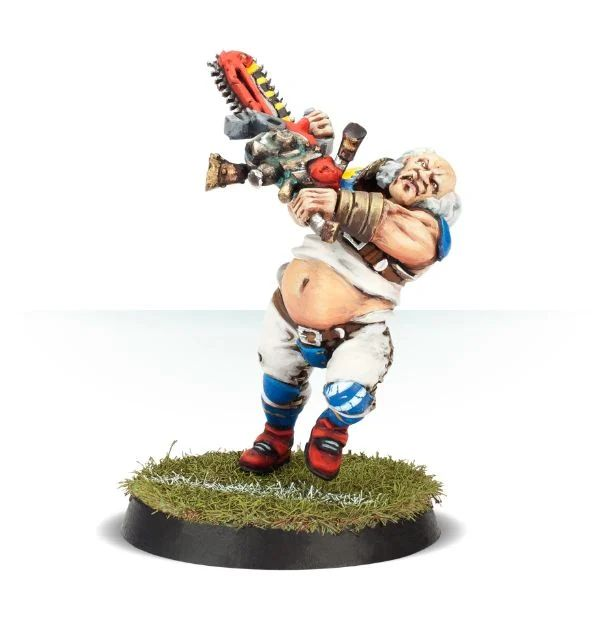

# Helmut Wulf

{ width=600 height=620 }

| Cost | MA | ST | AG | PA | AV |
| ---- | -- | -- | -- | -- | --- |
| **140K** | 6  | 3  | 3+ | - | 9+ |

*(Human, Special)*

* [Chainsaw]
* [Loner] (4+)
* [No Ball]
* [Pro]
* [Secret Weapon]
* [Stand Firm]
* **Old Pro**

Once per game, Helmut may use his Pro Skill to re-roll a single dice rolled as part of an Armour Roll.

### Plays For

* [Old World Classic]

### Accept to play for...

* [Bretonnian]
* [Human]
* [Imperial Nobility]
* [Norse]
* [Old World Alliance]
