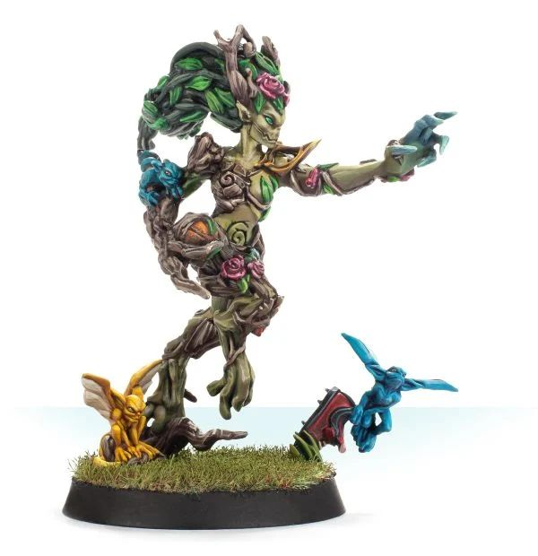

# Willow Rosebark

{ width=600 height=620 }

| Cost | MA | ST | AG | PA | AV |
| ---- | -- | -- | -- | -- | -- |
| **160K** | 6  | 4  | 3+ | 5+ | 9+ |

*(Blitzer, Dryad)*

* [Dauntless]
* [Loner] (4+)
* [Sidestep]
* [Thick Skull]
* **Woodland Fury**

Once per game, when Willow performs a Block Action that would result in her being Knocked Down, she can choose to re-roll a single Block Dice.

### Plays For

* [Woodland League]

### Accept to play for...

* [Gnome]
* [Halfling]
* [Wood Elf]
