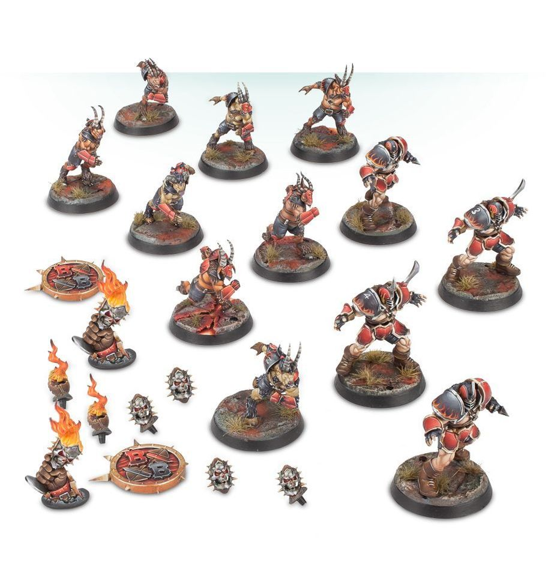

**TIER 2**

### Positionals

| Qty  | Position                                | MA | ST | AG | PA | AR  | Skills                                                                                                     | Primary | Secondary | Cost |
| ---- | ---------------------------------------- | -- | -- | -- | -- | --- | ----------------------------------------------------------------------------------------------------------- | ------- | --------- | ---- |
| 0-16 | Beastman Lineman *(Lineman, Beastman)*   | 6  | 3  | 3+ | 4+ | 9+  | • [Horns] • [Thick Skull]                                                                              | A P S D | G M       | 50K  |
| 0-4  | Chaos Chosen *(Blocker, Human)*          | 5  | 4  | 3+ | 5+ | 10+ | • [Arm Bar]                                                                                               | G M S   | A         | 100K |
| 0-1  | Troll *(Big Guy, Troll)*                 | 4  | 5  | 5+ | 5+ | 10+ | • [Always Hungry] • [Loner] (4+) • [Mighty Blow] (+1) • [Projectile Vomit] • [Really Stupid] • [Regeneration] • [Throw Team-mate] | M S     | A G       | 115K |
| 0-1  | Ogre *(Big Guy, Ogre)*                   | 5  | 5  | 4+ | 5+ | 10+ | • [Bone Head] • [Loner] (4+) • [Mighty Blow] (+1) • [Thick Skull] • [Throw Team-mate]        | M S     | A G       | 140K |
| 0-1  | Minotaur *(Big Guy, Minotaur)*           | 5  | 5  | 4+ | -  | 9+  | • [Frenzy] • [Horns] • [Loner] (4+) • [Mighty Blow] (+1) • [Thick Skull] • [Unchannelled Fury] | M S   | A G       | 150K |

### Special Rules

* [Favoured of …]  
  — Choose: Chaos Undivided, Hashut, Khorne, Nurgle, Slaanesh, or Tzeentch.

### Staff

* [Cheerleader] - 10K  
* [Assistant Coach] - 10K  
* [Apothecary] - 50K  
* [Re-roll] - 60K

### Starplayers

* [Akhorne The Squirrel] - 80K  
* [Max Spleenripper] - 130K  
* [Zzharg Madeye] - 130K  
* [Skitter Stab-Stab] - 150K  
* [Kreek "The Verminator" Rustgouger] - 170K  
* [Withergrasp Doubledrool] - 170K  
* [Bilerot Vomitflesh] - 180K  
* [Guffle Pussmaw] - 180K  
* [Glart Smashrip] - 195K  
* [Scyla Anfingrimm] - 200K  
* [Hakflem Skuttlespike] - 210K  
* [Grashnak Blackhoof] - 240K  
* [Grak and Crumbleberry] - 250K  
* [Lord Borak the Despoiler] - 260K  
* [H’tark The Unstoppable] - 300K  
* [Morg ’n’ Thorg] - 380K

### Inducements

* [Temp Agency Cheerleader] - 5K  
* [Prayers to Nuffle] - 10K  
* [Part-time Assistant Coach] - 20K  
* [Team Mascot] - 25K  
* [Weather Mage] - 25K  
* [Blitzer’s Best Keg] - 50K  
* [Bribe] - 100K  
* [Extra Team Training] - 100K  
* [Wandering Apothecary] - 100K  
* [Hireling Sports-Wizard] (Wizard) - 150K  
* [Biased Referee] - 120K  
* [Halfling Master Chef] - 300K
