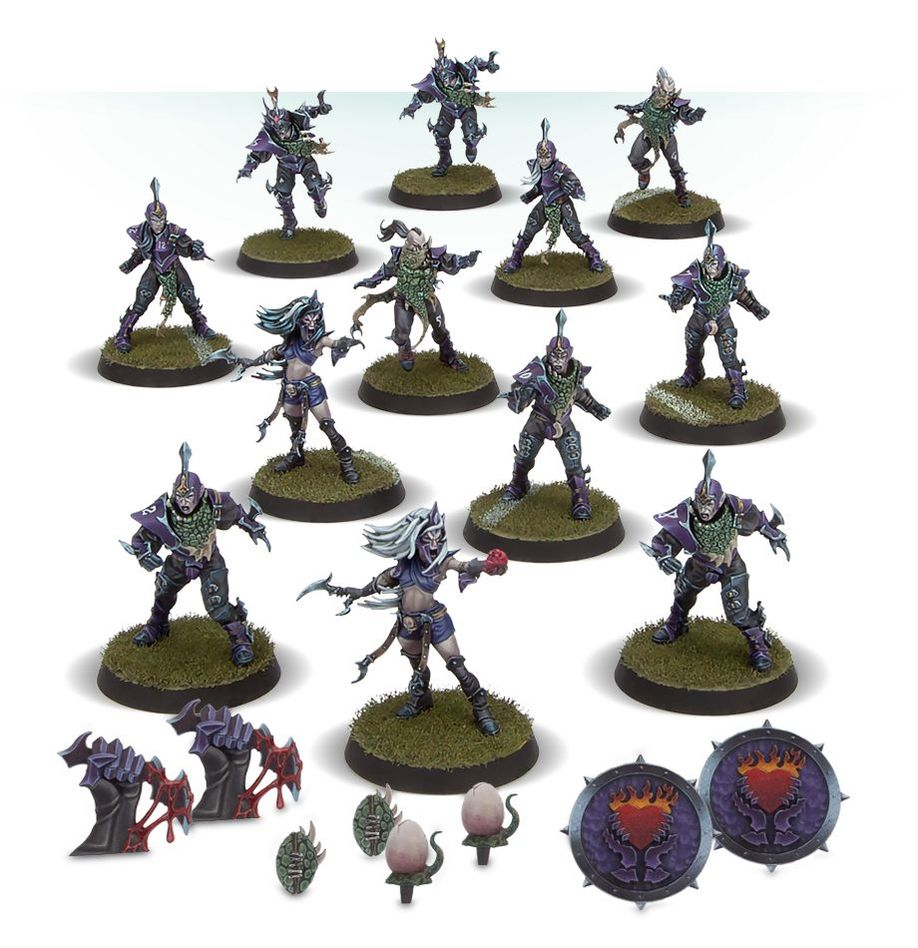

**TIER 1**

### Positionals

### Positionals

| Qty  | Position                       | MA | ST | AG | PA | AV | Skills                                                       | Primary | Secondary | Cost   |
| ---- | ------------------------------ | -- | -- | -- | -- | -- | ------------------------------------------------------------- | ------- | --------- | ------- |
| 0‑16 | Dark Elf Lineman *(Lineman, Elf)*   | 6  | 3  | 2+ | 3+ | 9+ | —                                                             | A G     | S D       | 65K    |
| 0‑2  | Dark Elf Runner *(Runner, Elf)*     | 7  | 3  | 2+ | 3+ | 8+ | • [Dump-off] • [Punt]                                      | A G P   | S D       | 80K    |
| 0‑2  | Dark Elf Assassin *(Special, Elf)*  | 7  | 3  | 2+ | 4+ | 8+ | • [Hit and Run] • [Shadowing] • [Stab]                  | A D     | G S       | 90K    |
| 0‑2  | Dark Elf Blitzer *(Blitzer, Elf)*   | 7  | 3  | 2+ | 3+ | 9+ | • [Block]                                                    | A G     | P S D     | 105K   |
| 0‑2  | Witch Elf *(Special, Elf)*          | 7  | 3  | 2+ | 4+ | 8+ | • [Dodge] • [Frenzy] • [Jump Up]                        | A G     | S D       | 110K   |

### Special Rules

* [Elven Kingdoms League]

### Staff

* [Cheerleader] - 10K
* [Assistant Coach] - 10K
* [Re-roll] - 50K
* [Apothecary]  - 50K

### Star Players

* [Akhorne The Squirrel] - 80K
* [Gloriel Summerbloom] - 150K
* [Kiroth Krakeneye] - 160K
* [Eldril Sidewinder] - 220K
* [Zolcath the Zoat] - 220K
* [Grak and Crumbleberry] - 250K
* [Jordell Freshbreeze] - 280K
* [Roxanna Darknail] - 270K
* [The Swift Twins] - 300K
* [Jeremiah Kool] - 300K
* [Morg 'n' Thorg] - 340K

### Inducements

* [Temp Agency Cheerleader] - 5K
* [Prayers to Nuffle] - 10K
* [Part-time Assistant Coach] - 20K
* [Team Mascot] - 25K
* [Weather Mage] - 25K
* [Mercenary Player] - 30K
* [Blitzer's Best Keg] - 50K
* [Bribe] - 100K
* [Extra Team Training] - 100K
* [Infamous Coaching Staff] - 100K
* [Wandering Apothecary] - 100K
* [Biased Referee] - 120K
* [Wizard] - 150K
* [Halfling Master Chef] - 300K
