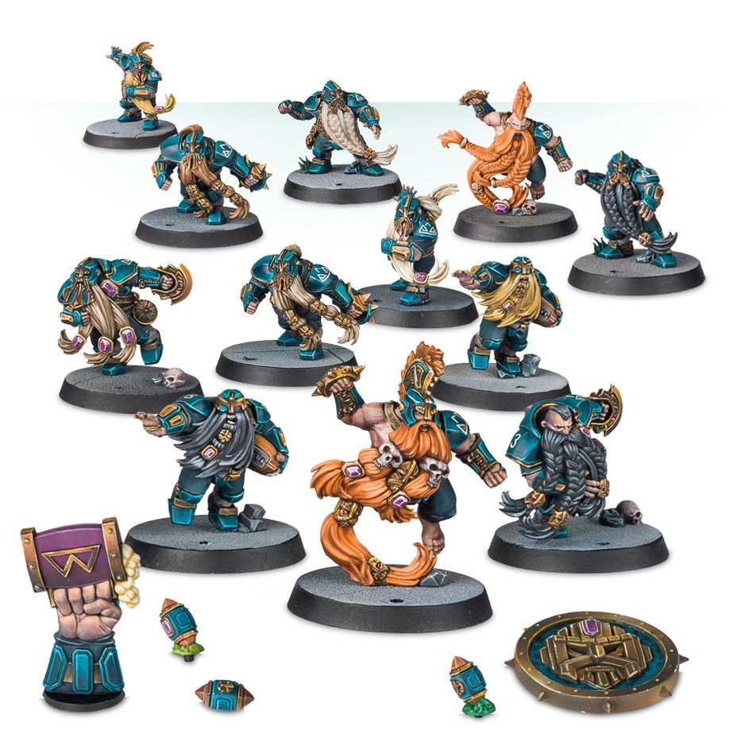

**TIER 1**
{ width=918 height=948 }

### Positionals

| Qty  | Position                                | MA  | ST  | AG  | PA  | AV  | Skills                                                                                                                                            | Primary | Secondary | Cost |
| ---- | --------------------------------------- | --- | --- | --- | --- | --- | ------------------------------------------------------------------------------------------------------------------------------------------------- | ------- | --------- | ---- |
| 0‑16 | Dwarf Lineman *(Lineman, Dwarf)*        | 4   | 3   | 4+  | 5+  | 10+ | • [Block] • [Defensive] • [Thick Skull]                                                                                                     | D G     | S         | 70K  |
| 0‑2  | Dwarf Runner *(Runner, Dwarf)*          | 6   | 3   | 3+  | 4+  | 9+  | • [Sprint] • [Sure Hands] • [Thick Skull]                                                                                                   | G P     | S         | 80K  |
| 0‑2  | Dwarf Blitzer *(Blitzer, Dwarf)*        | 5   | 3   | 4+  | 4+  | 10+ | • [Block] • [Diving Tackle] • [Tackle] • [Thick Skull]                                                                                   | G S     | P         | 100K |
| 0‑2  | Troll Slayer *(Special, Dwarf)*         | 5   | 3   | 4+  | 5+  | 9+  | • [Block] • [Dauntless] • [Frenzy] • [Hatred] (Troll) • [Thick Skull]                                                                 | G S     | D         | 95K  |
| 0‑1  | Deathroller *(Big Guy, Dwarf, Special)* | 5   | 7   | 5+  | -   | 11+ | • [Break Tackle] • [Dirty Player] • [Juggernaut] • [Loner] (4+) • [Mighty Blow] • [No Ball] • [Secret Weapon] • [Stand Firm] | D S     | G         | 170K |

### League

* [Worlds Edge Superleague]

### Special Rules

* [Brawlin' Brutes]
* [Bribery and Corruption]

### Staff

* [Cheerleader] - 10K
* [Assistant Coach] - 10K
* [Re-roll] - 60K
* [Apothecary] - 50K

### Star Players

* [Akhorne the Squirrel] - 80K
* [Barik Farblast] - 80K
* [Skrull Halfheight] - 150K
* [Grombrindal] - 170K
* [Thorsson Stoutmead] - 170K
* [Grim Ironjaw] - 190K
* [The Mighty Zug] - 220K
* [Skrorg Snowpelt] - 240K
* [Grak and Crumbleberry] - 250K
* [Morg 'n' Thorg]  - 340K

### Inducements

* [Temp Agency Cheerleader] - 5K
* [Prayers to Nuffle] - 10K
* [Part-time Assistant Coach] - 20K
* [Team Mascot] - 25K
* [Weather Mage] - 25K
* [Mercenary Player] - 30K
* [Blitzer's Best Keg] - 50K
* [Bribe] - 50K
* [Biased Referee] - 80K
* [Extra Team Training] - 100K
* [Infamous Coaching Staff] - 100K
* [Wandering Apothecary] - 100K
* [Wizard] - 150K
* [Halfling Master Chef] - 300K
