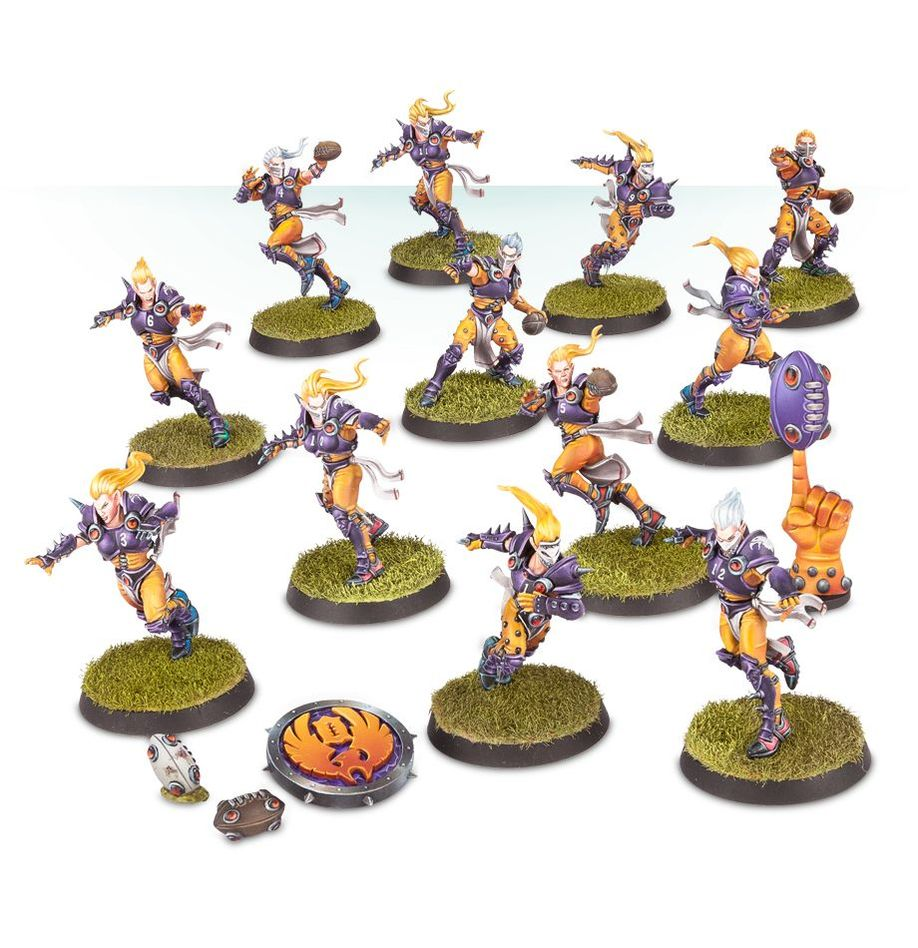

**TIER 2**

### Positionals

| Qty  | Position                          | MA | ST | AG | PA | AR | Skills                                              | Primary | Secondary | Cost |
| ---- | ---------------------------------- | -- | -- | -- | -- | -- | --------------------------------------------------- | ------- | --------- | ---- |
| 0-12 | Elf Lineman *(Lineman, Elf)*       | 6  | 3  | 2+ | 4+ | 8+ | • [Fumble-rooski]                                   | A G     | S         | 65K  |
| 0-2  | Elf Thrower *(Thrower, Elf)*       | 6  | 3  | 2+ | 2+ | 8+ | • [Hail Mary Pass] • [Pass]                     | A G P   | S         | 75K  |
| 0-4  | Elf Catcher *(Catcher, Elf)*       | 8  | 3  | 2+ | 4+ | 8+ | • [Catch] • [Diving Catch] • [Nerves of Steel] | A G     | S         | 100K |
| 0-2  | Elf Blitzer *(Blitzer, Elf)*       | 7  | 3  | 2+ | 3+ | 9+ | • [Block] • [Sidestep]                          | A G     | P S       | 115K |

### Special Rules

* [Elven Kingdoms League]

### Staff

* [Cheerleader] - 10K  
* [Assistant Coach] - 10K  
* [Re-roll] - 50K  
* [Apothecary] - 50K

### Starplayers

* [Akhorne The Squirrel] - 80K  
* [Gloriel Summerbloom] - 150K  
* [Swiftvine Glimmershard] - 110K  
* [Willow Rosebark] - 150K  
* [Kiroth Krakeneye] - 160K  
* [Maple Highgrove] - 210K  
* [Eldril Sidewinder] - 230K  
* [Zolcath The Zoat] - 230K  
* [Grak and Crumbleberry] - 250K  
* [Jordell Freshbreeze] - 250K  
* [Roxanna Darknail] - 270K  
* [Jeremiah Kool] - 320K  
* [The Swift Twins] - 340K  
* [Morg ’n’ Thorg] - 380K  

### Inducements

* [Temp Agency Cheerleader] - 5K  
* [Prayers to Nuffle] - 10K  
* [Part-time Assistant Coach] - 20K  
* [Team Mascot] - 25K  
* [Weather Mage] - 25K  
* [Blitzer’s Best Keg] - 50K  
* [Bribe] - 100K  
* [Extra Team Training] - 100K  
* [Wandering Apothecary] - 100K  
* [Hireling Sports-Wizard] (Wizard) - 150K  
* [Biased Referee] - 120K  
* [Halfling Master Chef] - 300K
