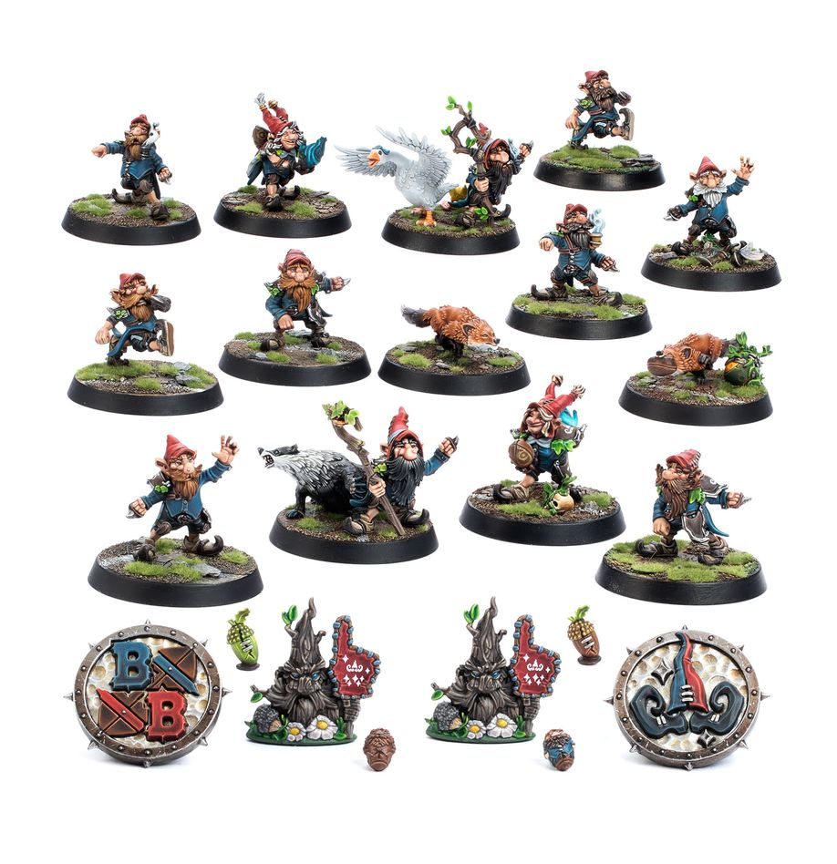

**TIER 4**

### Positionals

| Qty  | Position                                 | MA | ST | AG | PA | AV  | Skills                                                                                                                                       | Primary | Secondary | Cost    |
| ---- | ----------------------------------------- | -- | -- | -- | -- | --- | --------------------------------------------------------------------------------------------------------------------------------------------- | ------- | --------- | ------- |
| 0‑16 | Gnome Lineman *(Lineman, Gnome)*          | 5  | 2  | 3+ | 4+ | 7+  | • [Jump Up] • [Right Stuff] • [Stunty] • [Wrestle]                                                                                  | A       | G S D     | 40K  |
| 0‑2  | Woodland Fox *(Runner, Animal)*           | 7  | 2  | 2+ | —  | 6+  | • [Dodge] • [My Ball] • [Sidestep] • [Stunty]                                                                                       | —       | A         | 50K  |
| 0‑2  | Gnome Illusionist *(Special, Gnome)*      | 5  | 2  | 3+ | 3+ | 7+  | • [Jump Up] • [Stunty] • [Trickster] • [Wrestle]                                                                                    | A P     | G D       | 50K  |
| 0‑2  | Gnome Beastmaster *(Blocker, Gnome)*      | 5  | 2  | 3+ | 4+ | 8+  | • [Guard] • [Jump Up] • [Stunty] • [Wrestle]                                                                                        | A       | G S D     | 55K  |
| 0‑2  | Altern Forest Treeman *(Big Guy, Treeman)*| 2  | 6  | 5+ | 5+ | 11+ | • [Mighty Blow] • [Stand Firm] • [Strong Arm] • [Take Root] • [Thick Skull] • [Throw Team-mate] • [Timmm-ber!]       | S       | A G P     | 120K |

### Special Rules

* [Halfling Thimble Cup]
* [Woodland League]

### Staff

* [Cheerleader] - 10K
* [Assistant Coach] - 10K
* [Re-roll] - 50K
* [Apothecary] - 50K

### Star Players

* [Rodney Roachbait] - 70K
* [Cindy Piewhistle] - 100K
* [Akhorne The Squirrel] - 80K
* [Swiftvine Glimmershard] - 110K
* [Puggy Baconbreath] - 130K
* [Willow Rosebark] - 160K
* [Rowana Forestfoot] - 160K
* [Rumbelow Sheepskin] - 170K
* [Grombrindal] - 170K
* [Maple Highgrove] - 210K
* [Grak and Crumbleberry] - 250K
* [Deeproot Strongbranch] - 280K
* [Jordell Freshbreeze] - 280K
* [Morg 'n' Thorg] - 340K

### Inducements

* [Temp Agency Cheerleader] - 5K
* [Prayers to Nuffle] - 10K
* [Part-time Assistant Coach] - 20K
* [Team Mascot] - 25K
* [Weather Mage] - 25K
* [Mercenary Player] - 30K
* [Blitzer's Best Keg] - 50K
* [Bribe] - 100K
* [Extra Team Training] - 100K
* [Plague Doctor] - 100K
* [Wandering Apothecary] - 100K
* [Biased Referee] - 120K
* [Wizard] - 150K
* [Halfling Master Chef] - 300K
