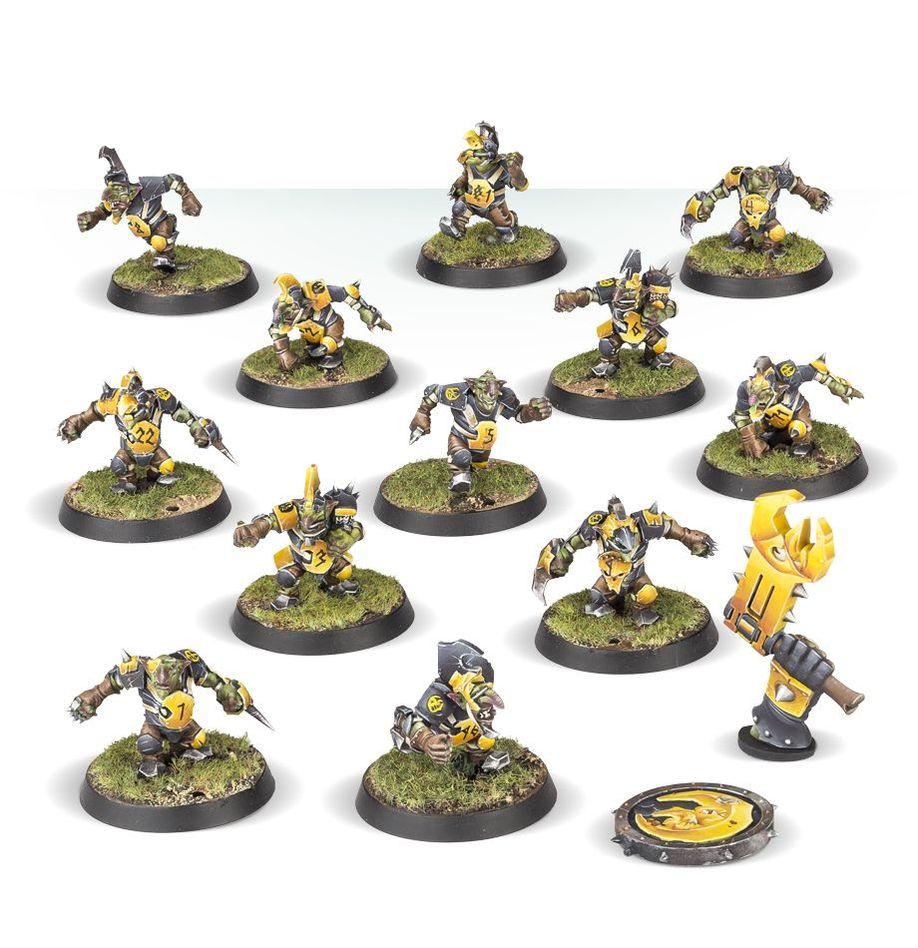

**TIER 4**

### Positionals

| Qty  | Position                          | MA | ST | AG | PA | AR  | Skills                                                                                                   | Primary | Secondary | Cost |
| ---- | ---------------------------------- | -- | -- | -- | -- | --- | --------------------------------------------------------------------------------------------------------- | ------- | --------- | ---- |
| 0-12 | Goblin *(Lineman, Goblin)*         | 6  | 2  | 3+ | 4+ | 8+  | • [Dodge] • [Right Stuff] • [Stunty]                                                                | A       | G S D P   | 40K  |
| 0-1  | Looney *(Chainsaw, Goblin)*        | 6  | 2  | 3+ | —  | 8+  | • [Chainsaw] • [No Ball] • [Secret Weapon] • [Stunty]                                          | A       | G S D     | 40K  |
| 0-1  | Bomma *(Bomber, Goblin)*           | 6  | 2  | 3+ | 4+ | 8+  | • [Bombardier] • [Dodge] • [Secret Weapon] • [Stunty]                                           | A P     | G S D     | 45K  |
| 0-1  | 'Ooligan *(Support, Goblin)*       | 6  | 2  | 3+ | 6+ | 8+  | • [Dirty Player] (+1) • [Disturbing Presence] • [Dodge] • [Right Stuff] • [Stunty]           | A       | G P S D   | 60K  |
| 0-1  | Doom Diver *(Runner, Goblin)*      | 6  | 2  | 3+ | 6+ | 8+  | • [Right Stuff] • [Stunty] • [Swoop]                                                                | A       | G S D     | 60K  |
| 0-1  | Fanatic *(Ball & Chain, Goblin)*   | 3  | 7  | 3+ | —  | 8+  | • [Ball & Chain] • [No Ball] • [Secret Weapon] • [Stunty]                                      | S       | A G D     | 70K  |
| 0-1  | Pogoer *(Pogo, Goblin)*            | 7  | 2  | 3+ | 5+ | 8+  | • [Dodge] • [Pogo] • [Stunty]                                                                 | A       | G S D P   | 75K  |
| 0-2  | Trained Troll *(Big Guy, Troll)*   | 4  | 5  | 5+ | 5+ | 10+ | • [Always Hungry] • [Loner] (3+) • [Mighty Blow] (+1) • [Projectile Vomit] • [Really Stupid] • [Regeneration] • [Throw Team-mate] | S       | A G P D   | 115K |

### Special Rules

* [Badlands Brawl]
* [Underworld Challenge]

### Staff

* [Cheerleader] - 10K
* [Assistant Coach] - 10K
* [Apothecary] - 50K
* [Re-roll] - 60K

### Star Players

* [Akhorne The Squirrel] - 80K
* [Fungus the Loon] - 80K
* [Bomber Dribblesnot] - 50K
* [Nobbla Blackwart] - 120K
* [Scrappa Sorehead] - 130K
* [Rashnak Backstabber] - 130K
* [Skitter Stab-Stab] - 150K
* [Glart Smashrip] - 195K
* [Hakflem Skuttlespike] - 210K
* [The Black Gobbo] - 225K
* [Glotl Stop] - 260K
* [Grak and Crumbleberry] - 250K
* [Ripper Bolgrot] - 250K
* [Varag Ghoul-Chewer] - 260K
* [H'thark the Unstoppable] - 260K
* [Morg 'n' Thorg] - 340K

### Inducements

* [Temp Agency Cheerleader] - 5K
* [Prayers to Nuffle] - 10K
* [Part-time Assistant Coach] - 20K
* [Team Mascot] - 25K
* [Weather Mage] - 30K
* [Blitzer's Best Keg] - 50K
* [Bribe] - 50K
* [Extra Team Training] - 100K
* [Wandering Apothecary] - 100K
* [Wizard] - 150K
* [Biased Referee] - 120K
* [Halfling Master Chef] - 300K
