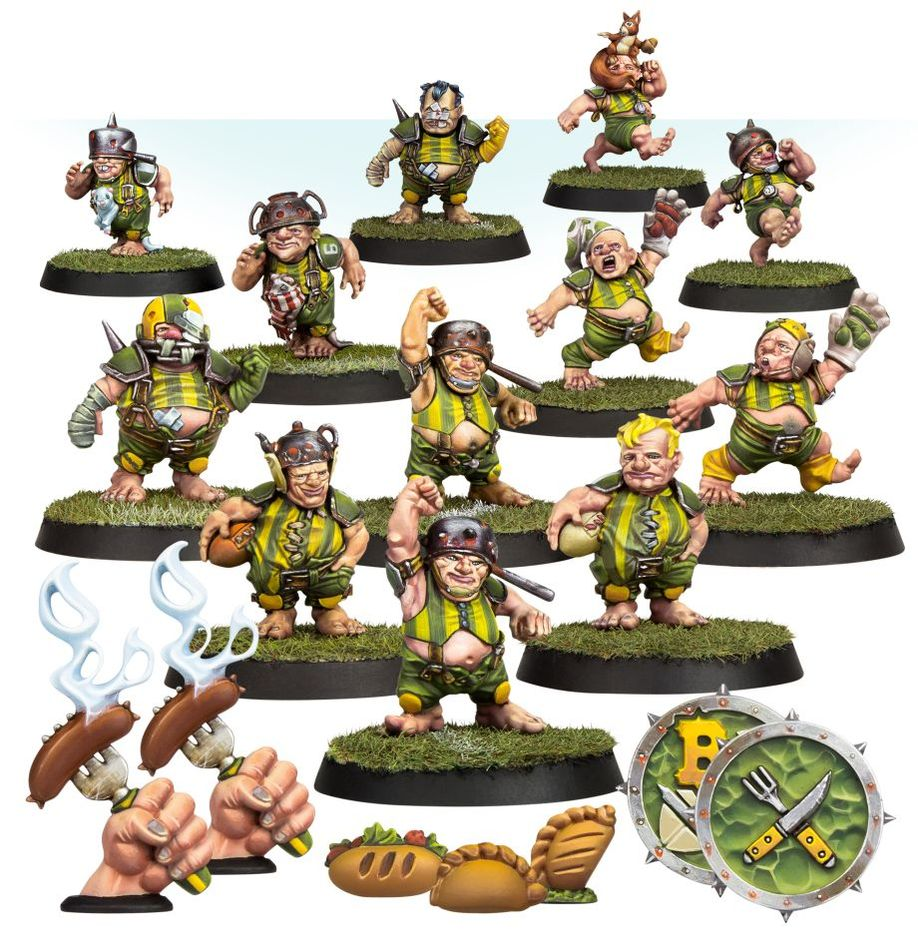

**TIER 4**

### Positionals

| Qty  | Position                           | MA | ST | AG | PA | AR | Skills                                                                                           | Primary | Secondary | Cost |
| ---- | ----------------------------------- | -- | -- | -- | -- | -- | ------------------------------------------------------------------------------------------------- | ------- | --------- | ---- |
| 0-16 | Halfling Hopeful *(Lineman, Halfling)* | 5  | 2  | 3+ | 4+ | 7+ | • [Dodge] • [Right Stuff] • [Stunty]                                                       | A       | G S D     | 30K  |
| 0-2  | Halfling Hefty *(Runner, Halfling)*    | 5  | 2  | 3+ | 3+ | 8+ | • [Dodge] • [Fend] • [Stunty]                                                              | A P     | G S D     | 50K  |
| 0-2  | Halfling Catcher *(Catcher, Halfling)* | 5  | 2  | 3+ | 5+ | 7+ | • [Catch] • [Dodge] • [Right Stuff] • [Sprint] • [Stunty]                            | A       | G S D     | 50K  |
| 0-2  | Athel Forest Treeman *(Big Guy, Treeman)* | 2 | 6 | 5+ | 5+ | 11+ | • [Mighty Blow] • [Stand Firm] • [Strong Arm] • [Take Root] • [Thick Skull] • [Throw Team-mate] • [Timmm-ber!] | S | A G P D | 120K |

### Special Rules

* [Halfling Thimble Cup]
* [Woodland League]

### Staff

* [Cheerleader] - 10K
* [Assistant Coach] - 10K
* [Apothecary] - 50K
* [Re-roll] - 60K

### Star Players

* [Rodney Roachbait] - 70K
* [Akhorne The Squirrel] - 80K
* [Cindy Piewhistle] - 80K
* [Rumbelow Sheepskin] - 170K
* [Puggy Baconbreath] - 120K
* [Swiftvine Glimmershard] - 110K
* [Willow Rosebark] - 150K
* [Rowan Forestfoot] - 160K
* [Thorsson Stoutmead] - 170K
* [Grim Ironjaw] - 200K
* [Maple Highgrove] - 210K
* [Grombrindal] - 210K
* [Frank 'n' Stein] - 250K
* [Grak and Crumbleberry] - 250K
* [Ivar Eriksson] - 260K
* [Skrorg Snowpelt] - 260K
* [Jordell Freshbreeze] - 260K
* [Deeproot Strongbranch] - 280K
* [The Mighty Zug] - 300K
* [Morg 'n' Thorg] - 340K

### Inducements

* [Temp Agency Cheerleader] - 5K
* [Prayers to Nuffle] - 10K
* [Part-time Assistant Coach] - 20K
* [Team Mascot] - 25K
* [Weather Mage] - 30K
* [Blitzer's Best Keg] - 50K
* [Bribe] - 100K
* [Extra Team Training] - 100K
* [Wandering Apothecary] - 100K
* [Wizard] - 150K
* [Biased Referee] - 120K
* [Halfling Master Chef] - 300K
