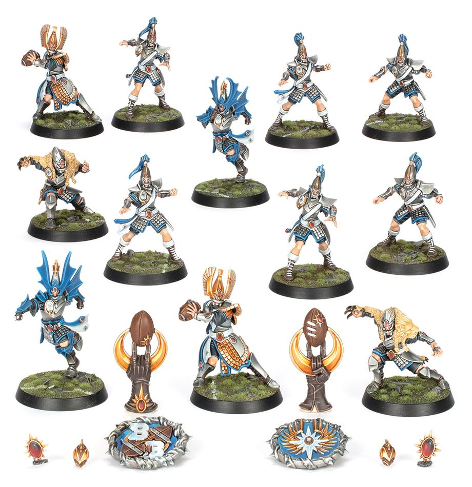

**TIER 1**

### Positionals

| Qty  | Position                          | MA  | ST  | AG  | PA  | AV  | Skills                                         | Primary | Secondary | Cost |
| ---- | --------------------------------- | --- | --- | --- | --- | --- | ---------------------------------------------- | ------- | --------- | ---- |
| 0‑16 | High Elf Lineman *(Lineman, Elf)* | 6   | 3   | 2+  | 3+  | 9+  |                                                | A G     | P S       | 65K  |
| 0‑2  | High Elf Thrower *(Thrower, Elf)* | 6   | 3   | 2+  | 2+  | 9+  | • [Cloud Burster] • [Pass] • [Safe Pass] | A G P   | S         | 100K |
| 0‑4  | High Elf Catcher *(Catcher, Elf)* | 8   | 3   | 2+  | 3+  | 8+  | • [Catch]                                      | A G     | S         | 90K  |
| 0‑2  | High Elf Blitzer *(Blitzer, Elf)* | 7   | 3   | 2+  | 4+  | 9+  | • [Block]                                      | A G     | P S       | 100K |

### League

* [Elven Kingdoms League]

### Staff

* [Cheerleader] - 10K
* [Assistant Coach] - 10K
* [Apothecary] - 50K
* [Re-roll] - 50K

### Star Players

* [Akhorne the Squirrel] - 80K
* [Gloriel Summerbloom] - 150K
* [Kiroth Krakeneye] - 160K
* [Eldril Sidewinder] - 220K
* [Zolcath the Zoat] - 220K
* [Grak and Crumbleberry] - 250K
* [Roxanna Darknail] - 270K
* [Jordell Freshbreeze] - 280K
* [The Swift Twins] - 300K
* [Jeremiah Kool] - 300K
* [Morg 'n' Thorg] - 340K

### Inducements

* [Temp Agency Cheerleader] - 5K
* [Prayers to Nuffle] - 10K
* [Part-time Assistant Coach] - 20K
* [Team Mascot] - 25K
* [Weather Mage] - 25K
* [Mercenary Player] - 30K
* [Blitzer's Best Keg] - 50K
* [Bribe] - 100K
* [Extra Team Training] - 100K
* [Infamous Coaching Staff] - 100K
* [Wandering Apothecary] - 100K
* [Biased Referee] - 120K
* [Wizard] - 150K
* [Halfling Master Chef] - 300K
