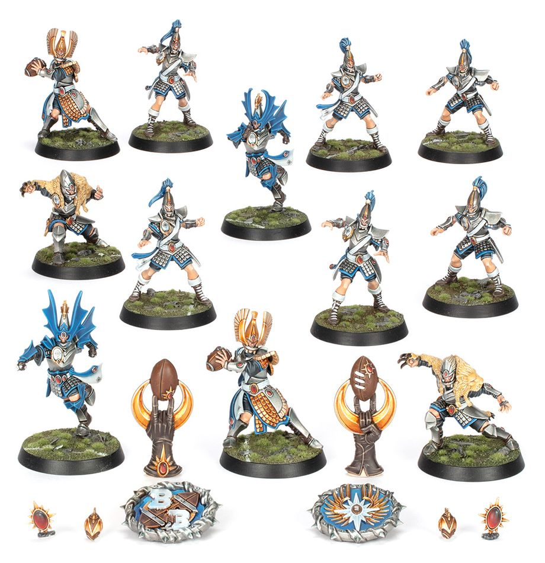

**TIER ?**
{ width=920 height=950 }

### Positionals

| Qty  | Position                                | MA | ST | AG | PA | AV | Skills                                            | Primary | Secondary | Cost |
|------|------------------------------------------|----|----|----|----|----|--------------------------------------------------|--------|-----------|------|
| 0-16 | High Elf Lineman *(Lineman, Elf)*        | 6  | 3  | 2+ | 3+ | 9+ |                                                  | A G    | S         | 65K  |
| 0-2  | Phoenix Warrior *(Thrower, Elf)*         | 6  | 3  | 2+ | 2+ | 9+ | • [Cloud Burster] • [Pass] • [Safe Pass]   | A G P  | S         | 90K  |
| 0-2  | Dragon Prince *(Blitzer, Elf, Runner)*   | 8  | 3  | 2+ | 4+ | 9+ | • [Block] • [My Ball] • [Steady Footing]   | A G    | S         | 110K |
| 0-2  | White Lion *(Blitzer, Elf)*              | 7  | 3  | 2+ | 3+ | 9+ | • [Claws] • [Wrestle]                         | A G    | P S       | 110K |

### League

* [Elven Kingdoms League]

### Staff

* [Cheerleader] - 10K
* [Assistant Coach] - 10K
* [Apothecary] - 50K
* [Re-roll] - 50K

### Star Players

* [Akhorne the Squirrel] - 80K
* [Gloriel Summerbloom] - 150K
* [Kiroth Krakeneye] - 160K
* [Eldril Sidewinder] - 220K
* [Zolcath the Zoat] - 220K
* [Grak and Crumbleberry] - 250K
* [Roxanna Darknail] - 270K
* [Jordell Freshbreeze] - 280K
* [The Swift Twins] - 300K
* [Jeremiah Kool] - 300K
* [Morg 'n' Thorg] - 340K

### Inducements

* [Temp Agency Cheerleader] - 5K
* [Prayers to Nuffle] - 10K
* [Part-time Assistant Coach] - 20K
* [Team Mascot] - 25K
* [Weather Mage] - 25K
* [Mercenary Player] - 30K
* [Blitzer's Best Keg] - 50K
* [Bribe] - 100K
* [Extra Team Training] - 100K
* [Infamous Coaching Staff] - 100K
* [Wandering Apothecary] - 100K
* [Biased Referee] - 120K
* [Wizard] - 150K
* [Halfling Master Chef] - 300K
