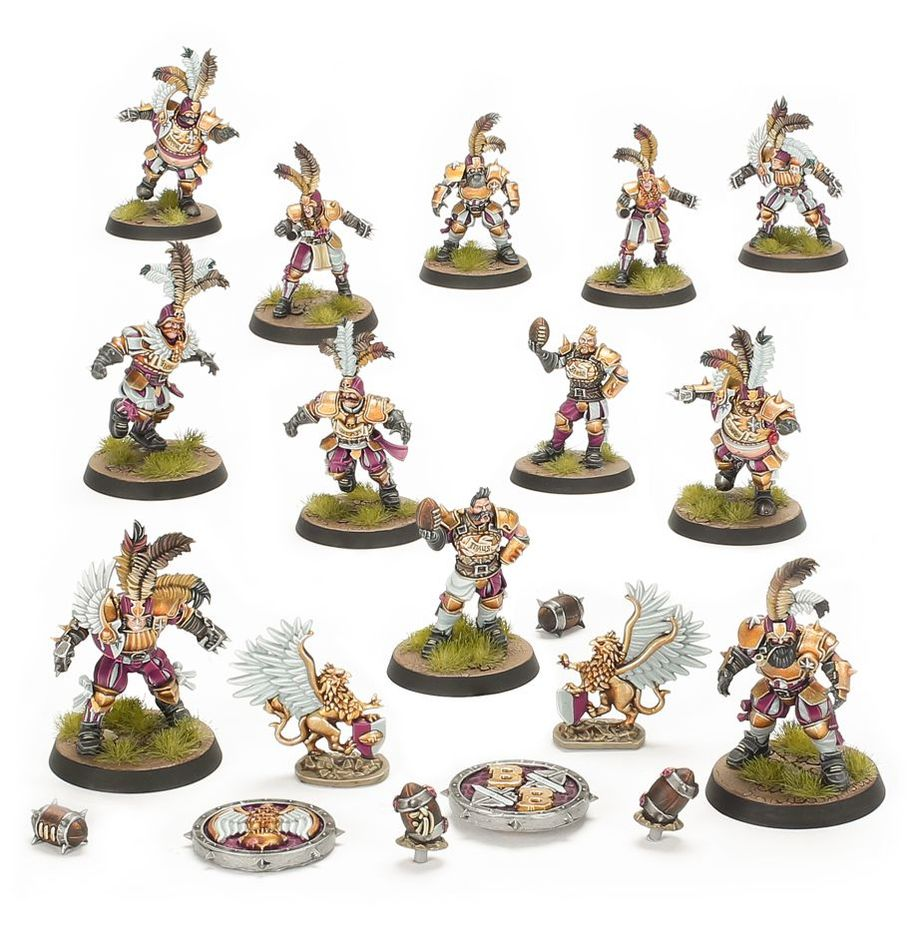

**TIER 2**

### Positionals

| Qty  | Position                            | MA | ST | AG | PA | AV | Skills                                                                                      | Primary | Secondary | Cost   |
| ---- | ------------------------------------ | -- | -- | -- | -- | -- | -------------------------------------------------------------------------------------------- | ------- | --------- | ------ |
| 0-16 | Imperial Retainer *(Lineman, Human)* | 6  | 3  | 3+ | 4+ | 8+ | • [Fend]                                                                                     | G       | A S       | 45K |
| 0-2  | Imperial Thrower *(Thrower, Human)*  | 6  | 3  | 3+ | 2+ | 9+ | • [Give and Go] • [Pass] • [Pro]                                                       | G P     | A S       | 75K |
| 0-4  | Bodyguard *(Blocker, Human)*         | 5  | 3  | 3+ | 4+ | 9+ | • [Stand Firm] • [Wrestle]                                                                | G S     | A         | 85K |
| 0-2  | Noble Blitzer *(Blitzer, Human)*     | 7  | 3  | 3+ | 4+ | 9+ | • [Block] • [Catch] • [Pro]                                                            | A G     | P S       | 90K |
| 0-1  | Ogre *(Big Guy, Ogre)*               | 5  | 5  | 4+ | 5+ | 10+| • [Bone Head] • [Loner] (3+) • [Mighty Blow] • [Thick Skull] • [Throw Team-mate] | S       | A G       | 140K |

### Special Rules

* [Old World Classic]

### Staff

* [Cheerleader] - 10K
* [Assistant Coach] - 10K
* [Apothecary] - 50K
* [Re-roll] - 70K

### Star Players

* [Akhorne The Squirrel] - 80K
* [Barik Farblast] - 80K
* [Cindy Piewhistle] - 120K
* [Puggy Baconbreath] - 130K
* [Helmut Wulf] - 140K
* [Grombrindal] - 170K
* [Thorsson Stoutmead] - 170K
* [Karla von Kill] - 210K
* [Ivar Eriksson] - 215K
* [The Mighty Zug] - 220K
* [Skrorg Snowpelt] - 240K
* [Grak and Crumbleberry] - 250K
* [Griff Oberwald] - 300K
* [Morg 'n' Thorg] - 340K

### Inducements

* [Temp Agency Cheerleader] - 5K
* [Prayers to Nuffle] - 10K
* [Part-time Assistant Coach] - 20K
* [Team Mascot] - 25K
* [Weather Mage] - 30K
* [Blitzer's Best Keg] - 50K
* [Bribe] - 100K
* [Extra Team Training] - 100K
* [Wandering Apothecary] - 100K
* [Wizard] - 150K
* [Biased Referee] - 120K
* [Halfling Master Chef] - 300K
