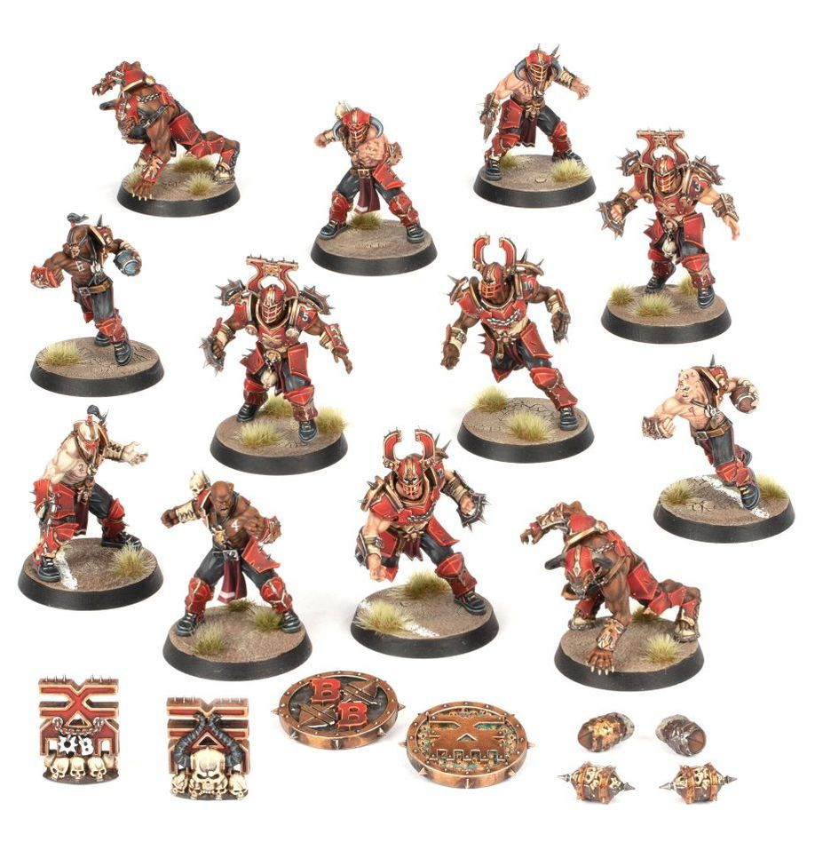

**TIER 3**

### Positionals

| Qty  | Position                               | MA | ST | AG | PA | AV | Skills                                                                                               | Primary | Secondary | Cost   |
| ---- | --------------------------------------- | -- | -- | -- | -- | -- | ----------------------------------------------------------------------------------------------------- | ------- | --------- | ------ |
| 0‑16 | Bloodborn Marauder *(Lineman, Human)*   | 6  | 3  | 3+ | 4+ | 8+ | • [Frenzy]                                                                                           | G M     | A S D     | 50K |
| 0‑2  | Khorngor *(Runner, Beastman)*           | 6  | 3  | 3+ | 4+ | 9+ | • [Horns] • [Juggernaut] • [Jump Up] • [Thick Skull]                                        | G M S   | A P D     | 70K |
| 0‑4  | Bloodseeker *(Blocker, Human)*          | 5  | 4  | 4+ | 6+ | 10+| • [Frenzy]                                                                                           | G M S   | A D       | 105K|
| 0‑1  | Bloodspawn *(Big Guy, Spawn)*           | 5  | 5  | 4+ | –  | 9+  | • [Claws] • [Frenzy] • [Loner] (4+) • [Mighty Blow] • [Unchannelled Fury]                | M S     | A G       | 160K |

### Special Rules

* [Chaos Clash]
* [Favoured of Khorne][Favoured of...]
* [Brawlin' Brutes]

### Staff

* [Cheerleader] - 10K
* [Assistant Coach] - 10K
* [Apothecary] - 50K
* [Re-roll] - 60K

### Star Players

* [Akhorne The Squirrel] - 80K
* [Max Spleenripper] - 130K
* [Scyla Anfingrimm] - 200K
* [Grashnak Blackhoof] - 240K
* [Grak] - 250K
* [Crumbleberry] - 250K
* [Lord Borak The Despoiler] - 270K
* [Morg 'n' Thorg] - 340K

### Inducements

* [Temp Agency Cheerleader] - 5K
* [Prayers to Nuffle] - 10K
* [Part-time Assistant Coach] - 20K
* [Team Mascot] - 25K
* [Weather Mage] - 25K
* [Mercenary Player] - 30K
* [Blitzer's Best Keg] - 50K
* [Bribe] - 100K
* [Extra Team Training] - 100K
* [Infamous Coaching Staff] - 100K
* [Wandering Apothecary] - 100K
* [Biased Referee] - 120K
* [Wizard] - 150K
* [Halfling Master Chef] - 300K
