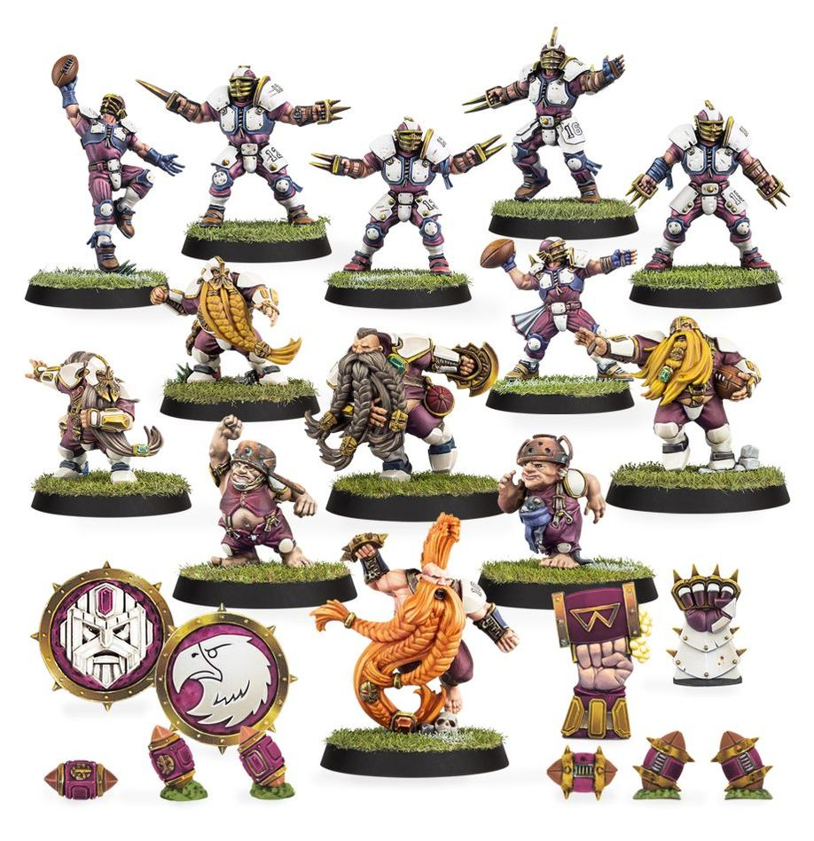

**TIER 1**
{ width=918 height=948 }

### Positionals

| Qty  | Position                                   | MA  | ST  | AG  | PA  | AV  | Skills                                                                                                                           | Primary | Secondary | Cost |
| ---- | ------------------------------------------ | --- | --- | --- | --- | --- | -------------------------------------------------------------------------------------------------------------------------------- | ------- | --------- | ---- |
| 0‑16 | Human Lineman *(Lineman, Human)*           | 6   | 3   | 3+  | 4+  | 9+  |                                                                                                                                  | G       | A S       | 50K  |
| 0‑3  | Halfling Hopeful *(Lineman, Halfling)*     | 5   | 2   | 3+  | 4+  | 7+  | • [Dodge] • [Right Stuff] • [Stunty]                                                                                       | A       | G S       | 30K  |
| 0‑1  | Human Catcher *(Catcher, Human)*           | 8   | 3   | 3+  | 4+  | 8+  | • [Catch] • [Dodge]                                                                                                           | A G     | P S       | 75K  |
| 0‑3  | Dwarf Lineman *(Lineman, Dwarf)*           | 4   | 3   | 4+  | 5+  | 10+ | • [Block] • [Defensive] • [Thick Skull]                                                                                    | G D     | S         | 70K  |
| 0‑1  | Human Thrower *(Thrower, Human)*           | 6   | 3   | 3+  | 3+  | 9+  | • [Pass] • [Sure Hands]                                                                                                       | G P     | A S       | 75K  |
| 0‑1  | Dwarf Runner *(Runner, Dwarf)*             | 6   | 3   | 3+  | 4+  | 9+  | • [Sprint] • [Sure Hands] • [Thick Skull]                                                                                  | G P     | A S       | 80K  |
| 0‑1  | Human Blitzer *(Blitzer, Human)*           | 7   | 3   | 3+  | 4+  | 9+  | • [Block] • [Tackle]                                                                                                          | G S     | A         | 85K  |
| 0‑1  | Dwarf Blitzer *(Blitzer, Dwarf)*           | 5   | 3   | 4+  | 4+  | 10+ | • [Block] • [Diving Tackle] • [Tackle] • [Thick Skull]                                                                  | G S     | P         | 100K |
| 0‑1  | Troll Slayer *(Special, Dwarf)*            | 5   | 3   | 4+  | 5+  | 9+  | • [Block] • [Dauntless] • [Frenzy] • [Hatred (Troll)] • [Thick Skull]                                                | G S     | A         | 95K  |
| 0‑1  | Ogre *(Big Guy, Ogre)*                     | 5   | 5   | 4+  | 5+  | 10+ | • [Bone Head] • [Loner] (3+) • [Mighty Blow] • [Thick Skull] • [Throw Team-mate]                                     | S       | A G       | 140K |
| 0‑1  | Altern Forest Treeman *(Big Guy, Treeman)* | 2   | 6   | 5+  | 5+  | 11+ | • [Mighty Blow] • [Stand Firm] • [Strong Arm] • [Take Root] • [Thick Skull] • [Throw Team-mate] • [Timmm-ber!] | S       | A G P     | 120K |

### League

* [Old World Classic]

### Staff

* [Cheerleader] - 10K
* [Assistant Coach] - 10K
* [Apothecary] - 50K
* [Re-roll] - 70K

### Star Players

* [Akhorne the Squirrel] - 80K
* [Barik Farblast] - 80K
* [Cindy Piewhistle] - 100K
* [Puggy Baconbreath] - 130K
* [Helmut Wulf] - 140K
* [Grombrindal] - 170K
* [Thorsson Stoutmead] - 170K
* [Karla von Kill] - 210K
* [Ivar Eriksson] - 215K
* [The Mighty Zug] - 220K
* [Skrorg Snowpelt] - 240K
* [Grak and Crumbleberry] - 250K
* [Griff Oberwald] - 300K
* [Morg 'n' Thorg] - 340K

### Inducements

* [Temp Agency Cheerleader] - 5K
* [Prayers to Nuffle] - 10K
* [Part-time Assistant Coach] - 20K
* [Team Mascot] - 25K
* [Weather Mage] - 25K
* [Mercenary Player] - 30K
* [Blitzer's Best Keg] - 50K
* [Bribe] - 100K
* [Extra Team Training] - 100K
* [Infamous Coaching Staff] - 100K
* [Wandering Apothecary] - 100K
* [Riotous Rookies] - 100K
* [Biased Referee] - 120K
* [Wizard] - 150K
* [Halfling Master Chef] - 300K
