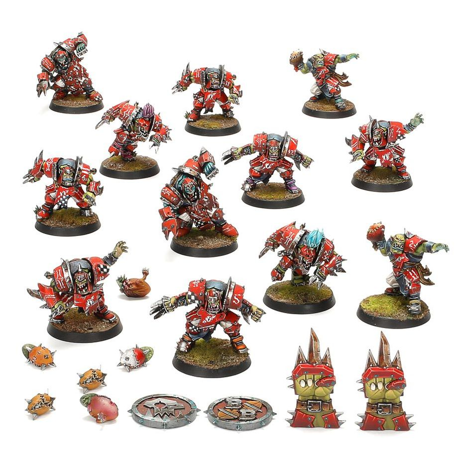

**TIER 2**

### Positionals

| Qty | Position                         | MA | ST | AG | PA | AV | Skills                                                                                           | Primary | Secondary | Cost |
| --- | -------------------------------- | -- | -- | -- | -- | -- | ----------------------------------------------------------------------------------------------------------- | ------- | --------- | ---- |
| 0-6 | Goblin Lineman *(Lineman, Goblin)* | 6  | 2  | 3+ | 4+ | 8+ | • [Dodge] • [Right Stuff] • [Stunty]                                                                  | A       | G S       | 40K |
| 0-2 | Orc Thrower *(Thrower, Orc)*       | 5  | 3  | 3+ | 3+ | 9+ | • [Pass] • [Sure Hands]                                                                                  | G P     | A S       | 75K |
| 0-4 | Orc Blitzer *(Blitzer, Orc)*       | 6  | 3  | 3+ | 4+ | 9+ | • [Block] • [Break Tackle]                                                                                | G S     | A D       | 85K |
| 0-2 | Big Un Blocker *(Blocker, Orc)*    | 5  | 4  | 4+ | 5+ | 10+| • [Mighty Blow] • [Taunt] • [Thick Skull] • [Unsteady]                                             | G S     | A D       | 95K |
| 0-1 | Troll *(Big Guy, Troll)*           | 4  | 5  | 5+ | 5+ | 10+| • [Always Hungry] • [Loner] (4+) • [Mighty Blow] • [Projectile Vomit] • [Really Stupid] • [Regeneration] • [Throw Team-mate] | A S G P | -         | 115K |

### Special Rules

* [Badlands Brawl]
* [Brawlin' Brutes]
* [Team Captain]

### Staff

* [Cheerleader] - 10K
* [Assistant Coach] - 10K
* [Apothecary] - 50K
* [Re-roll] - 60K

### Starplayers

* [Akhorne The Squirrel] - 80K
* [Fungus The Loon] - 80K
* [Bomber Dribblesnot] - 80K
* [Nobbla Blackwart] - 120K
* [Scrappa Sorehead] - 120K
* [Rashnak Backstabber] - 130K
* [The Black Gobbo] - 210K
* [Grak and Crumbleberry] - 250K
* [Ripper Bolgrot] - 250K
* [Varag Ghoul-Chewer] - 260K
* [H'tark The Unstoppable] - 300K
* [Morg 'n' Thorg] - 340K

### Inducements

* [Temp Agency Cheerleader] - 5K
* [Prayers to Nuffle] - 10K
* [Part-time Assistant Coach] - 20K
* [Team Mascot] - 25K
* [Weather Mage] - 30K
* [Blitzer's Best Keg] - 50K
* [Bribe] - 100K
* [Extra Team Training] - 100K
* [Wandering Apothecary] - 100K
* [Riotous Rookies] - 100K
* [Biased Referee] - 120K
* [Wizard] - 150K
* [Halfling Master Chef] - 300K
