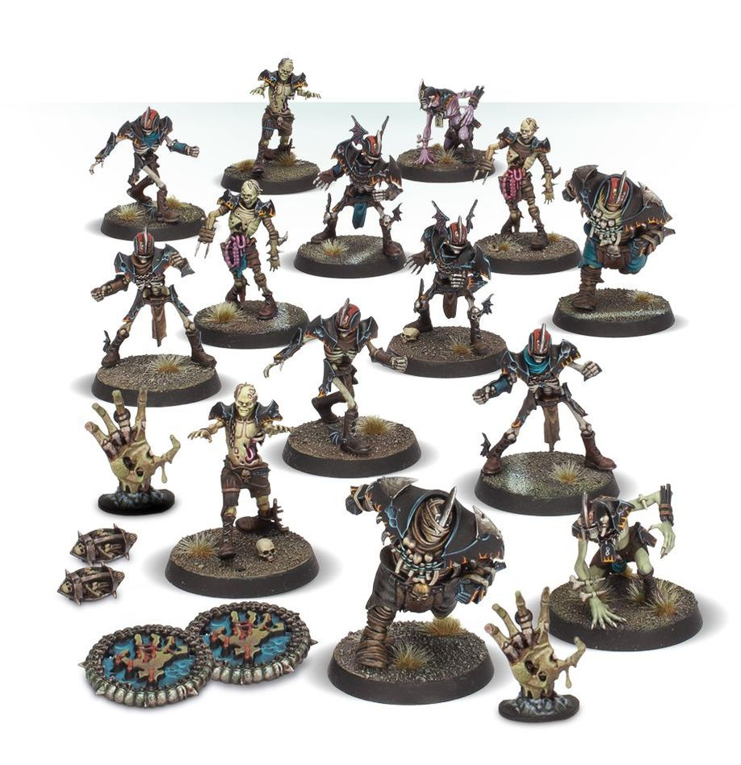

**TIER 2**

### Positionals

| Qty  | Position                                           | MA | ST | AG | PA | AV | Skills & Traits                                             | Primary | Secondary | Cost   |
| ---- | -------------------------------------------------- | -- | -- | -- | -- | -- | ------------------------------------------------------------ | ------- | --------- | ------- |
| 0‑16 | Skeleton Lineman *(Human, Lineman, Skeleton, Undead)* | 5  | 3  | 4+ | 6+ | 8+ | • [Regeneration] • [Thick Skull]                          | G       | A D S    | 40K    |
| 0‑16 | Zombie Lineman *(Human, Lineman, UndeaD Zombie)*     | 4  | 3  | 4+ | 6+ | 9+ | • [Eye Gouge] • [Regeneration] • [Unsteady]            | D G    | A S       | 40K    |
| 0‑2  | Ghoul Runner *(Ghoul, Runner, Undead)*                | 7  | 3  | 3+ | 3+ | 8+ | • [Dodge] • [Regeneration]                                | A G    | D P S    | 75K    |
| 0‑2  | Wight Blitzer *(Blitzer, Human, Skeleton, Undead)*    | 6  | 3  | 3+ | 5+ | 9+ | • [Block] • [Regeneration] • [Tackle] • [Thick Skull] | G S    | A D       | 95K    |
| 0‑2  | Mummy *(Big Guy, Blocker, Human, Undead)*             | 3  | 5  | 5+ | 6+ | 10+| • [Mighty Blow] • [Regeneration]                          | S       | A G       | 125K   |

### Special Rules

* [Sylvanian Spotlight]
* [Masters of Undeath]

### Staff

* [Cheerleader] - 10K
* [Assistant Coach] - 10K
* [Apothecary] - 50K
* [Re-roll] - 70K

### Star Players

* [Akhorne The Squirrel] - 80K
* [Skrull Halfheight] - 150K
* [Gretchen Wächter] - 260K
* [Ivan 'the Animal' Deathshroud] - 210K
* [Wilhelm Chaney] - 220K
* [Captain Karina von Riesz] - 230K
* [Frank 'n' Stein] - 250K
* [Grak and Crumbleberry] - 250K
* [Count Luthor Von Drakenborg] - 340K

### Inducements

* [Temp Agency Cheerleader] - 5K
* [Prayers to Nuffle] - 10K
* [Part-time Assistant Coach] - 20K
* [Team Mascot] - 25K
* [Weather Mage] - 25K
* [Mercenary Player] - 30K
* [Blitzer's Best Keg] - 50K
* [Bribe] - 100K
* [Extra Team Training] - 100K
* [Infamous Coaching Staff] - 100K
* [Wandering Apothecary] - 100K
* [Biased Referee] - 120K
* [Wizard] - 150K
* [Halfling Master Chef] - 300K
