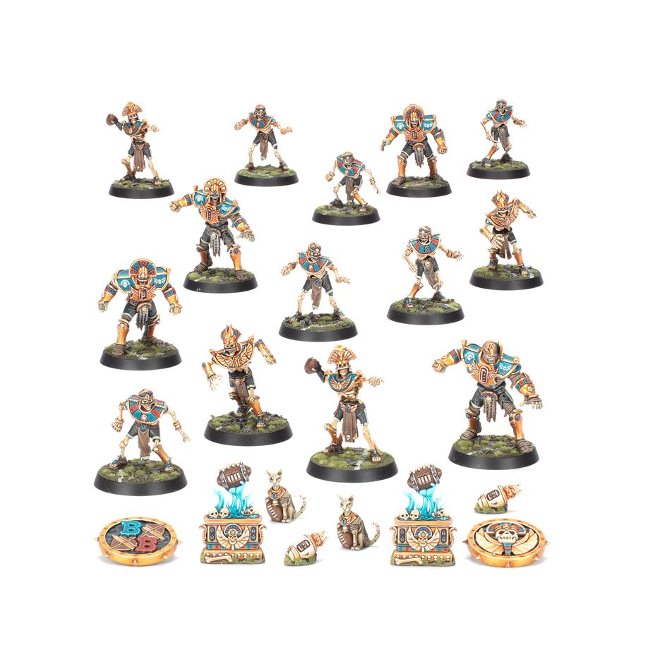

**TIER 2**

### Positionals

| Qty | Position                          | MA | ST | AG | PA | AV | Skills                                                        | Primary | Secondary | Cost |
| --- | --------------------------------- | -- | -- | -- | -- | -- | ---------------------------------------------------------------------- | ------- | --------- | ---- |
| 0-16 | Skeleton Lineman *(Lineman, Skeleton)* | 5  | 3  | 4+ | 6+ | 8+ | • [Regeneration] • [Thick Skull]                                   | G       | A S D     | 40K |
| 0-2  | Tomb Kings Thrower *(Thrower, Skeleton)* | 6  | 3  | 4+ | 3+ | 8+ | • [Pass] • [Regeneration] • [Sure Hands] • [Thick Skull]     | G P     | A S D     | 65K |
| 0-2  | Tomb Kings Blitzer *(Blitzer, Skeleton)* | 6  | 3  | 4+ | 5+ | 9+ | • [Block] • [Regeneration] • [Thick Skull]                      | G S     | A D       | 85K |
| 0-4  | Tomb Guardian *(Blocker, Human)*        | 4  | 5  | 5+ | 5+ | 10+| • [Brawler] • [Decay] • [Regeneration]                          | S A G   | -         | 115K |

### Special Rules

* [Sylvanian Spotlight]
* [Masters of Undeath]

### Staff

* [Cheerleader] - 10K
* [Assistant Coach] - 10K
* [Apothecary] - 50K
* [Re-roll] - 60K

### Star Players

* [Akhorne The Squirrel] - 80K
* [Skrull Halfheight] - 150K
* [Gretchen Wächter] - 260K
* [Ivan 'the Animal' Deathshroud] - 210K
* [Wilhelm Chaney] - 220K
* [Captain Karina von Riesz] - 230K
* [Frank 'n' Stein] - 250K
* [Grak and Crumbleberry] - 250K
* [Count Luthor Von Drakenborg] - 340K

### Inducements

* [Temp Agency Cheerleader] - 5K
* [Prayers to Nuffle] - 10K
* [Part-time Assistant Coach] - 20K
* [Team Mascot] - 25K
* [Weather Mage] - 25K
* [Mercenary Player] - 30K
* [Blitzer's Best Keg] - 50K
* [Bribe] - 100K
* [Extra Team Training] - 100K
* [Mortuary Assistant] - 100K
* [Wandering Apothecary] - 100K
* [Biased Referee] - 120K
* [Wizard] - 150K
* [Halfling Master Chef] - 300K
