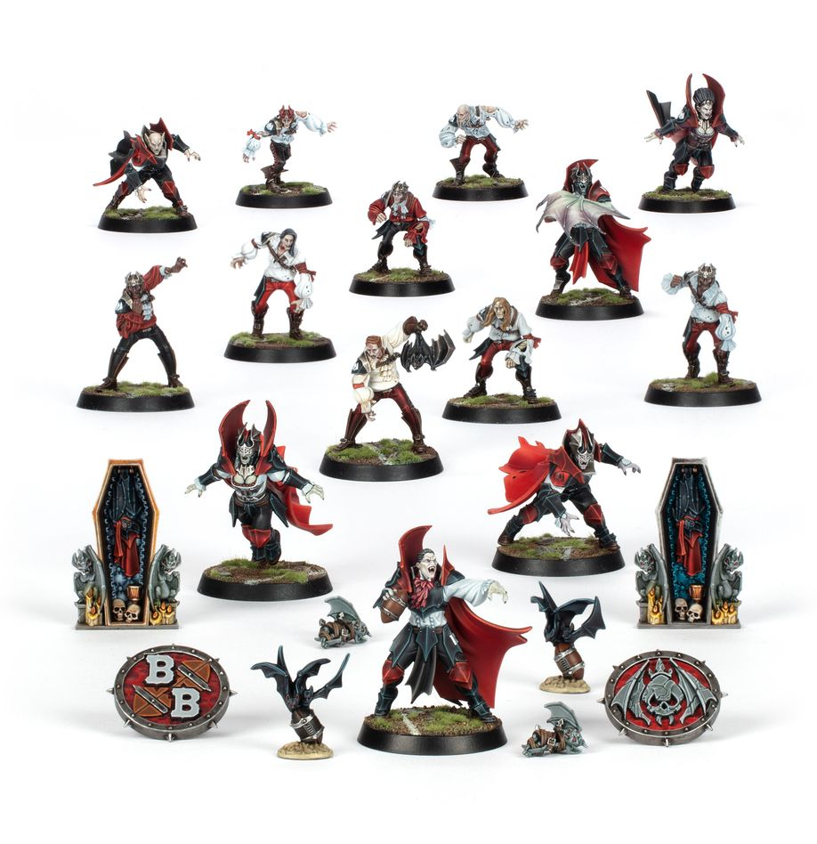

**TIER 2**
{ width=918 height=948 }

### Positionals

| Qty  | Position                                     | MA  | ST  | AG  | PA  | AV  | Skills & Traits                                                                     | Primary | Secondary | Cost |
| ---- | -------------------------------------------- | --- | --- | --- | --- | --- | ----------------------------------------------------------------------------------- | ------- | --------- | ---- |
| 0‑16 | Thrall Lineman *(Human, Lineman, Thrall)*    | 6   | 3   | 3+  | 4+  | 8+  |                                                                                     | G       | A S       | 40K  |
| 0‑2  | Vampire Runner *(Runner, Undead, Vampire)*   | 8   | 3   | 2+  | 3+  | 8+  | • [Bloodlust] (2+) • [Hypnotic Gaze] • [Regeneration]                         | A G     | P S       | 100K |
| 0‑2  | Vampire Thrower *(Thrower, Undead, Vampire)* | 6   | 4   | 2+  | 2+  | 9+  | • [Bloodlust] (2+) • [Hypnotic Gaze] • [Pass] • [Regeneration]             | A G P   | S         | 110K |
| 0‑2  | Vampire Blitzer *(Blitzer, Undead, Vampire)* | 6   | 4   | 2+  | 4+  | 9+  | • [Bloodlust] (3+) • [Hypnotic Gaze] • [Juggernaut] • [Regeneration]       | A G S   |           | 110K |
| 0‑1  | Vargheist *(Big Guy, Undead, Vampire)*       | 5   | 5   | 4+  | 6+  | 10+ | • [Bloodlust] (3+) • [Claws] • [Frenzy] • [Loner] (4+) • [Regeneration] | S       | A G       | 150K |

### League

* [Sylvanian Spotlight]

### Special Rules

* [Masters of Undeath]

### Staff

* [Cheerleader] - 10K
* [Assistant Coach] - 10K
* [Apothecary] - 50K
* [Re-roll] - 60K

### Star Players

* [Akhorne the Squirrel] - 80K
* [Skrull Halfheight] - 150K
* [Gretchen Wächter] - 260K
* [Ivan 'the Animal' Deathshroud] - 210K
* [Wilhelm Chaney] - 220K
* [Captain Karina von Riesz] - 230K
* [Grak and Crumbleberry] - 250K
* [Count Luthor Von Drakenborg] - 340K

### Inducements

* [Temp Agency Cheerleader] - 5K
* [Prayers to Nuffle] - 10K
* [Part-time Assistant Coach] - 20K
* [Team Mascot] - 25K
* [Weather Mage] - 25K
* [Mercenary Player] - 30K
* [Blitzer's Best Keg] - 50K
* [Bribe] - 100K
* [Extra Team Training] - 100K
* [Infamous Coaching Staff] - 100K
* [Wandering Apothecary] - 100K
* [Mortuary Assistant] - 100K
* [Biased Referee] - 120K
* [Wizard] - 150K
* [Halfling Master Chef] - 300K
