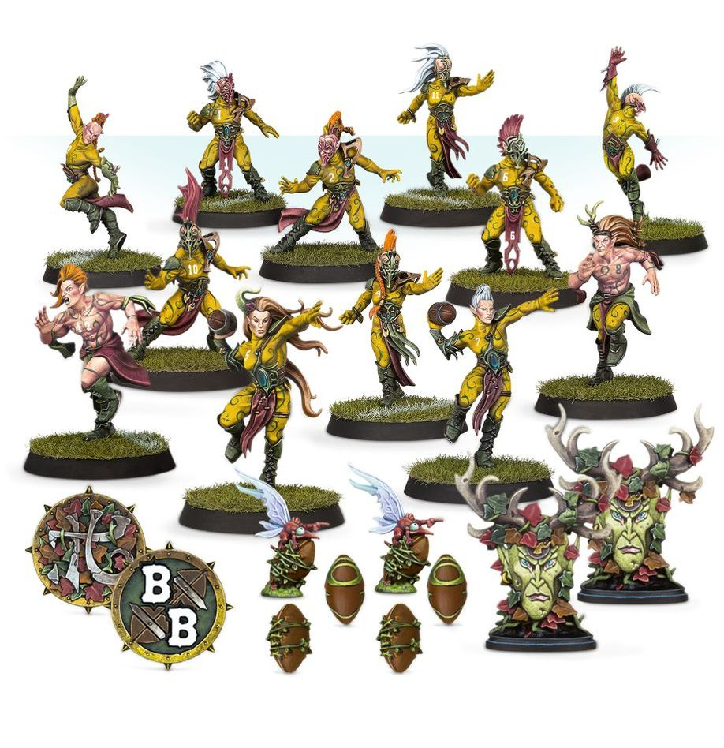

**TIER 1**

### Positionals

| Qty | Position                           | MA | ST | AG | PA | AR | Skills & Traits                                                                                              | Primary | Secondary | Cost |
| --- | ---------------------------------- | -- | -- | -- | -- | -- | ------------------------------------------------------------------------------------------------------------ | ------- | --------- | ---- |
| 0-16 | Wood Elf Lineman *(Lineman, Elf)*    | 7  | 3  | 2+ | 4+ | 8+ |                                                                                                              | A G     | S         | 65,000 |
| 0-2  | Wood Elf Thrower *(Thrower, Elf)*    | 7  | 3  | 2+ | 2+ | 8+ | • [Pass] • [Safe Pair of Hands]                                                                           | A G P   | S         | 85,000 |
| 0-4  | Wood Elf Catcher *(Catcher, Elf)*    | 8  | 2  | 2+ | 4+ | 8+ | • [Catch] • [Dodge] • [Sprint]                                                                         | A G P   | S         | 90,000 |
| 0-1  | Loren Forest Treeman *(Big Guy, Treeman)* | 2  | 6  | 5+ | 5+ | 11+| • [Loner] (4+) • [Mighty Blow] • [Stand Firm] • [Strong Arm] • [Take Root] • [Thick Skull] • [Throw Team-mate] | S       | A G       | 120,000 |
| 0-2  | Wardancer *(Blitzer, Elf)*           | 8  | 3  | 2+ | 4+ | 8+ | • [Block] • [Dodge] • [Leap]                                                                           | A G     | P S       | 130,000 |

Re-rolls: **50,000 gp**  
Leagues: **Elven Kingdoms League**, **Woodland League**  
Apothecary: **Yes**  
Tier: **1**  
Special Rules: **None**

---

### Star Players

* [Rodney Roachbait] - 70,000  
* [Akhorne The Squirrel] - 80,000  
* [Swiftvine Glimmershard] - 110,000  
* [Gloriel Summerbloom] - 150,000  
* [Willow Rosebark] - 150,000  
* [Kiroth Krakeneye] - 160,000  
* [Maple Highgrove] - 210,000  
* [Eldril Sidewinder] - 220,000  
* [Zolcath The Zoat] - 230,000  
* [Grak and Crumbleberry] - 250,000  
* [Jordell Freshbreeze] - 250,000  
* [Roxanna Darknail] - 270,000  
* [Lucien Swift] - 300,000  
* [Valen Swift] - 300,000  
* [Morg ’n’ Thorg] - 340,000  

---

### Inducements

* [Temp Agency Cheerleader] - 5,000  
* [Prayers to Nuffle] - 10,000  
* [Part-time Assistant Coach] - 20,000  
* [Team Mascot] - 25,000  
* [Weather Mage] - 25,000  
* [Blitzer’s Best Keg] - 50,000  
* [Bribe] - 100,000  
* [Extra Team Training] - 100,000  
* [Wandering Apothecary] - 100,000  
* [Josef Bugman] - 100,000  
* [Biased Referee] - 120,000  
* [Hireling Sports-Wizard] (Wizard) - 150,000  
* [Halfling Master Chef] - 300,000
