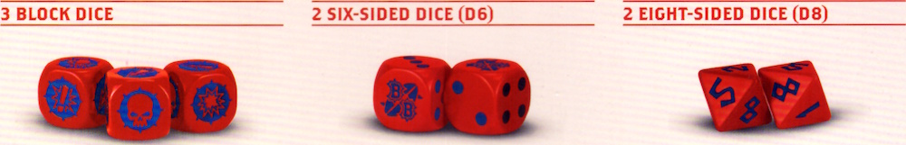
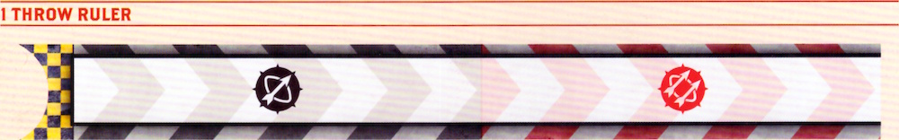
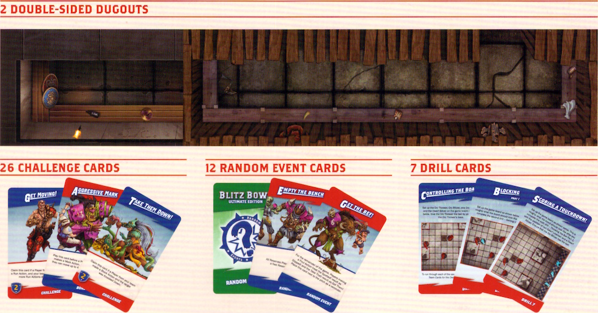
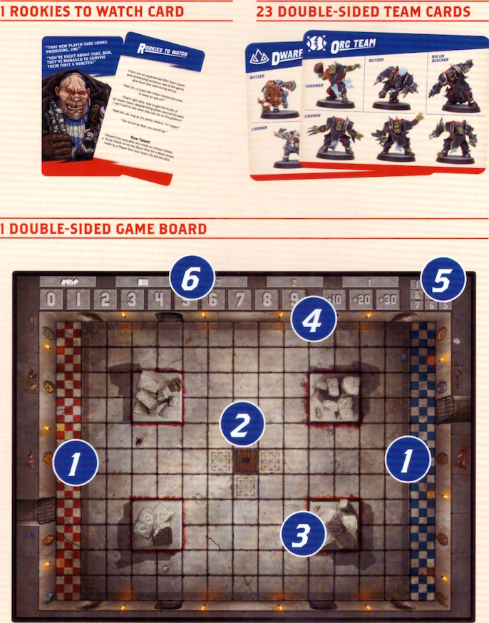

## INTRODUCTION

Welcome to Blitz Bowl! The fast-paced, sports-based game of gladiatorial mayhem where teams of budding Blood Bowl rookies aim to test their mettle by participating in the Crush in the hopes of being discovered and whisked away to the fame and fortune of the big leagues!  

Each player is a coach in charge of a team competing against their opponent to score as many points as possible by scoring touchdowns and completing challenges. If, at the start of your turn, you are 10 or more points ahead, then you immediately win the game! Otherwise, the game carries on until there are no more challenges left to complete, at which point the team with the most points wins and receives their hard-earned moment of triumph!

## CONTENTS OF THE BOX

Aside from this rules booklet, Blitz Bowl contains the following contents:

The game board contains the playing area, known as the pitch, which is divided into squares.  
Each side of the game board also contains some special features as described here:

1. End Zones where the teams start, and where Touchdowns are scored.  
2. Trapdoors where a ball comes into play.  
3. Blocked Squares that are delineated by a red border.  
4. Score Track.  
5. Bounce Chart.  
6. Challenge Card Tableau - one space for the Challenge Deck (marked ), one space for discarded Challenge Cards (marked ), and three for active Challenge Cards (marked 1, 2, 3).