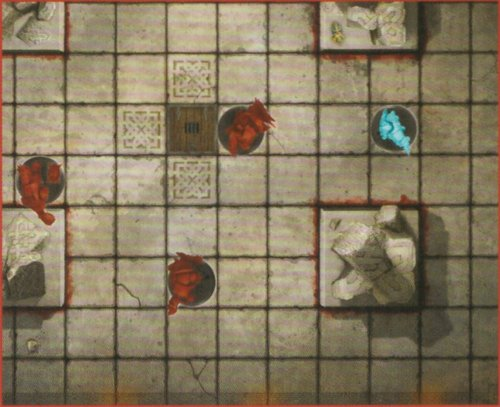
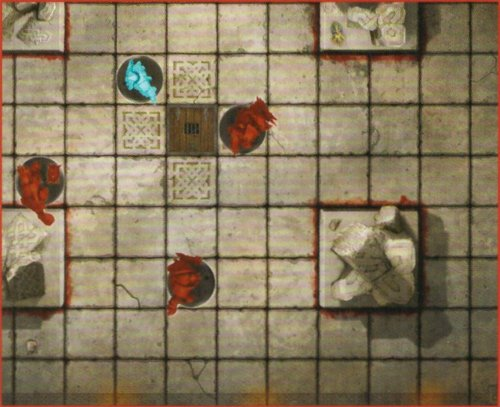
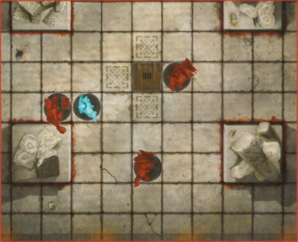
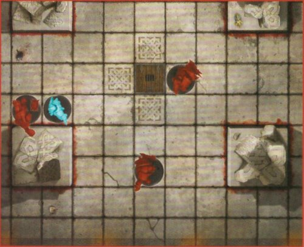
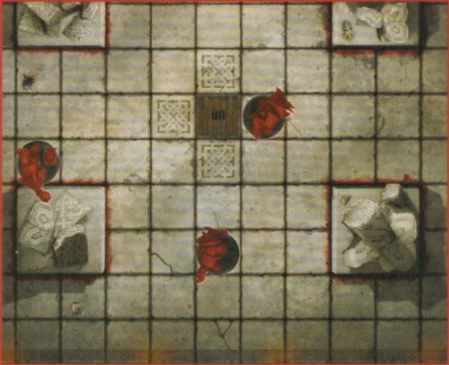
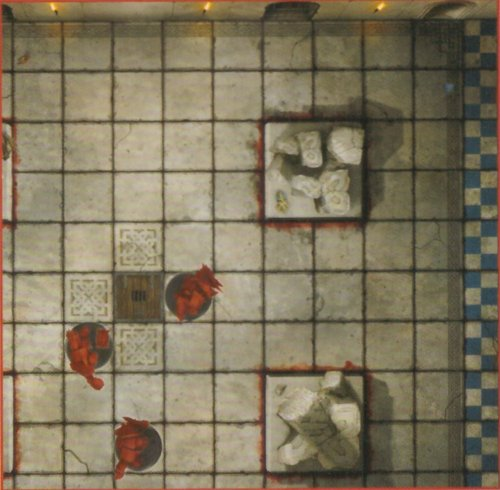
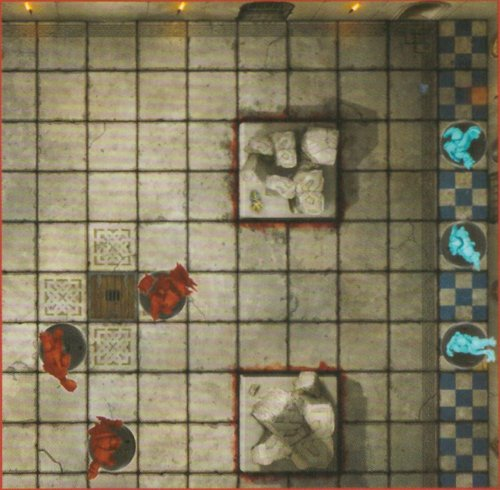

## Drill 1: Controlling the Board

Set up the game board as shown below. Set up the Orc Thrower, Orc Blitzer, one Orc Lineman, and the Dwarf Blitzer on the game board. Give the Orc Thrower the ball by placing it on the Orc Thrower's base.

*To run through each of the seven drills, you'll need the Team Cards for the Dwarf and Orc teams.*

This drill demonstrates the **Run Action**, and shows how Players can be used to control areas of the game board.

The Dwarf Blitzer is going to make a **Run Action**. On the Dwarf Team Card, you'll see they have a Move Value of 5. This allows them to move up to 5 squares (moving diagonally is allowed). When making a **Run Action**, a Player is not allowed to move into a square occupied by another Player or an obstruction (squares outlined in red) and, most importantly, cannot move into a square that is adjacent to an Opposition Player (a Player from the other team).

Following these restrictions, move the Dwarf Blitzer so that they are 2 squares away from the Orc Thrower. They can't move between the Orc Blitzer and the Orc Linemen, so they will need to run around them, to their right, in order to accomplish this.

As you can see, by carefully placing their Players, the Orc Coach has made it more difficult for the Dwarf Blitzer to get to the ball carrier!

---

### Drill 2: Getting Up Close

Set up the game board as shown below. This is roughly what the board should look like after you complete the first drill - [Controlling the Board](#drill-1-controlling-the-board).

This drill demonstrates the **Mark Action**.

The Run Action does not let Players move next to each other. Barring exceptional cases, the only way to do this is with the **Mark Action**. The **Mark Action** allows a Player to move up to 2 squares, and end that move adjacent to an Opposition Player.

The Dwarf Blitzer is going to make a **Mark Action**. Move them up to 2 squares so that they are adjacent to the Orc Thrower. Note that this is not the only Player the Dwarf Blitzer could end the move next to; however, as the Orc Thrower has the ball, they make a far better target!

Whilst a Player is standing in a square that is adjacent to one or more Opposition Players, those Players are all Marked. Marked Players cannot make Run Actions, so Marking a Player is a great way to slow them down.

---

### Drill 3: Blocking Part 1

Set up the game board as shown below. This is roughly what the board should look like after you complete the second drill - [Getting Up Close](#drill-2-getting-up-close).

This drill demonstrates the **Block Action**.

The Dwarf Blitzer and Orc Thrower are now Marked. Marked Players can only make a **Block Action** or a **Sidestep Action**.

A **Sidestep Action** is a move of a single square, and after that move the Player making the action must be Open. However, the Dwarf Blitzer is more interested in knocking the Orc Thrower off their feet, so they will make a **Block Action** instead!

A Player can make a Block Action against any standing Opposition Player next to them, so the Dwarf Blitzer targets the Orc Thrower. When a Player makes a **Block Action**, roll a number of Block Dice equal to their Block value - in this case, the Dwarf Blitzer rolls one Block Dice.

For this example, we will assume that the roll is (), which is the Shove result. To resolve this result, the Orc Thrower is moved directly away from the Dwarf Blitzer by one space. The Dwarf Blitzer has the option to move into the space the Orc Thrower was in, and chooses to do so. This is called following up.

---

### Drill 4: Blocking Part 2

Set up the game board as shown below. This is roughly what the board should look like after you complete the third drill - [Blocking Part 1](#drill-3-blocking-part-1).

This drill goes into more detail on the **Block Action**.

In a game of Blitz Bowl, each Coach takes it in turn to make three Actions with their Players. As the Coach of the Dwarf team has made three Actions - Run, Mark, and Block - it is now the Orc Coach's turn.

The Orc Thrower will start things off with a **Block Action** targeting the Dwarf Blitzer. The Orc Thrower rolls one Block Dice; for this example, we will assume that the roll is (), which knocks the Dwarf Blitzer down! Lay the Dwarf Blitzer down in their square - they are now Prone, so the Orc Thrower is no longer Marked.

Also, the Dwarf Coach must make an Armour Check by rolling a D6 and comparing it to the Dwarf Blitzer's Armour Value. If the result is lower than the Dwarf Blitzer's Armour Value, then they are Injured and removed from the board! Otherwise, they stay Prone, and will have to make a Stand Up Action to rise to their feet. For the purposes of the following drill, we will assume the Dwarf Blitzer is Injured.

---

### Drill 5: Throwing the Ball Part 1

Set up the game board as shown below. This is roughly what the board should look like after you complete the fourth drill - [Blocking Part 2](#drill-4-blocking-part-2).

The following two drills show how to make a **Throw Action** with a Player.

Now that the Orc Thrower is no longer Marked, they can make a **Throw Action**. However, the Orc Blitzer and Orc Lineman are difficult to throw to - they are either behind an obstruction (outlined in red) or they are quite far away. To make the throw easier, the Orc Thrower will first make a Run Action, as you learned in drill 1. Do this now, but for the purposes of this drill, do not move the Orc Thrower next to an Orc Player.

After the **Run Action**, the Orc Thrower will make a **Throw Action**. First, place the Throw Ruler so that the curved end is in line with the Orc Thrower's base. If the Throw Ruler reaches the centre of a square containing a Team-mate, the ball can be thrown to that Team-mate. See if you can end the **Run Action** in such a way that both Orc Players can potentially be thrown to, with the Short Throw (![short throw symbol]) section of the Throw Ruler reaching the centre of both Orc Players' squares. Now pick a viable Team-mate for the ball to be thrown to and move on to the next drill.

---

### Drill 6: Throwing the Ball Part 2

Set up the game board as shown below. This is roughly what the board should look like after you complete the fifth drill - [Throwing the Ball Part 1](#drill-5-throwing-the-ball-part-1). Ensure that the Orc Thrower has the ball.

This drill continues to show how to make a **Throw Action** with a Player.

After picking a Team-mate that is in range of the **Throw Action**, make a Throw Check by rolling a D6 and comparing the result to the throwing Player's Throw Value, which is found on their Team Card. If the result is equal to or higher than the Player's Throw Value, the **Throw Action** is successful - place the ball on the base of the Team-mate it was thrown to, they are now in possession of the ball.

Otherwise, the throw is inaccurate - the ball is placed in the target Team-mate's square and then Bounces away. However, if a 1 is rolled, the throwing Player will Fumble the ball and it is instead placed in their square before Bouncing away instead.

Whenever the ball Bounces, roll a D8 and compare the result on the Bounce Chart (which can be found on the game board). Then move the ball one square in the direction indicated by the Bounce Chart.

---

### Drill 7: Scoring a Touchdown!

Set up the game board as shown below. This is roughly what the board should look like after you complete the sixth drill - [Throwing the Ball Part 2](#drill-6-throwing-the-ball-part-2), with the addition of two Dwarf Linemen and a Dwarf Blitzer. Ensure that the Orc Blitzer has the ball.

This drill shows how to score a Touchdown.

The Orc Blitzer is in a position to score a Touchdown. Before they can do so, however, the Dwarf Coach gets to take their turn, as the Orc Coach has now made three Actions - Block, Run, and Throw. The Dwarf Coach makes three **Reserves Actions**, bringing two Dwarf Linemen and a Dwarf Blitzer onto the pitch in their End Zone.

The Orc Coach now takes their turn. To score a Touchdown, a Player from your team must be in the other team's End Zone, have possession of the ball, and be **Open, after completing an Action during your turn.**

In this case, the **Orc Coach** can score a **Touchdown** by making one **Run Action** with the Orc Blitzer in possession of the ball. See if you can figure out how! After you do so, the **Orc team** scores **4 points**, which would be recorded with the **Orc team's Score Marker** on the **Score Track**.

That concludes the drills and you are now familiar enough with the rules to start playing. Simply head to the rulebook to see how to set up and start a match!

---