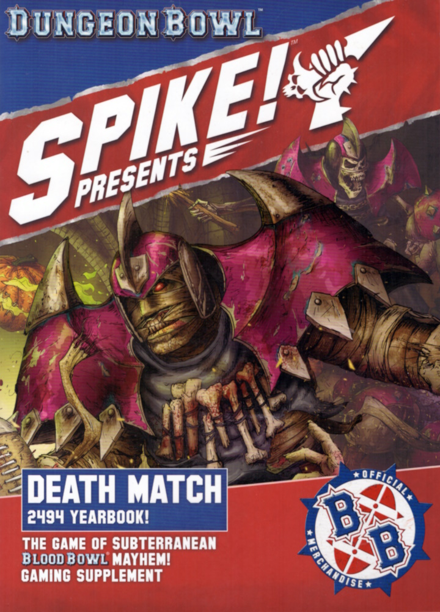

## COLLEGE OF LIFE TILES

### THE TUCK SHOP

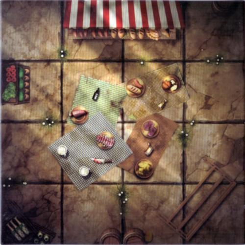

Any player who begins their activation within the Tuck Shop may choose to take the Tasty Snack Special action instead of doing anything else for that turn:

**TASTY SNACK:** When a player performs this action, roll a D6 and consult the snack table below.

| D6 | RESULT                           | OUTCOME                                                                                                                                                                                                                                                                                                            |
|----|----------------------------------|--------------------------------------------------------------------------------------------------------------------------------------------------------------------------------------------------------------------------------------------------------------------------------------------------------------------|
| 1  | *"Was It Something They Ate?"*   | The player's stomach begins to tighten and twist, wracked with pain thanks to the perilous pastry they just consumed! The player is Placed Prone and is Stunned; this will not cause a Turnover unless this player was carrying the ball.                                                                       |
| 2‑5| *"Oh, That's My Favourite!"*     | After a quick pit stop, the player is refreshed and ready to play some Dungeon Bowl! The player may re-roll a single Block dice, Agility test or Passing Ability test until the end of the game — remember you can't re-roll a re-roll! A player may only benefit from this result once per game; if they roll this again, nothing happens. |
| 6  | *"Don't Forget Your Vegetables!"* | After consuming a new trial superfood, this player seems to be at the top of their game, perhaps even above it! The player increases their ST by 1 until the end of the game. A player may only benefit from this result once per game; if they roll this again, nothing happens.                               |

### THE ROOT WALK

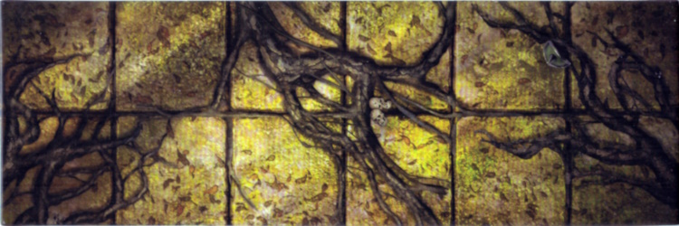

Any player who ends their activation within the Root Walk must roll a D6. On a 2+, this player continues their activation as normal. On a 1, the player becomes entangled in the roots, and is unable to move. At the beginning of an entangled player's activation, before declaring which action they will perform, roll a D6. If the number is equal to or lower than their ST, they successfully break free of the roots and can act as normal. If they roll higher than their ST, or roll a natural 6, the player remains entangled and cannot move from the square they currently occupy for any reason, voluntarily or otherwise.

### TRANQUIL MEADOW

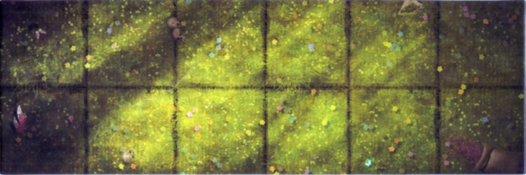

Any player that begins their activation within the Tranquil Meadow increases their MA by 1 until the end of their activation.

### FUNGUS FARM

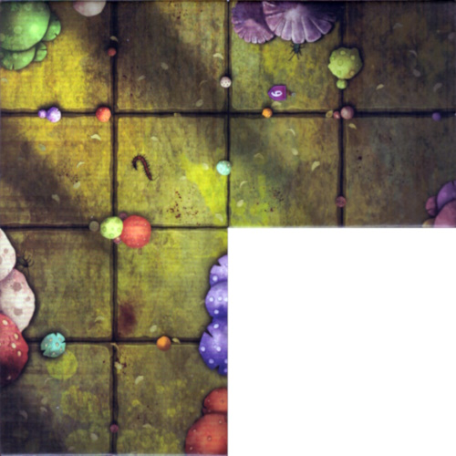

Whenever a player ends their activation in the Fungus Farm, roll a D6. On a 2+, the player shrugs off the effect of the spores and is unaffected. On a 1, the player is Placed Prone; this will not cause a Turnover unless that player was also carrying the ball. Snotling, Goblin and Troll players ignore this effect - they are well accustomed to the spores thanks to their excessive consumption of mushrooms!

### FOUNTAIN OF YOUTH

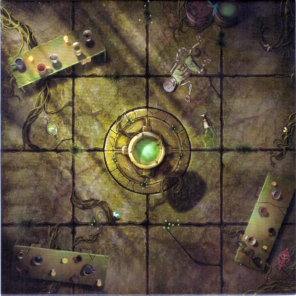

Any player who begins their activation within the Fountain of Youth tile may perform the Drink from the Fountain Special action instead of doing anything else for that turn:

**DRINK FROM THE FOUNTAIN:** When a player performs this action, roll a D6 and consult the table below:

| D6  | RESULT                     | OUTCOME                                                                                                                                                                                                                                                                                  |
|-----|----------------------------|-------------------------------------------------------------------------------------------------------------------------------------------------------------------------------------------------------------------------------------------------------------------------------------------|
| 1‑3 | *"You Have Chosen, Poorly!"* | The player begins to cough and splutter, as if their very life is draining away! The player is Placed Prone and an Injury roll is made against them - this will not cause a Turnover unless the player was carrying the ball.                                                         |
| 4‑6 | *"You Have Chosen, Wisely!"* | Old wounds begin to heal and the player swells with new-found energy! The player immediately recovers from any Serious Injuries or Lasting Injuries from previous games. Additionally, for the duration of the game, the first time this player would be removed from play as a Casualty, instead place them in the Reserves box and do not roll on the Casualty table. |

### GLUTTONOUS GREENHOUSE

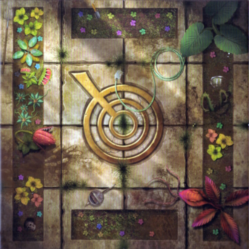

At the end of each coach's team turn, before the next team turn begins, randomly select a player within the Gluttonous Greenhouse. Immediately make an Armour roll against that player.

### MALODOROUS MARSH

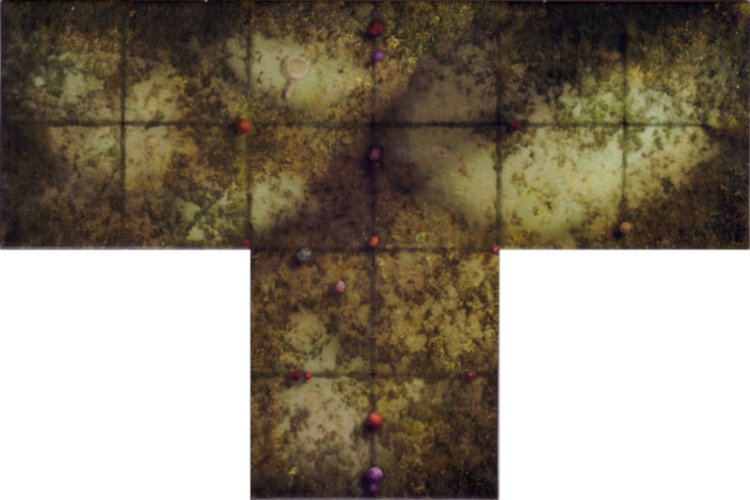

While within the Malodorous Marsh, any player with a ST of 3 or less applies a -1 penalty to the roll when attempting to Dodge, Jump or Leap.

## COLLEGE OF DEATH TILES

### WEREWOLF'S LAIR

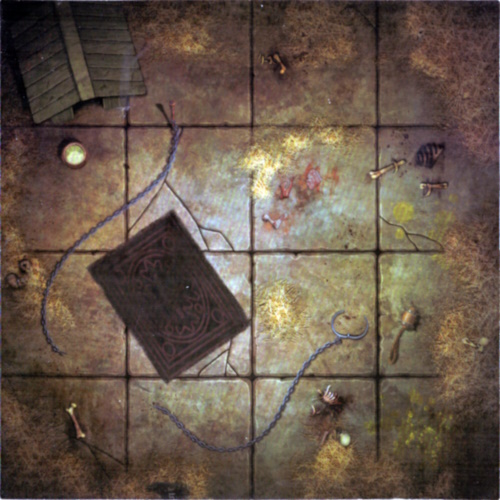

This room contains a Werewolf, who will fiercely defend its territory. The Werewolf is set up after both teams, and always begins the game on the square containing the dog house.

**THE BEAST UNLEASHED:** If there are any players within the Werewolf's Lair at the end of any team turn, roll a D6. On a 1, the Werewolf remains in the dog house for the time being. On a 2+, it will Blitz the closest standing player within the lair by the shortest possible route (if there are two or more players an equal distance away, then randomly determine which the Werewolf will Blitz). If the Werewolf moves into a square in which the ball is placed, the ball will bounce as described on page 11 of the *Dungeon Bowl Rulebook*. If the Werewolf moves over a square containing a Portal, the Werewolf treats it as a normal square and will not be teleported.

If the Werewolf selects the result of the block dice, it will always choose the result in the following order: POW!, Stumble, Push Back, Both Down and, lastly, Player Down!. If the Werewolf pushes a player as a result of the block dice, it will always push that player directly towards the closest entrance to the Werewolf's Lair. If there are two or more entrances an equal distance away, randomise which of those entrances it will push them towards. Once the Werewolf has completed its Blitz action, remove it from the board and place it back on the tile containing the dog house. Should the Werewolf become Knocked Down, remove it from the board and return it to the square containing the dog house. If the Werewolf cannot be placed on the dog house, place it in the closest unoccupied square - if there is more than one eligible square, randomise which the Werewolf will be placed into.

The Werewolf has MA8, ST3, the Claws Mutation and the Frenzy Skill.

### HALL OF BONES

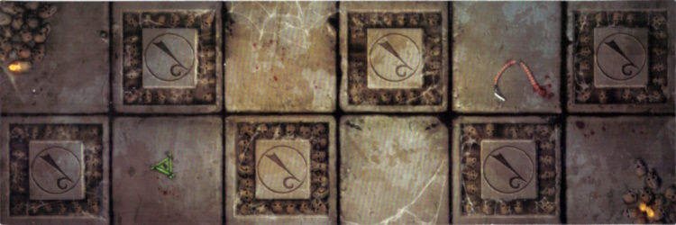

Any player who begins their activation within the Hall of Bones may choose to take the Skull Smash Special action, instead of doing anything else for that turn:

**SKULL SMASH:** Select an opposition player within one square of this player, who can be seen by this player, and roll a D6. On a 4+, the opposition player is immediately Knocked Down.

### SWIRLING MISTS

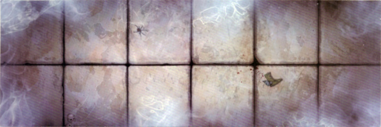

Any player attempting to Rush into a square within the Swirling Mists must apply a -1 modifier to the roll.

### GHOST JUNCTION

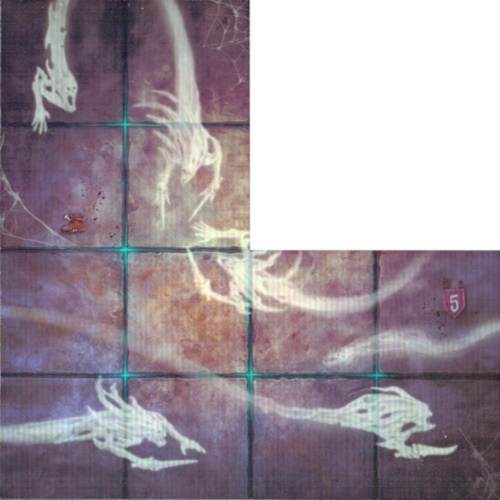

If a player attempts to move into the Ghost Junction, they must roll a D6. On a 2+, they may continue their activation as normal. On a 1, that player cannot willingly enter the Ghost Junction this turn, but may continue to move the rest of their MA as normal. A player may be moved into the Ghost Junction as a result of a Push Back, chain-push or any effect that would move them against their will.

### NECROMANCER'S LABORATORY

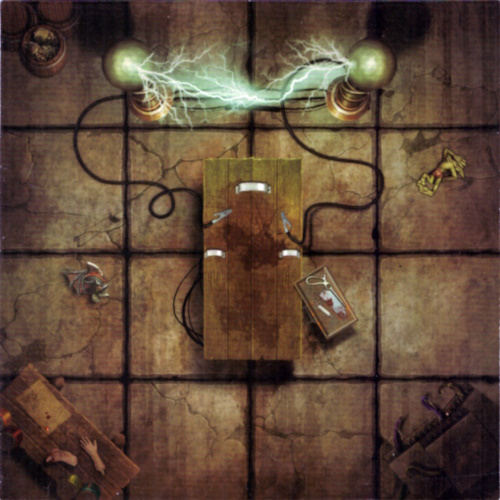

Any player who begins their activation within the Necromancer's Laboratory may choose to take the Under the Saw Special action, instead of doing anything else for that turn:

**UNDER THE SAW:** When a player performs this action, roll a D6 and consult the Experiment table below. Once the result has been applied, that player's activation immediately ends.

| D6 | RESULT                         | OUTCOME |
|----|--------------------------------|---------|
| 1  | *"Oops..."*                   | The player is immediately placed in the Casualty box; they will take no further part in the game. This does not result in a Turnover unless this player was also carrying the ball. |
| 2  | *"That Was Close!"*           | The player doesn't receive any benefits from the experiment other than leaving with their life! |
| 3‑5| *"No, There Won't Be Side Effects!"* | The player gains a random Mutation until the end of the game. If the player would gain a random Mutation which they cannot use or already have, simply randomise again until you get one that is appropriate. A player may only benefit from this result once per game; if they roll this again, nothing happens. |
| 6  | *"Yes, Yes, YES!"*            | The player gains a Mutation of your choice until the end of the game. A player may only benefit from this result once per game; if they roll this again, nothing happens. |

### THE CORPSE CHASM

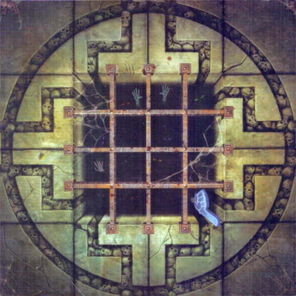

While within the Corpse Chasm, if a Push Back result is applied during a Block action, the target of the Block must make an Agility test. If the test is failed, treat the result of the Block as a POW! instead.

### SPIKE PIT

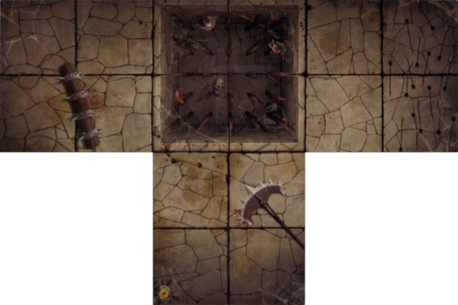

The Spike Pit is a 2 square by 2 square feature in this room. The Spike Pit can only be crossed by Jumping as described on page 37 of the *Dungeon Bowl Rulebook*, except that if they are successful they will land in an unoccupied square on another side of the pit. If the player fails the Agility test to Jump across the pit, they will Fall Over in the Spike Pit square closest to the target square. 

Additionally, if a player is Pushed Back into the Spike Pit, they will be Knocked Down. If a player begins their activation in the Spike Pit, they will escape the Spike Pit; remove the player from the table and place them standing in any of the closest unoccupied squares that are adjacent to the Spike Pit feature. If there is no available square, the player's activation immediately ends as they cower among the spikes waiting for an opportunity to escape. Once a player has escaped from the Spike Pit their activation ends. Should the ball land in the Spike Pit, scatter it another square so that it is no longer in the Spike Pit.

Whenever an Armour roll is made for a player within the Spike Pit feature, an additional +1 modifier is added to the roll.

## SPONSORSHIP DEALS

**College Dungeon Bowl** matches are an ideal event for companies, big and small, to splash their cash on some quality marketing, ensuring that they can get their names out there and associated with the potential stars of the future.

This is especially true for smaller companies, as getting their adverts into a Blood Bowl ad reel can be a costly endeavour. However, when the local Dungeon Bowl team needs to raise funds for some extra equipment (*or to pay off their last lost bet - Ed*), there is plenty of opportunity for both fledgling companies and well-established brands to plaster the new gear with logos and slogans. Some sponsors' contributions go beyond new equipment and coffers full of coins, providing teams with all sorts of additional 'game aids': from dusty old maps that contain hidden secrets, to thunderously explosive chests that are sure to make any game go out with a bang!

### DUNGEON BOWL, BROUGHT TO YOU BY…

Sponsors are an optional rule that can be incorporated into a Dungeon Bowl League by the league commissioner, or used in exhibition play to add some additional variety to your Dungeon Bowl games. If these optional rules are used, then at the beginning of the season when coaches set up their team Draft list to the league commissioner, they'll need to select a Sponsor that they are going to represent for the season. Coaches will have the choice of: Cragfall's Catacomb Cartography, Farblast & Sons Ordnance Solutions, Dr Brauer's Prototype Portals, Crystal Ball Sportscasting, Lightninseeds, or Air Oberwald. A Sponsor may be selected by any number of teams, but if you are playing a smaller league with 4-6 coaches, you might want to try randomly assigning a Sponsor to each team, or coming up with a strategy system to allow your coaches sole rights to a Sponsor!

If you wish to use Sponsors in exhibition play, coaches can simply choose which Sponsor they would like to use at the start of each game (though it is usually more fun if coaches choose different Sponsors). In the case of a multi-game or day event, players can choose a Sponsor to represent for the duration of the event.

Each Sponsor gives a unique benefit to the team that chooses them:

#### CRAGFALL'S CATACOMB CARTOGRAPHY "CAN'T USE AN OLD MAP TO EXPLORE A NEW DUNGEON"

If Cragfall's Catacomb Cartography is your chosen Sponsor then, once per game, during your team turn, at the beginning of any player's activation, you may select a player on your team without the ball and remove them from the board - immediately place that player in any unoccupied square in another, non-End Zone, room. If the selected player has not activated this turn, they may still perform an action as normal.

#### FARBLAST & SONS ORDNANCE SOLUTIONS "FARBLAST: WHEN YOU NEED TO BLAST THINGS THAT ARE VERY FAR AWAY!"

If Farblast & Sons Ordnance Solutions is your chosen Sponsor, whenever a player opens a Chest to search for the ball, if the Chest does not contain the ball and is booby trapped it will Knock Down all players within 2 squares instead of just those adjacent. Additionally, if two or more teams in the match have Farblast & Sons Ordnance Solutions as their chosen Sponsor, apply a +1 modifier to the Armour roll when players are Knocked Down by a booby-trapped Chest.

#### DR BRAUER'S PROTOTYPE PORTALS "GETTING YOU THERE 50% OF THE TIME, EVERY TIME!"

If Dr Brauer's Prototype Portals is your chosen Sponsor, whenever a player on your team teleports into the dungeon from the dugout, roll 2D6 and choose which of the two corresponding Portals your player will arrive in. If a double is rolled on the 2D6, the player will not arrive this turn and is placed back in the dugout as the Portal fails to function. The player is otherwise unaffected and may attempt to enter the dungeon again during your next team turn.

#### CRYSTAL BALL SPORTSCASTING "FOR THAT CRYSTAL CLEAR PICTURE"

If Crystal Ball Sportscasting is your chosen Sponsor, whenever a player on your team performs a Foul action, roll a D6. On a 2+, a timely mystical blackout cuts the live feed of the incident and the player cannot be Sent-off for rolling a natural double during the Foul action. On a 1, the player may not Argue the Call if they roll a natural double, as the image remains focused and the referee has a clear view of the incident. Additionally, your opponents may not Argue the Call when one of their players is Sent-off, as Crystal Ball Sportscasting has ensured the referee has a perfect picture of any opposition fouls!

#### LIGHTNINGADE "JUMP START YOUR DAY, THE RIGHT WAY!"

If Lightningade is your chosen Sponsor, whenever a player on your team would be KO'd or Injured, roll a D6. On a 5+, the player quickly recovers their wits and is placed in the Reserves box. On a 1-4, nothing happens; place the player in the Knocked-out box or Casualty box as normal.

#### AIR OBERWALD, "JUST BOOT IT"

When Air Oberwald becomes your chosen Sponsor, select a player on your team to become an Air Oberwald Athlete. At the beginning of each game, after step 4 of the pre-game sequence, your Air Oberwald Athlete may choose one of the following benefits for the duration of the game:

**CUSTOM KNUCKLE BLADES** - The selected player gains the Sneaky Git skill and the Stab trait.

**BOOTS OF SPEED** - The selected player improves their MA by 1 and gains the Sprint skill.

**EXTRA PADDING** - The selected player improves their AV by 1 (to a maximum of 11+) and gains the Thick Skull skill.

**PERSONAL PHYSICIAN** - Whenever a Casualty roll is made against this player, the opposing coach rolls twice and you may choose which result is applied. Additionally, if a Badly Hurt result is applied, the player is removed from the Casualty box and placed in the Reserves box instead.

Additionally, in League play, an Air Oberwald Athlete will earn 1 additional Star Player Point for each game they play in, as Air Oberwald's advertisements and features rocket the player to stardom!

If your Air Oberwald Athlete dies, then at the end of the game in which they are killed you may choose a new player on your team to become your Air Oberwald Athlete.

### CHANGING SPONSORS

Sponsors will regularly change throughout a Dungeon Bowl season, as winning teams try to negotiate better deals, and losing teams are picked up on the cheap by companies looking for an underdog comeback story. After one game throughout the season, a team may choose to swap their Sponsor for one of the others that are available. However, a team may only switch Sponsors once per season.
