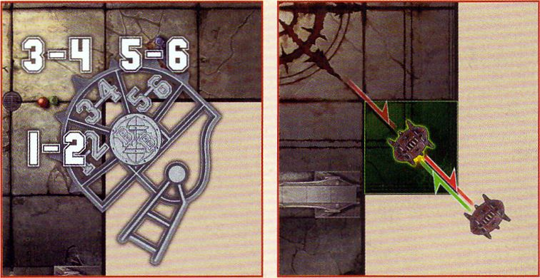

Dungeon Bowl has long been a way for the Colleges of Magic to settle their squabbles about which lore of magic is the greatest, ever since the Magisterium (who are themselves big Blood Bowl fans!) suggested using the game to decide arguments. That way, the Wizards wouldn't resort to unleashing their magics upon the other colleges, causing mayhem for the poor civilians nearby!

This idea proved popular, though the Magisterium made a few not-so-subtle changes to how to play the game, resulting in the game of Dungeon Bowl that the colleges play today.
Regardless, Dungeon Bowl has become an immensely popular game within the colleges of the Old World, and students from all manner of races have enrolled in their chosen college to study and, more importantly, play Dungeon Bowl. In fact, many Blood Bowl teams sign the stars of Dungeon Bowl colleges to their rosters as rookies; for some, this is their only path into the big leagues that is Blood Bowl!

This section covers in detail the rules and regulations of the game of Dungeon Bowl.

## GENERAL PRINCIPLES

(see General Principles, [page 23 of the *Blood Bowl Rulebook*](../core_rules/rules_and_regulations.md#general-principles))

## DICE ROLLING

(see Dice Rolling, [page 24 of the *Blood Bowl Rulebook*](../core_rules/rules_and_regulations.md#dice-rolling))

## RE-ROLLS

(see Re-Rolls, [page 24 of the *Blood Bowl Rulebook*](../core_rules/rules_and_regulations.md#re-rolls))

## LINE OF SIGHT

To determine if one player can see another, we need to determine if it has Line of Sight. A player is said to have Line of Sight to another player if a straight line can be
drawn from the centre of the square they are in, to the centre of the square that the other model is in - so long as the line does not cross any walls of the dungeon. A Player can still see another player if this line touches, but does not cross, a wall.

## DEVIATE, SCATTER OR BOUNCE

The footballs used in Dungeon Bowl are oddly shaped and often behave quite erratically especially when they hit a flat surface. Throughout the rules, reference will be made to the ball 'deviating', 'scattering' or 'bouncing', and it is worth establishing early on what is meant by each of these terms:

**DEVIATE**

(see Deviate, [page 25 of the *Blood Bowl Rulebook*](../core_rules/rules_and_regulations.md#deviate))

**SCATTER**

(see Scatter, [page 25 of the *Blood Bowl Rulebook*](../core_rules/rules_and_regulations.md#scatter))

**BOUNCE**

(see Bounce, [page 25 of the *Blood Bowl Rulebook*](../core_rules/rules_and_regulations.md#bounce))

**BOUNCING OFF THE WALL**

Sometimes the ball will hit the walls of the dungeon, causing it to veer off in a random direction. This could be due to the ball bouncing into the wall, a player fumbling the ball next to the wall, or various other reasons.

When the ball would hit the wall of the dungeon following a bounce, scatter or deviation, place the Ricochet template so that the Blood Bowl logo is theoretically where the ball would be if it hadn't hit the wall, and then roll a D6. The ball will be placed in the square corresponding to the roll, as determined by the Ricochet template.

If the ball would bounce into a corner, then it will bounce as shown in one of the diagrams below, depending on which is most appropriate.

Sometimes players may try to use the walls to their advantage, throwing the ball in such a way as to bounce it off the side of the dungeon into a more advantageous position. This works slightly differently and is described fully on [page 43](./the_rules_of_dungeon_bowl.md#throwing-the-ball-at-the-wall).

## Player Status

(see Player Status, [page 26 of the *Blood Bowl Rulebook*](../core_rules/rules_and_regulations.md#player-status))

### PRONE AND STUNNED PLAYERS

(see Prone And Stunned Players, [page 27 of the *Blood Bowl Rulebook*](../core_rules/rules_and_regulations.md#prone-and-stunned-players))

## PLAYER PROFILE AND CHARACTERISTICS TESTS

(see Player Profile And Characteristics Tests, [pages 28-29 of the *Blood Bowl Rulebook*](../core_rules/rules_and_regulations.md#player-profile-and-characteristics-tests))

## Drafting a Dungeon Bowl Team

(see Drafting a Blood Bowl Team, [pages 30-33 of the *Blood Bowl Rulebook*](../core_rules/rules_and_regulations.md#drafting-a-blood-bowl-team))

### PURCHASING TEAM RE-ROLLS

(see Purchasing Team Re-Rolls, [pages 34 of the *Blood Bowl Rulebook*](../core_rules/rules_and_regulations.md#purchasing-team-re-rolls))

### OTHER INFORMATION

(see OTHER INFORMATION, [pages 35 of the *Blood Bowl Rulebook*](../core_rules/rules_and_regulations.md#other-information))