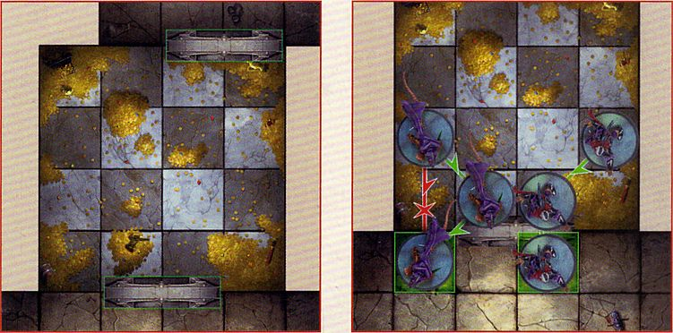
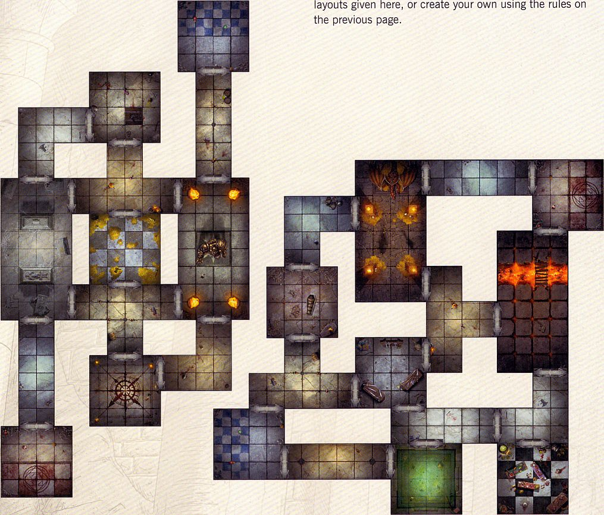
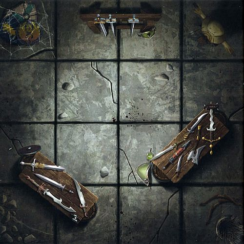
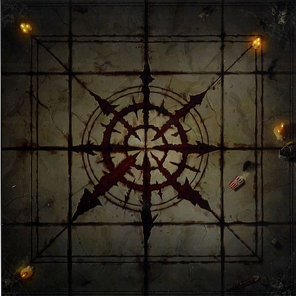
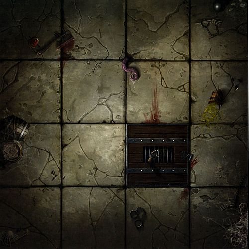
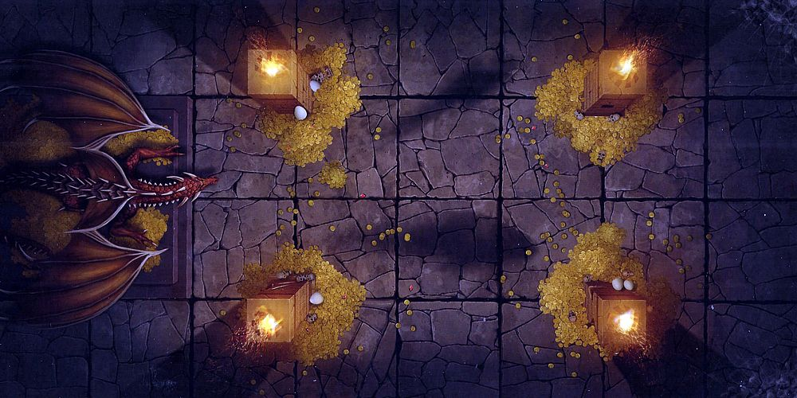

Whilst Blood Bowl is played on the pitches of the Old World in front of roaring crowds of fans, the game of Dungeon Bowl is far different. Instead, the teams are teleported into the winding dungeon vy the magic of the Magisteruim, where they must navigate the various corridors and traps to find the football and score the game-winning touchdown.

There is no kick-off in a game Dungeon Bowl (the ball would just hit the roof), instead the ball is hidden in one of the many chests placed around the dungeon - whilst the other chests contain magical booby traps placed by the Magisterium themselves.

Over the course of the game, coaches are permitted to send extra players from the dugout into the dungeon, utilising a series of magical portals put in place for players to navigate the dungeon - though there is no way of knowing which of the various portals a player will turn up in!

Play continues until one team finds the football in one of the chests, and manages to score a touchdown to end the game. This does mean that there is no set time limit for a game of Dungeon Bowl; in fact, some games have been known to last mere minutes, whilst others have gone on for multiple days!

As the game is only played to a single touchdown, there is never any chance of a draw - a college will either score the winning touchdown, or will suffer defeat!

## Setting Up The Game

The first thing that you need to do in order to play a game of Dungeon Bowl is to set up the dungeon - a rather important feature of the game!

Setting up the dungeon is easy, and should be a collaborative between both players. The aim of this should be to create an interesting diverse dungeon that both players will enjoy playing across. Remember, al this stage of the game, it is not yet a competition!

Whilst players are free to make the dungeon look however they wish, and we encourage them to work together to make a balanced playing area that doesn't inherently give one player an advantage, there are a few rules that govern how the dungeon should be laid out.

When creating the dungeon, it should contain at least four corridor pieces, at least three small rooms, at least one large room and, of course, the two End Zones - although these are not placed until the very end of creating the dungeon (more on that later).

Whenever two Dungeon tiles are placed adjacent to each other, there should always be at least two squares connecting them. No Dungeon tiles should ever be connected by a single square - this simply wouldn't give enough room for the players to move through! Additionally, wherever two Dungeon tiles join together, place a Door token between them to show the doorway that connects the two tiles. These are always two squares wide, and should be placed as centrally as possible. It should also be noted that the doorways are always assumed to have the doors removed, and so are simply openings - the Magisterium thought traversing the dungeon would be difficult enough without having to constantly open and close doors!

When both players are happy with how the dungeon is laid out, the two End Zones should be placed. These should be placed as far away from each other as possible within the dungeon.

After the dungeon has been laid out, the Chests and Portals need to be deployed.

The Chests are always deployed first. Both coaches roll a single D6, re-rolling any ties, with the coach who rolls highest deploying the first Chest and alternating from there. Make sure players don't look inside the Chests, that way it is entirely unknown which Chest contains the ball. Chests may be deployed in any square, with the following exceptions:

* Chests may not be deployed in either End Zone, or in a dungeon tile connected to an End Zone.

* Only a single Chest may be deployed in each Dungeon tile.

After the Chests have been deployed, the Portals need to be placed within the dungeon. Each Portal is numbered differently, between 1 and 6, and should be deployed in order. Starting with the coach who rolled lowest in the previous roll-off, players alternate deploying the Portals following the same restrictions as the Chest. Additionally, Portals may not be deployed within 2 squares of a Chest.

After the dungeon has been laid out, coaches toss a coin. The winner chooses which of the two End Zones is theirs. With the dungeon deployed between them, coaches place their dugout beside their End Zone.

Both coaches then place their teams in the dungeon and their re-roll markers onto their dugout before quickly explaining the details of their team for their opponent's benefit.

Below are some examples of ways you could choose to lay out the dungeon. You can choose to use one of the layouts given here, or create your own using the rules on the [previous page](#setting-up-the-game).

### PRE-GAME SEQUENCE

Once the game is set up, the pre-game sequence begins and both coaches run through the following sequence of steps:

1.	COIN TOSS: The coaches toss a coin, with the winner getting the first turn.
2.	TAKE ON JOURNEYMEN: If a team cannot field 11 players for a league game, the team temporarily takes on a number of Journeyman players.
3.	INDUCEMENTS: Both coaches decide if they will purchase any Inducements for the game ahead, paid for from a team's Treasury, from 'Petty Cash', or both.
4.	DEPLOY PLAYERS: Starting with the coach who has the first turn, coaches deploy six players from their roster within their End Zone.

#### TAKE ON JOURNEYMEN

(see Take On Journeymen, [pages 38 of the *Blood Bowl Rulebook*](../core_rules/the_rules_of_blood_bowl.md#3-take-on-journeymen))

#### INDUCEMENTS

(see Inducements, [pages 38 of the *Blood Bowl Rulebook*](../core_rules/the_rules_of_blood_bowl.md#4-inducements))

#### PETTY CASH

(see Petty Cash, [pages 38 of the *Blood Bowl Rulebook*](../core_rules/the_rules_of_blood_bowl.md#petty-cash))

#### TREASURY

(see Treasury, [pages 38 of the *Blood Bowl Rulebook*](../core_rules/the_rules_of_blood_bowl.md#treasury))

#### COMMON INDUCEMENTS

(see Common Inducements, [pages 38 of the *Blood Bowl Rulebook*](../core_rules/the_rules_of_blood_bowl.md#common-inducements))

## Dungeon Tile Special Rules

From pitfalls and chasms to ancient crypts, and even the chance of some wandering creatures, the dungeons that the Wizards of the Old World maintain are filled with all kinds of perils and dangers. Quite why they keep such shall we say, interesting dungeons has never really been ascertained. What is certain is that it certainly spices up the games played
within them!

Some of the Dungeon tiles, specifically the small rooms and the large rooms, have special rules associated with them, adding to the unpredictability that Dungeon Bowl is known for.

Here we present the rules for each of the unique rooms in Dungeon Bowl.

### THE ARMOURY

Whenever an Armour roll is made for a player within the Armoury, an additional +1 modifier is added to the roll.

### THE BONE PIT 

Players that attempt to Throw, Catch or Hand-off the ball within the Bone Pit suffer a -1 modifier to the dice roll.

### THE CURSED ROOM

Whilst a player is within the Cursed Room they may not use team re-rolls or a Skill or Trait that allows them to re-roll any number of dice.

### THE FLOODED ROOM

Whilst within the Flooded Room, players that attempt to Rush will Fall Over on the roll of a 1 or a 2 rather than just a 1.

### THE FORGOTTEN JAIL

Any player that begins their turn within the Forgotten Jail must roll a D6. On a 1 or 2, the player reduces their MA by 2 until the end of their activation.

### THE KITCHEN

Any player that begins their activation within the Kitchen may perform the Throw Food special action instead of doing anything else for that turn:

***THROW FOOD:*** Select an opposition player within 4 squares of this player, who can be seen by this player, and roll a D6. On 5+ the opposition player is immediately Knocked Down.

### THE SEWER

Players that enter the Sewer gain the Disturbing Presence trait until the start of their next activation.

### THE TREASURE-ROOM

A player that begins their activation within the Treasure Room may perform the Gather Funds special action instead of doing anything else for that turn:

***GATHER FUNDS:*** This player's activation ends immediately; make a note each time this action is used. At the end of the game if one or more player performed this action, then your team gains an additional 10,000 gold pieces. If three or more players performed this instead gains an additional 20.000 gold pieces. If five or more players performed this action, then your team instead gains an additional 30,000 gold pieces.

### THE CHAOTIC IDOL

The Chaotic Idol is a 2 square by 2 square impassable feature in this room that is treated as a wall. Additionally, if a player begins their activation within this room, roll a D6. On the roll of a 6, the player increases their ST by 1 for the duration of their activation.

### THE CRYPT

Crypt has two 1 square by 2 square impassable features in this 'at are treated as a wall, though they do not block Line of Sight. Additionally, if a player would be pushed into a Crypt then they are Knocked Down and any Armour roll made against them will have a +1 modifier.

### THE DRAGON YOUNGLING'S LAIR

The Dragon Youngling is a 2 square by 2 square impassable feature in this room that is treated as a wall, though it does not block Line of Sight. Additionally, any player that begins their activation within the Dragon Youngling's Lair must roll a D6. On a 5+ that player is immediately Knocked Down. This will only cause a Turnover if the player was holding the ball.

### THE FIERY CHASM

The Fiery Chasm is a 1 square by 4 square impassable feature in this room, though it does not block Line of Sight. It also has a rope bridge across it that takes up a single square; this can be crossed as normal.

Any player that is pushed into the Fiery Chasm automatically suffers a Casualty result; roll on the Casualty table for them. Additionally, should the ball land in one of the squares of the Fiery Chasm, scatter it another square that it is no longer in the Fiery Chasm.

## Chests

Back when the game of Dungeon Bowl was first invented, the Magisterium realised that they would need to tweak some of the more traditional rules of Blood Bowl to suit the more unique setting of the dungeon and to add that extra bit of excitement to the game. One of these changes was to remove the usual kick-off; it wouldn't really work with the low ceilings in many rooms of the dungeon.

Instead, a number of identical chests are placed around the dungeon that the players will need to locate. One of these chests will include the all-important football; however, the others are fitted with a spectacular, though (usually) non-lethal, magical spell that will explode in the face of whoever should open it!

### DEPLOYMENT

The six Chests are deployed around the dungeon as described on [page 24](#setting-up-the-game). One of these will contain the football, whilst the other five will contain an explosive magical spell.

### OPENING CHESTS

Players may not move over a Chest, it is essentially an impassible feature that does not block Line of Sight. A player that finishes a Move action (but not as part of a Blitz action) in a square adjacent to a Chest, and who is not Marked 'when they finish their Move action, may choose to open the Chest. When a Player opens a Chest, remove the lid of the model to see what is inside.

If the Chest contains the football, then the player immediately gains Possession of the ball and their activation ends immediately. The Chest is - removed from play and the square it was in becomes a normal square.

If the Chest is empty, the player has set off one of the magical booby traps put in Place by the Magisterium prior to the game. The player who opened the Chest and all players adjacent to the Chest, are immediately Knocked Down and Armour roll is made for each of them. After the Armour roll has been made for each player, the Chest is then removed from play and the square it was in becomes a normal square.

Note that players may still continue to open Chests even after the ball has been found. In fact, this is a good way to cause extra damage to the opposition, and perhaps even knock over key players such as Big Guys or the ball carrier!

## Portals

The dungeons of the various colleges can be large and winding constructions, often making them hard for players to navigate quickly. In the early days, there were numerous accounts of games taking many hours, or even days, as the teams ran around the dungeon in circles trying to find one of the end zones. This prompted the Magisterium to come up with a solution to help make the games go that little bit quicker, and add an extra bit of uncertainty into the mix for everyone's amusement!

What they came up with was the use of magical teleport portals. In every game of Dungeon Bowl, there are six of these mystical spells placed around the dungeon, allowing players to teleport in-between them at speed. However, once a player enters one of these portals they have no control of which of the others they will come out of! This has resulted in a much more dynamic and exciting game, though on occasion it has led to some remarkable magical mishaps...

### TELEPORTING

Each of the Portals is numbered between 1 and 6. When a player steps on, or is pushed into, a Portal roll a D6; the player is immediately teleported to the Portal with the corresponding number.

If this player is teleported as the result of a Move action then it will cost them a square of their Movement Allowance to gather their wits and carry on with their act nation (if they have any left, of course). Should a player use a Portal more than once during a team turn, the magical powers will cause a huge strain upon their body which could result in massive internal injuries. Any player that is teleported more than once during any team turn will immediately suffer an Injury roll.

If a player is pushed into a Portal, they will be teleported as normal. If the player was Knocked Down as they were pushed, make the Armour roll (and Injury roll if needed) before teleporting them across the dungeon.

If a loose ball lands on a Portal it will he scattered in the same way, though it will never cause a Chain Reaction of a Magical Mishap. If the ball teleports onto a square containing a standing player, they must try to catch it as normal. Otherwise simply scatter the ball one square from the Portal it is teleported to.

### CHAIN REACTIONS

If a player is teleported into the same square as another player, it will result in a Chain Reaction. The player that was originally occupying the Portal will be teleported themselves to another Portal - which may result in another Chain Reaction.	

Remember that if a player is teleported more than once in an activation, they will suffer an Injury roll.

### MAGICAL MISHAP

Teleportation spells are not perfect, and can be temperamental at best. There is always a chance that a player simply doesn't materialise after being teleported. To represent this, if a player that is being teleported rolls the same number as the Portal they are being teleported from, they will suffer a Magical Mishap. For example, if a player on Portal number 3 rolled a 3 on the D6.

When this happens, the player is removed from the dungeon and will take no further part in the game. They have been teleported to elsewhere in the college but remain unharmed; and will be located by their colleges Wizards once the game is completed. A Magical Mishap does not cause a Turnover.

Should a player with the ball suffer a Magical Mishap, the ball will not also disappear - being far more important than the players, the ball has been enchanted to protect it from such instances! Instead, the ball will simply scatter one square from the Portal.

### DUGOUT PORTALS	

Each college's dugout contains its own one-way Portal to allow more players to enter the dungeon. Once per turn a coach may teleport a single player from their dugout into the dungeon, in the same manner as if they had entered a Portal, with the exception that they may not move further that turn. The team that has the first turn cannot teleport a player in on their first team turn. As the player cannot roll the same number as they started on (as dugout Portals aren't numbered), players being teleported into the dungeon cannot suffer a Magical Mishap - though they can cause a Chain Reaction. Players can never be teleported back into a dugout.

Unlike in a standard game of Blood Bowl, a Dungeon Bowl team can have as many players in the dungeon as they can teleport in. However, in practice, it is unlikely a team will be able to get all 16 into play before a touchdown is scored.