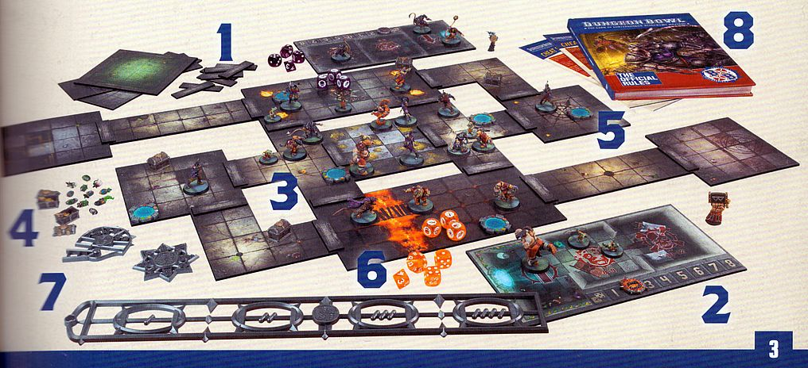
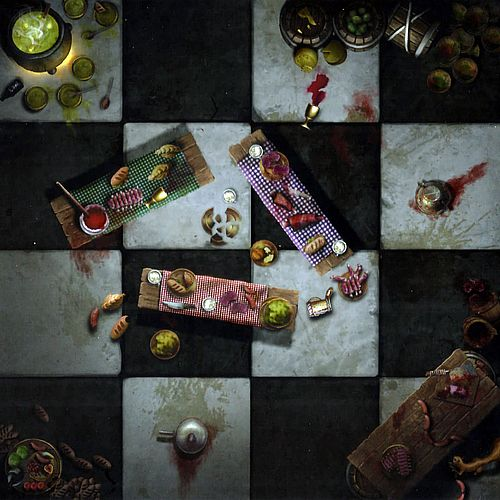
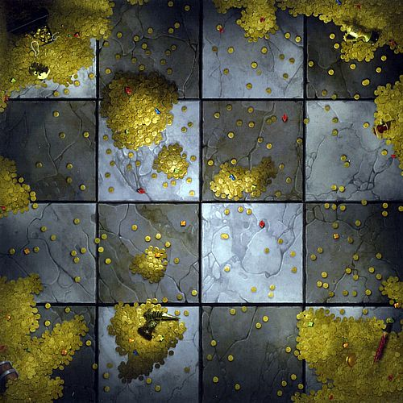
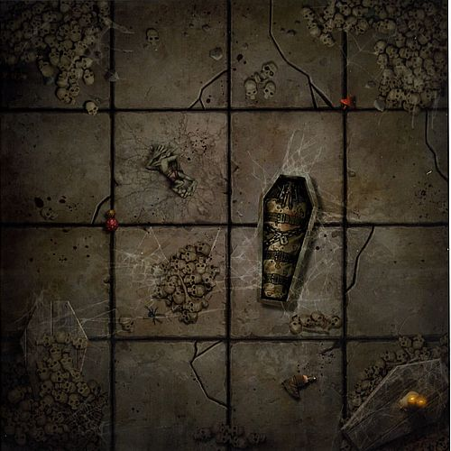
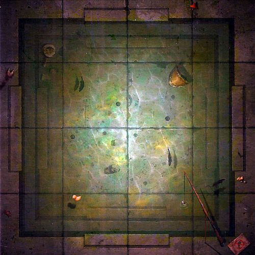
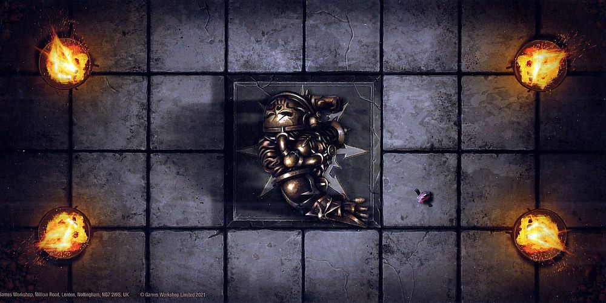
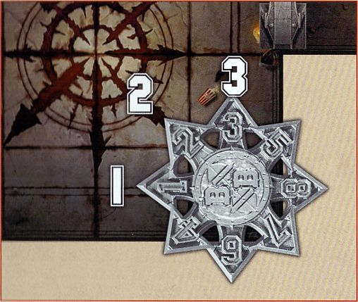
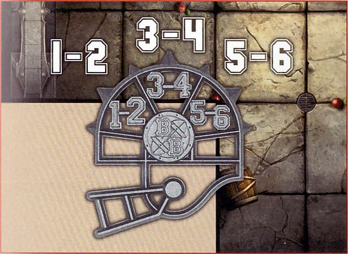

There are many different variations of Blood Bowl played in the Old World, but perhaps the strangest is that of Dungeon Bowl. For years, Wizards and spellcasters have been embroiled in much debate about which of their Colleges of Magic is the greatest, and Dungeon Bowl is used as a different, yet exciting, way of attempting to settle the matter without involving the general population (who often end up worse off when Wizards cannot agree!).

To play a game of Dungeon Bowl, there are a few key items you will need. So, let's have a look at a game in progress and list the vital components you'll require to get you started.

1. ***DUNGEON TILES:*** These are the tiles that are used to create the dungeon where the teams will play a game of Dungeon Bowl. They can be arranged in a selection of different ways, allowing players to create numerous different dungeon layouts for the games. 
2. ***TWO TEAM DUGOUTS:*** These are used to keep track of game information, such as which players are ready to enter the dungeon, if any players are Knocked Out or Injured, and the number of re-rolls a team has remaining.
3. ***TWO DUNGEON BOWL TEAMS:*** There are eight different Colleges of Magic, each with their own selection of miniatures that can be used. Often teams will be made up of multiple races and positions, leading to some rather unusual combinations being possible!
4. ***CHEST:*** These are placed around the dungeon, and could contain either the ball or a booby trap, making for an exciting and unpredictable game!
5. ***PORTALS:*** These are placed throughout the dungeon and act as a way for players to attempt to quickly navigate the dungeon, and for teams to add more players to the dungeon as the game goes on.
6. ***DICE:*** Dungeon Bowl uses a selection of different types of dice: regular six-sided dice, block dice, eight-sided dice and 16-sided dice to bring the action to life.
7. ***MEASURERS & TEMPLATES:*** These are used for passing the ball, determining how a ball bounces, and so on.
8. ***THIS RULEBOOK:*** The one you are holding right now! This has all the information you need to play the game of Dungeon Bowl, as well as having the rosters for each of the eight Colleges of Magic so you can start planning your teams right away!

## DUNGEON BOWL TILES

Arguably, the most important thing for a game of Dungeon Bowl are the Dungeon tiles themselves. After all, you can't play Dungeon Bowl without a dungeon for the teams to run around in, get lost in, and fall into its cleverly-hidden traps!

There are a number of different Dungeon tiles, and on these pages we are going to show you which tile is which so that you know what rooms, corridors and other places you can use to create your dungeon.

#### END ZONES (X2 DOUBLE-SIDED)

Simply put, these tiles are where teams are trying to get the ball in order to score the game­winning touchdown.

#### CORRIDORS

These long, thin tiles add to the claustrophobic nature of Dungeon Bowl, and make it difficult for players to get past the opposition. There is a total of four double-sided long corridors, two double-sided T-junction corridors, and two double­sided L-shaped corridors.

#### SQUARE ROOMS
There are four square tiles that feature special rooms on them. Each tile is double-Sided, giving eight unique square rooms. These are:

***THE ARMOURY***

***THE SEWER***

***THE KITCHEN***

***THE CURSED ROOM***

***THE FORGOTTEN JAIL***

***THE TREASURE ROOM***

***THE BONE PIT***

***THE FLOODED ROOM***

#### LARGE ROOMS
There are two large tiles that feature special rooms on them. Each tile is double-sided, giving four unique rectangular rooms. These are:

***CHAOTIC IDOL***

***FIERY CHASM***

***DRAGON YOUNGLING'S LAYER***

***THE CRYPT***

#### DID YOU KNOW?

The protection spells placed upon the game balls to prevent them being teleported out of the dungeon only came into place after a game between the Blazing Axes and the Iron Hawks saw the ball bounce into a portal and seemingly teleport to elsewhere in the dungeon. It took the colleges nearly three days to realise that the ball was no longer in the dungeon, and had instead ended up in the college library.

The Magisterium all knew of course, but they were having too much fun watching the teams beat each other up as they searched for it to mention anything!

## SPORT PARAPHERNALIA

Dungeon Bowl teams rarely travel light. Be it the kit and armour of the players, the equipment and playbooks of the I coaches or the snacks and refreshments for players waiting to enter the dungeon, there is no end to the equipment teams have in their dugouts. On the tabletop, games of Dungeon Bowl require somewhat less in the way of equipment, but there are certain accessories that are vital to the game.

#### THE FOOTBALL

(see The Football, [page 20 of the *Blood Bowl Rulebook*](../core_rules/blood_bowl_stadia.md#the-football))

#### CHESTS

Speaking of the ball, at the start of any game of Dungeon Bowl, the ball has been hidden in one of the chests around the dungeon.

The others contain a rather explosive surprise for anyone who opens them! The full rules for chests can be found on [page 31](./set-up.md#chests).

#### PORTALS 

A series of magical portals are also placed throughout the dungeon. These are used for many things, from players trying to quickly manoeuvre through the dungeon, to coaches sending extra players in to aid the rest of their team-mates. The full rules for portals can be found on [page 32](./set-up.md#portals).

#### TEAM RE-ROLLMARKER

A coach is responsible for keeping track of how many team re-rolls they have and how many have been used. You may use either a single marker or several markers (one for each team re-roll) as you prefer.

### TEMPLATES

Dungeon Bowl also makes use of three unique templates. These are the 'Random Direction template', the 'Ricochet template' and the 'range ruler'. These are used as described below:

#### THE RANDOM DIRECTION TEMPLATE

(see The Random Direction Template, [page 20 of the *Blood Bowl Rulebook*](../core_rules/blood_bowl_stadia.md#the-random-direction-template))

#### CORNER BOUNCES

Should the ball hit the corner of the dungeon, the direction of the bounce is determined by placing the Random Direction template as shown in the diagram and rolling a D3.

#### THE RICOCHET TEMPLATE

If the ball ever hits the wall of the dungeon, it will bourn off it in a random direction. Position the Ricochet template as shown in the diagram below, with the Blood Bowl logo over the square the ball would theoretically have been in if it hadn't hit a wall and roll a D6 to determine the direction the ball travels.

Bouncing off the wall is covered in greater detail on page 43.

#### THE RANGE RULER

(see The Range Ruler, [page 21 of the *Blood Bowl Rulebook*](../core_rules/blood_bowl_stadia.md#the-range-ruler))

### DUNGEON BOWL DICE

(see Blood Bowl Dice, [page 21 of the *Blood Bowl Rulebook*](../core_rules/blood_bowl_stadia.md#blood-bowl-dice))